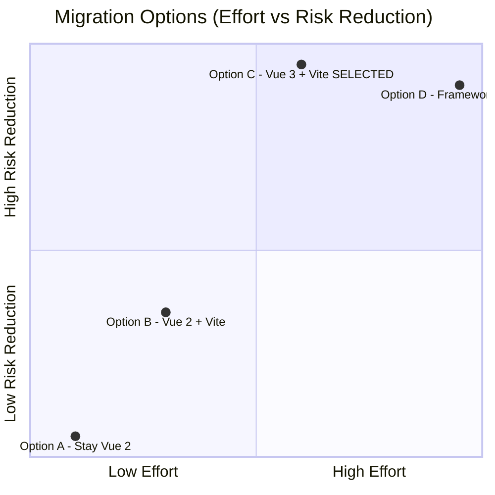

# ADR-0001 Vue 3 + Vite Migration

## Status

Proposed

## Context

The portfolio application currently runs on Vue 2.7.16 with `@vue/cli-service` (Webpack 5) as the build
tool. Several converging factors make continuing on this stack untenable:

1. **Vue 2 reached End-of-Life on 31 December 2023.** No further security patches will be released.
2. **Node 16 reached End-of-Life on 11 September 2023.** The `.nvmrc` pins the project to
   `v16.17.0`, exposing the build environment to unpatched CVEs.
3. **jQuery 3.7.1 is used as the primary DOM manipulation layer** alongside Vue's reactivity system.
   This creates a dual-mutation architecture where jQuery imperatively mutates the DOM at the same
   nodes Vue 2's virtual DOM also manages, causing hard-to-trace rendering bugs and a known XSS
   vector in `src/http.js:43` (`$("#all-post").html(li)` injects unsanitized server HTML).
4. **The Heroku-hosted GraphQL backend** (`jcc-portfolio-api.herokuapp.com`) is permanently
   offline. `UpdatesComponent.vue` and `http.js` exist solely to consume it and are dead code.
5. **Bootstrap 4.6.2 requires jQuery** at runtime. Upgrading to Bootstrap 5 (jQuery-free) is a
   prerequisite for removing jQuery entirely.
6. **`@vue/cli-service`** (Webpack) has much slower cold-start and HMR times than Vite and is no
   longer actively developed for Vue 3 projects.

Tracked in GitHub issue: https://github.com/jcchikikomori/portfolio/issues/62

### ADR Triggers (per documentation-criteria)

| Trigger | Evidence |
|---------|----------|
| External dependency replacement | jQuery removed; Bootstrap 4 → 5; `@vue/cli-service` → Vite; `@babel/eslint-parser` → ESLint flat config / native parser |
| Architecture change | Dual Vue 2 + jQuery DOM mutation → pure Vue 3 reactive state |
| Data flow change | jQuery direct DOM writes (`$.html()`, `$.attr()`, `$.addClass()`) → Vue reactive bindings and Composition API |

## Decision

Migrate from **Vue 2.7 + Webpack (`@vue/cli-service`) + jQuery + Bootstrap 4** to
**Vue 3 + Vite + Bootstrap 5 (jQuery-free) + Vitest** on Node 22 LTS.

Remove `src/http.js`, `src/components/UpdatesComponent.vue`, and all jQuery imports.

### Decision Details

| Item | Content |
|------|---------|
| **Decision** | Migrate to Vue 3 + Vite + Bootstrap 5 on Node 22 LTS; remove jQuery and the dead Updates feed entirely |
| **Why now** | Vue 2 and Node 16 are both EOL; the XSS vulnerability in `http.js` is active even though the backend is offline (the file is imported and its function could be called); staying on the current stack means shipping EOL software |
| **Why this** | Vite is the Vue core team's endorsed build tool for Vue 3; Bootstrap 5 eliminates jQuery as a runtime dependency; the Composition API enables full reactivity without touching the DOM imperatively |
| **Known unknowns** | `register-service-worker` compatibility with Vite's PWA plugin ecosystem requires early validation; `dialog-polyfill` may need replacement as the native `<dialog>` element now has broad browser support |
| **Kill criteria** | If any existing Vue 2 SFC pattern cannot be automatically migrated and manual rewrite produces visible regressions in the rendered portfolio across the three supported form factors (mobile, tablet, desktop) |

## Rationale

### Options Considered

#### Option A — Stay on Vue 2, upgrade Node only (rejected)

- **Pros**: Minimal change surface; no risk of SFC breakage.
- **Cons**: Vue 2 is EOL with no security patches. `@vue/cli-service` is Webpack-based with slow
  DX. jQuery XSS vector remains. ESLint `plugin:vue/essential` continues to flag Vue 2-only rules.
  This option cannot address the root security issues.

#### Option B — Vue 2.7 + Vite (migration-lite, rejected)

Vue 2.7 introduced `defineComponent` / `setup()` compatibility, and community Vite plugins exist
for Vue 2 (e.g., `vite-plugin-vue2`).

- **Pros**: Smaller diff; Vite DX gain; partial Composition API.
- **Cons**: Vue 2 remains EOL. jQuery still needed because Vue 2 lacks `<script setup>` with full
  Composition API. The community plugin is unmaintained. No path to `plugin:vue/vue3-recommended`.
  Essentially buys 6-12 months before the same migration is needed again.

#### Option C — Vue 3 + Vite + Bootstrap 5, remove jQuery (selected)

- **Pros**:
  - Vue 3 is actively maintained; Vue 2 EOL risk eliminated.
  - Vite cold-start is ~10× faster than Webpack; HMR is sub-second.
  - Bootstrap 5 removes jQuery as a runtime dependency.
  - Composition API + `<script setup>` replaces all jQuery DOM mutations with reactive
    template bindings, making the XSS vector structurally impossible.
  - Deleting `http.js` and `UpdatesComponent.vue` removes 74 lines of dead code including the
    only confirmed XSS sink.
  - `plugin:vue/vue3-recommended` + `eslint-plugin-security` provide stronger static guarantees.
  - Node 22 LTS is supported until April 2027 (Node 20 is EOL 2026-04-30).
- **Cons**:
  - Breaking changes in Vue 3 require SFC review (filters removed, `$emit` type changes,
    `v-model` argument changes, `<Transition>` renames).
  - `dialog-polyfill` must be reassessed (`<dialog>` is now baseline in all modern browsers;
    the polyfill may be removed).
  - `volar-service-vetur` is replaced by `@vue/language-tools` (Volar for Vue 3).
  - Build configuration moves from `vue.config.js` to `vite.config.js`; all existing Webpack
    aliases and public path config must be translated.

#### Option D — React or Svelte rewrite (rejected)

- **Pros**: Modern framework; full ecosystem.
- **Cons**: Full rewrite of all SFCs; no business case for framework change in a personal portfolio;
  violates YAGNI. Not scoped in the issue.

### Trade-off Summary

Option C occupies the best risk-reduction-to-effort ratio for this project's size and goals.

## Consequences

### Positive Consequences

- Vue 2 EOL risk eliminated; Vue 3 security patches apply immediately after migration.
- Node 16 EOL risk eliminated; CI matrix already tests on Node 18, 20, 22 (see `default.yml`).
- XSS sink in `http.js:43` eliminated by deletion, not patching — structural fix.
- jQuery removed from runtime and build chain; bundle size reduction estimated at ~30 KB
  gzipped (jQuery 3.7.1 minified + gzipped ≈ 30 KB).
- Build times improve: Vite cold-start vs `@vue/cli-service` Webpack start is typically
  5–15× faster for a project of this size.
- `plugin:vue/vue3-recommended` catches more Vue-specific anti-patterns.
- `eslint-plugin-security` adds XSS, prototype pollution, and regex DoS detection at lint time.
- PWA functionality preserved via `vite-plugin-pwa` (wraps Workbox, same as `@vue/cli-plugin-pwa`).

### Negative Consequences

- Vue 3 breaking changes require manual review of all SFCs; `vue-compat` (migration build) is
  explicitly not used to avoid carrying Vue 2 compatibility shims into production.
- `dialog-polyfill` public CSS (`public/css/dialog-polyfill.css`) must be reassessed; if kept,
  the import in `vendors/_v2.scss` must be updated.
- Bootstrap 4 Sass import path (`/node_modules/bootstrap/scss/bootstrap`) changes to Bootstrap 5
  path; any Bootstrap 4-specific utility classes in SFCs must be audited.
- Glyphicon fonts in `public/fonts/` (Bootstrap 3 artifact) can be removed; this is a clean-up
  opportunity, not a breaking change.
- GitHub Actions workflow files use outdated action versions (`actions/checkout@v2.3.1`,
  `actions/setup-node@v1`, `JamesIves/github-pages-deploy-action@3.6.2`); they must be updated
  in parallel with the Node version change.

### Neutral Consequences

- `babel.config.js` is deleted; Vite uses esbuild for transpilation, making Babel unnecessary.
- `.nvmrc` changes from `v16.17.0` to `22` (or `22.x.x` LTS).
- `volar.config.js` (Vetur service) is replaced by standard Volar (`@vue/language-tools`) with no
  separate config file required for basic usage.
- `pnpm` remains the package manager (already in use via `pnpm-lock.yaml`).
- SCSS structure in `src/assets/scss/` is preserved with only vendor import path updates.

## Architecture Impact

### Components changed

| Component | Change |
|-----------|--------|
| `src/main.js` | `new Vue({ render: h => h(App) }).$mount()` → `createApp(App).mount()` |
| `src/App.vue` | Options API preserved; remove unused `methods: {}` |
| `src/components/ProfileComponent.vue` | Remove jQuery `goToUrl` helper; replace with native anchor navigation or `window.open`; remove `UpdatesComponent` import |
| `src/components/ProjectsComponent.vue` | Remove jQuery `goToUrl` helper; same replacement |
| `src/components/SpotifyComponent.vue` | No jQuery usage; cosmetic cleanup only |
| `src/components/LoaderComponent.vue` | No jQuery usage; no change |
| `src/theme.js` | jQuery `addClass`/`removeClass`/`attr` → `document.body.classList`, `document.querySelector` |
| `src/visualizer.js` | jQuery `addClass`/`removeClass` → `document.body.classList` |
| `src/http.js` | **DELETED** |
| `src/components/UpdatesComponent.vue` | **DELETED** |
| `vue.config.js` | **DELETED** → `vite.config.js` created |
| `babel.config.js` | **DELETED** |
| `volar.config.js` | **DELETED** → Volar requires no separate config file |

### New dependencies introduced

| Package | Role |
|---------|------|
| `vue@^3.4` | Vue 3 runtime |
| `vite@^5` | Build tool |
| `@vitejs/plugin-vue@^5` | Vue SFC compilation plugin for Vite |
| `vite-plugin-pwa@^0.20` | PWA / service worker (replaces `@vue/cli-plugin-pwa`) |
| `vitest@^1` | Unit test framework |
| `@vue/test-utils@^2` | Component testing utilities for Vue 3 |
| `bootstrap@^5.3` | jQuery-free Bootstrap |
| `eslint-plugin-security@^3` | Security-focused ESLint rules |
| `@vue/language-tools` | Volar IDE support (dev-only) |

### Architectural constraints added

- All DOM manipulation must go through Vue's reactive template system. Direct `document.querySelector`
  calls are permitted only in `theme.js` and `visualizer.js` (non-component utilities) where Vue
  reactivity cannot reach `<body>` class state; these must be documented.
- No new jQuery imports are permitted after migration.

## Implementation Guidance

- **Composition API over Options API for new code**: Existing components may remain Options API
  if the migration effort is not justified; however, new components must use `<script setup>`.
- **Replace jQuery DOM calls with the narrowest native equivalent**: `classList.add/remove/toggle`
  for class manipulation, `element.setAttribute` for attribute mutation, `window.open` for
  navigation — not a wholesale jQuery API rewrite.
- **Keep `src/theme.js` and `src/visualizer.js` as module-level functions**: They operate on
  `<body>` which is outside the Vue app root; refactoring them into Vue composables would require
  Vue context and adds unnecessary complexity.
- **Delete rather than comment**: `http.js` and `UpdatesComponent.vue` must be deleted, not
  disabled with comments or feature flags.
- **Maintain SCSS architecture**: The seven-layer SCSS structure (`abstracts/`, `vendors/`,
  `base/`, `layout/`, `components/`, `pages/`, `themes/`) must be preserved; only Bootstrap and
  dialog-polyfill import paths change.
- **Incremental CI validation**: Each PR in the migration sequence must pass `pnpm run lint`,
  `pnpm run build`, and `pnpm run test` before merging to avoid compounding breakage.
- **Keep PR size within 200 lines**: The migration should be split into at minimum three PRs
  (tooling, deletion + jQuery removal, component updates + tests).

## Related Information

- GitHub Issue: https://github.com/jcchikikomori/portfolio/issues/62
- Vue 3 Migration Guide: https://v3-migration.vuejs.org/
- Vite documentation: https://vitejs.dev/guide/
- Bootstrap 5 migration from v4: https://getbootstrap.com/docs/5.3/migration/
- Vitest documentation: https://vitest.dev/guide/
- `vite-plugin-pwa` documentation: https://vite-pwa-org.netlify.app/
- `eslint-plugin-security`: https://github.com/eslint-community/eslint-plugin-security
- Vue 3 `@vue/test-utils` v2: https://test-utils.vuejs.org/
- Design Doc: docs/design/vue3-vite-migration.md
