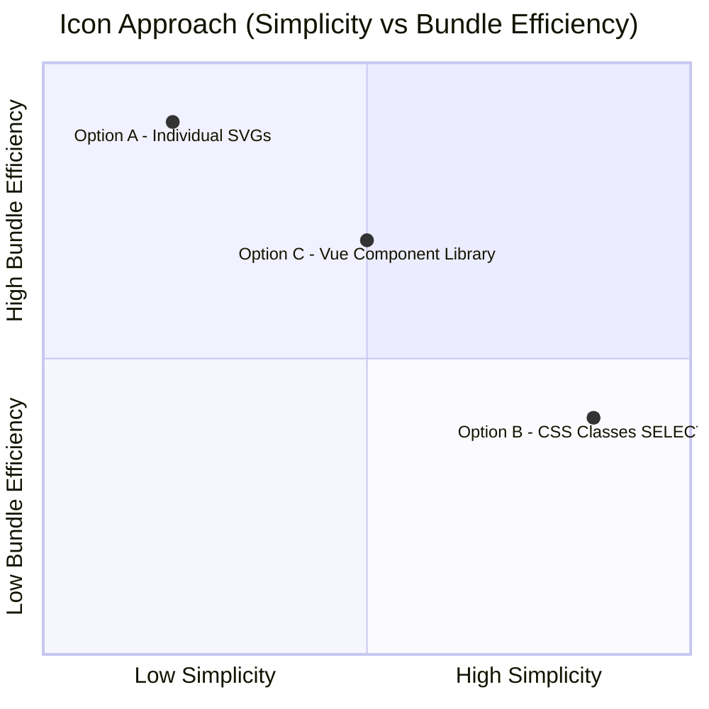

# ADR-0002 Career History Re-design: Icon System, Dialog Pattern, and Data Extraction

## Status

Proposed

## Context

The portfolio's "My Career History" section (`ProjectsComponent.vue`) has been functional since the original build but suffers from several design and maintainability limitations:

1. **No visual company branding**: Career cards use only CSS `background-image` screenshots with no company logos, making it hard for visitors to quickly identify employers.
2. **No technology/platform indicators**: There is no way to see which technologies or platforms were used at each role.
3. **No screenshot preview**: The only way to see project screenshots is via the card background images; there is no enlarged/detail view.
4. **Hardcoded career data**: All 6 active career entries are hardcoded as raw HTML in the template (a 7th, PayMaya, is commented out). Adding, removing, or reordering entries requires template changes.
5. **No industries section**: The "Industries" button in `ProfileComponent.vue` is permanently disabled (`is-disabled` class, no click handler).
6. **Missing logo accessibility**: No consideration for WCAG 2 AA contrast in light/dark mode for company logos.
7. **No placeholder for missing logos**: Cards without company logos have no fallback indicator.

The re-design (GitHub issue #41) introduces company icons, platform/language icons, a screenshot dialog, a separate industries section, WCAG AA compliant logo variants, and a placeholder icon for missing logos. This ADR records the technical decisions underpinning these changes.

### ADR Triggers (per documentation-criteria)

| Trigger | Evidence |
|---------|----------|
| External dependency introduction | `bootstrap-icons` CSS library (new dependency) |
| Data flow change | Hardcoded HTML career cards to data-driven `v-for` from `src/data/careers.js` |
| Architecture change | New peer dialog pattern for screenshots; new `IndustriesComponent` |

## Decision

Introduce **Bootstrap Icons via CSS class approach**, use **peer `<dialog>` elements** for screenshot previews, **extract career data** into a dedicated JS data module, implement **WCAG AA dual logo variants**, and use **`bi-x-lg` as a missing-logo placeholder**.

### Decision Details

| Item | Content |
|------|---------|
| **Decision** | Add bootstrap-icons CSS, extract career data to `src/data/careers.js`, create peer screenshot dialog, create IndustriesComponent, use dual logos for WCAG AA, show `bi-x-lg` cross when logo is null |
| **Why now** | Issue #41 is scoped under the v3 milestone; the Vue 3 + Vite migration (ADR-0001) is complete, providing a stable foundation for frontend feature work |
| **Why this** | Bootstrap Icons is already the de-facto icon set for Bootstrap 5 projects; CSS class approach keeps bundle small and avoids individual SVG import boilerplate; peer dialogs follow the existing `#dialog-projects` / `#dialog-spotify` pattern; data extraction enables `v-for` iteration and future API-driven data |
| **Known unknowns** | Visual clarity of all company logos against both light (#fff) and dark (#212529) backgrounds needs manual audit per logo (logos are exempt from WCAG SC 1.4.3; SC 1.4.11 requires 3:1 for non-text elements); some logos may require custom background padding |
| **Kill criteria** | If bootstrap-icons CSS adds more than 500 KB to the production bundle (full CSS is ~100 KB, but tree-shaking by usage is not applicable to CSS -- the full file ships); consider individual SVG imports as fallback |

## Rationale

### Options Considered

#### Option A -- Individual SVG file imports per icon (rejected)

Import each Bootstrap Icon as an SVG file via Vite's asset handling.

- **Pros**: Only ships used icons; smallest possible bundle addition; full control over SVG attributes (fill, stroke, size, aria-label).
- **Cons**: Each icon requires an explicit `import` statement and `` or inline SVG tag; adding a new icon requires code changes in both data and template; no unified styling via CSS classes; more verbose template code.

#### Option B -- Bootstrap Icons CSS class approach (selected)

Install `bootstrap-icons` via pnpm; import the CSS file once in `main.scss`; use `<i class="bi bi-globe"></i>` in templates.

- **Pros**: Single import; familiar Bootstrap pattern consistent with existing NES.css icon usage (`<em class="nes-icon">`); icons render via CSS pseudo-elements and webfont; adding new icons requires only a class name string in data; responsive to `font-size` and `color` CSS properties; widely documented.
- **Cons**: Ships the full icon webfont (~180 KB woff2) even if only a few icons are used; CSS-only approach means no SVG manipulation (e.g., multi-color fills); depends on webfont loading (FOUT possible on slow connections).

#### Option C -- Vue icon component library (e.g., `bootstrap-icons-vue`, rejected)

Use a Vue wrapper library that provides each icon as a Vue component.

- **Pros**: Tree-shakable (only used icons are bundled); Vue-native composition; type-safe icon names with IDE autocomplete.
- **Cons**: Adds another dependency on top of bootstrap-icons; wrapper libraries are community-maintained and may lag behind bootstrap-icons releases; does not align with the project's Options API + minimal-dependency philosophy (per ADR-0001); more complex than CSS classes for a portfolio site.

### Trade-off Summary

Option B is selected because simplicity and consistency with existing patterns outweigh bundle size concerns for a portfolio site. The ~180 KB woff2 is acceptable for a personal portfolio.

### Dialog Pattern Decision

**Peer dialog** (separate `<dialog>` sibling alongside `#dialog-projects`) is selected over **nested dialog** or **modal-within-modal**.

| Pattern | Pros | Cons |
|---------|------|------|
| Peer dialog | Follows existing `#dialog-projects` / `#dialog-spotify` pattern; `theme.js` `querySelectorAll('.nes-dialog')` auto-applies `.is-dark`; independent scroll; clean DOM structure | Two dialogs may be open simultaneously; requires managing z-index |
| Nested dialog | Single container; natural parent-child relationship | HTML spec does not support nested `<dialog>`; `showModal()` on nested dialog produces undefined behavior; violates NES.css dialog styling assumptions |
| In-place expansion | No new dialog; expand card in-line | Breaks card grid layout; complex CSS transitions; poor mobile experience |

### Data Extraction Decision

Career data moves from hardcoded HTML in `ProjectsComponent.vue` template to a JS array in `src/data/careers.js`.

- Enables `v-for` rendering with consistent card structure
- Each career entry is a plain object with typed fields (id, company, description, dates, url, imgClass, logo, logoDark, platforms, clickAction, alertMsg, screenshots)
- `logo: null` signals the placeholder icon
- Future: data could be fetched from an API without template changes

### Logo Placeholder Decision

When `career.logo` is `null`, render `<i class="bi bi-x-lg"></i>` instead of a broken `` tag or an empty space.

- `bi-x-lg` is a Bootstrap Icons cross icon, universally understood as "not available"
- Consistent with the CSS class icon approach
- Inherits `color` from parent for automatic dark mode support

### WCAG AA Dual Logo Decision

Each career entry supports `logo` (light mode) and `logoDark` (dark mode) fields. The template conditionally renders based on the active theme.

- Company logos are exempt from WCAG SC 1.4.3 (text contrast, 4.5:1) because they are non-text content. For non-text graphical elements, WCAG SC 1.4.11 requires a minimum 3:1 contrast ratio.
- The dual-logo approach is a best practice for visual clarity on both light and dark backgrounds, not a strict WCAG requirement.
- Company logos with dark backgrounds may appear unclear on the dark theme and vice versa
- Dual variants allow per-logo optimization without runtime image manipulation

### Options API Consistency Decision

New components (`IndustriesComponent`) and data modules use Options API, not Composition API.

- **Supersedes ADR-0001 `<script setup>` mandate for new components**: ADR-0001 stated "new components must use `<script setup>`". This ADR explicitly overrides that guidance for the career history re-design scope. Rationale: the entire project (all 4 existing SFCs) uses Options API; introducing Composition API for one new component would create an inconsistent codebase with two paradigms, increasing cognitive load for no measurable benefit. A future dedicated ADR can address a project-wide Composition API migration if warranted.
- Per ADR-0001 implementation guidance: "Existing components may remain Options API"
- The issue comment from the repository owner recommends "a separate component to prevent having issues on migrating"
- Maintaining a single API style across all SFCs reduces cognitive load
- Composition API migration can be a separate future effort

## Consequences

### Positive Consequences

- Career cards become data-driven, reducing template complexity from ~120 lines to ~30 lines
- Adding or removing career entries requires only a data file change
- Company logos with WCAG AA support improve accessibility
- Platform/language icons provide at-a-glance technology context
- Screenshot dialog enables detailed project preview
- Industries section surfaces cross-company domain experience
- Bootstrap Icons CSS integrates seamlessly with existing Bootstrap 5 and NES.css styling

### Negative Consequences

- `bootstrap-icons` adds ~180 KB (woff2 webfont) to the production bundle
- Full CSS file ships even though only ~15 icons are used (no tree-shaking for CSS)
- Dual logo variants require sourcing and maintaining two versions per company logo
- New test surface area: data modules, screenshot dialog, industries component

### Neutral Consequences

- `theme.js` requires no changes: existing `querySelectorAll('.nes-dialog')` and `querySelectorAll('.nes-container')` auto-apply `.is-dark` to new dialogs and containers
- SCSS structure gains a new partial (`_industries.scss`) in the `components/` layer
- Existing `_projects.scss` dark mode block continues to work but may be simplified when per-card background-images are replaced by logo images
- `src/data/` directory is new but follows the convention of separating data from components

## Architecture Impact

### Components Changed

| Component | Change |
|-----------|--------|
| `ProjectsComponent.vue` | Refactored from hardcoded cards to `v-for` over `careers` data; adds logo/icon rendering; adds screenshot dialog trigger |
| `ProfileComponent.vue` | Industries button enabled; imports and mounts `IndustriesComponent`; adds `showIndustries` method |
| `_projects.scss` | Per-card `background-image` rules replaced by logo `` rendering; dark mode simplified |
| `main.scss` | Adds `@import "components/industries"` and bootstrap-icons CSS import |

### New Components Introduced

| Component | Role |
|-----------|------|
| `src/data/careers.js` | Exports `careers` array with career entry objects |
| `src/data/industries.js` | Exports `industries` array with industry classification objects |
| `src/components/IndustriesComponent.vue` | Renders industries dialog with `v-for` over `industries` data |
| `src/assets/scss/components/_industries.scss` | SCSS partial for industries dialog styling |

### New Dependencies Introduced

| Package | Role | Size Impact |
|---------|------|-------------|
| `bootstrap-icons` | Icon webfont + CSS classes | ~180 KB woff2 + ~100 KB CSS |

### Architectural Constraints Added

- Company logo files must be placed in `public/img/logos/` with naming convention `{career-id}.{svg,png}` and `{career-id}-dark.{svg,png}` for dark mode variants
- All new dialogs must use `<dialog class="nes-dialog">` to receive automatic `.is-dark` toggling from `theme.js`
- Icon usage must use the `bi bi-{name}` CSS class pattern, not inline SVG

## Implementation Guidance

- **Data before UI**: Extract career data to `src/data/careers.js` as the first step; this decouples template refactoring from data correctness
- **Incremental dialog creation**: Add the screenshot dialog as a peer sibling to `#dialog-projects`, not inside it
- **Logo-first, then icons**: Add company logos before platform icons to validate the WCAG AA workflow early
- **Keep `theme.js` untouched**: New dialogs auto-receive dark mode via existing `querySelectorAll` selectors
- **Test data modules independently**: `careers.js` and `industries.js` should have unit tests validating data shape (required fields, no broken URLs)
- **PR size constraint**: Each PR should stay within 200 lines; the 6-PR split aligns with this constraint

## Related Information

- GitHub Issue: https://github.com/jcchikikomori/portfolio/issues/41
- Prerequisite ADR: docs/adr/ADR-0001-vue3-vite-migration.md
- Bootstrap Icons documentation: https://icons.getbootstrap.com/
- Bootstrap Icons npm: https://www.npmjs.com/package/bootstrap-icons
- WCAG 2 AA contrast requirements: https://www.w3.org/WAI/WCAG21/Understanding/contrast-minimum.html
- HTML `<dialog>` element specification: https://html.spec.whatwg.org/multipage/interactive-elements.html#the-dialog-element
- companieslogo.com (logo source referenced in issue): https://companieslogo.com
