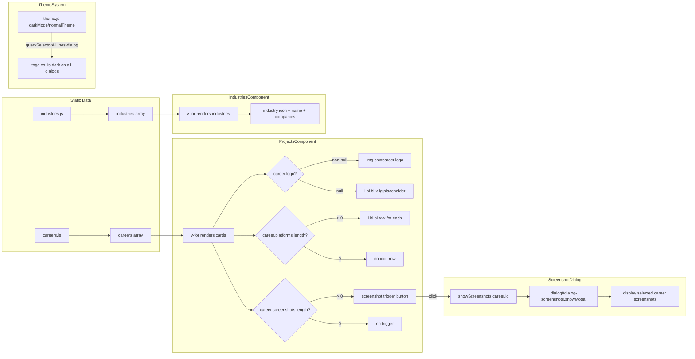

# Career History Re-design -- Design Document

## Overview

Re-design the "My Career History" dialog in the portfolio application to be data-driven with company logos, platform/language icons (Bootstrap Icons), a screenshot preview dialog, a new Industries section, WCAG 2 AA compliant logo variants for light/dark mode, and a placeholder icon for missing logos. This replaces the current hardcoded HTML cards in `ProjectsComponent.vue` with a `v-for` loop over extracted career data.

## Design Summary (Meta)

```yaml
design_type: "extension"
risk_level: "medium"
complexity_level: "medium"
complexity_rationale: >
  (1) 6 distinct functional requirements (logos, platform icons, screenshot dialog,
  industries section, WCAG AA dual logos, placeholder icon) each with acceptance
  criteria spanning light/dark mode and mobile viewports.
  (2) New dependency (bootstrap-icons) introduces bundle size risk; new peer dialog
  pattern must coexist with existing dialog animation system; 100% test coverage
  floor must be maintained across 9 changed/new files.
main_constraints:
  - "100% test coverage floor (Vitest v2, lines/branches/functions/statements)"
  - "PR size <= 200 lines each"
  - "Options API only (no Composition API)"
  - "jQuery removed -- do not re-introduce"
  - "theme.js must remain unchanged"
biggest_risks:
  - "bootstrap-icons CSS bundle size (~280 KB total) may slow initial load"
  - "Existing test selectors (e.g., .card-img-top.placeholder) break when template changes"
unknowns:
  - "Visual clarity of each company logo on both backgrounds (logos are exempt from WCAG SC 1.4.3; SC 1.4.11 requires 3:1 for non-text elements)"
  - "Whether all company logos are available as SVG from companieslogo.com"
```

## Background and Context

### Prerequisite ADRs

- **ADR-0001-vue3-vite-migration.md**: Vue 3 + Vite foundation; Options API convention; jQuery removal; `theme.js` pattern for dark mode; dialog animation via CSS `[open]` selector
- **ADR-0002-career-history-redesign.md**: Bootstrap Icons CSS approach; peer dialog pattern; data extraction; WCAG AA dual logos; `bi-x-lg` placeholder; Options API consistency

### Agreement Checklist

#### Scope
- [x] Refactor `ProjectsComponent.vue` from hardcoded HTML to data-driven `v-for`
- [x] Extract career data to `src/data/careers.js`
- [x] Add company logo images with light/dark mode variants
- [x] Add platform/language icons using Bootstrap Icons CSS classes
- [x] Create screenshot peer `<dialog>` alongside `#dialog-projects`
- [x] Create `IndustriesComponent.vue` with industries data
- [x] Enable Industries button in `ProfileComponent.vue`
- [x] Add `bi-x-lg` placeholder when `career.logo` is `null`
- [x] Install `bootstrap-icons` dependency via pnpm

#### Non-Scope (Explicitly not changing)
- [x] `theme.js` -- unchanged; new dialogs auto-receive `.is-dark` via existing `querySelectorAll`
- [x] `SpotifyComponent.vue` -- no changes
- [x] `LoaderComponent.vue` -- no changes
- [x] `App.vue` -- no changes
- [x] `visualizer.js` -- no changes
- [x] `main.js` -- no changes (bootstrap-icons CSS imported via SCSS, not JS)
- [x] Existing dialog open animation (`_animations.css`) -- unchanged; new dialogs inherit it
- [x] Backend / API integration -- no backend exists; data is static JS

#### Constraints
- [x] Parallel operation: No -- sequential feature PRs on `feature/41-my-career-history-re-design` branch
- [x] Backward compatibility: Not required -- feature branch targets `develop`
- [x] Performance measurement: Noted -- bootstrap-icons bundle size should be measured in build output
- [x] Test coverage: Must maintain 100% lines/branches/functions/statements
- [x] PR size: Each PR <= 200 lines

#### Agreement Reflection in Design
- [x] Data extraction (PR 1) reflected in "Data Modules" section
- [x] Bootstrap Icons install (PR 1) reflected in "Dependencies" section
- [x] Logo assets (PR 2) reflected in "Logo Strategy" section
- [x] Template refactor (PR 3) reflected in "Component Architecture" section
- [x] Screenshot dialog (PR 4) reflected in "Screenshot Dialog" section
- [x] Industries (PR 5) reflected in "IndustriesComponent" section
- [x] Mobile polish (PR 6) reflected in "Responsive Design" section
- [x] No design contradicts agreements -- confirmed

#### Applicable Standards

- [x] Vue 3 Options API `[implicit]` -- Evidence: all 4 SFCs use `export default { name, components, methods, data }` pattern -- Confirmed: Yes
- [x] NES.css dialog pattern `[implicit]` -- Evidence: `#dialog-projects`, `#dialog-spotify` both use `<dialog class="nes-dialog">` with `<form method="dialog">` -- Confirmed: Yes
- [x] ESLint `plugin:vue/vue3-recommended` + `plugin:security/recommended-legacy` `[explicit]` -- Source: `.eslintrc.json` -- Confirmed: Yes
- [x] SCSS 7-layer architecture `[explicit]` -- Source: `src/assets/scss/main.scss` (abstracts, vendors, base, layout, components, pages, themes) -- Confirmed: Yes
- [x] pnpm package manager `[explicit]` -- Source: `CLAUDE.md`, `pnpm-lock.yaml` -- Confirmed: Yes
- [x] Vite environment variables (`import.meta.env`) `[explicit]` -- Source: `CLAUDE.md` -- Confirmed: Yes (no env vars introduced in this feature)
- [x] `window.open` with `noopener,noreferrer` for external links `[implicit]` -- Evidence: `ProjectsComponent.vue:135`, `ProfileComponent.vue:101` -- Confirmed: Yes
- [x] Dark mode via `.is-dark` class toggled by `theme.js` `[implicit]` -- Evidence: `theme.js:5-6`, `_projects.scss:91` -- Confirmed: Yes

#### Quality Assurance Mechanisms

- [x] **ESLint** -- Enforces: Vue 3 best practices + security rules -- Config: `.eslintrc.json` -- Covers: `src/**/*.{js,vue}` -- Status: `adopted`
- [x] **Vitest v2 with coverage thresholds** -- Enforces: 95% lines/branches/functions (config) but project maintains 100% -- Config: `vite.config.js:56-58` -- Covers: `src/**/*.{js,vue}` excluding tests and service worker -- Status: `adopted`
- [x] **Autoprefixer** -- Enforces: CSS vendor prefixes for browserslist -- Config: `package.json:36-38` -- Covers: all CSS output -- Status: `adopted`
- [x] **Sass quietDeps** -- Enforces: suppression of Bootstrap deprecation warnings -- Config: `vite.config.js:47` -- Covers: SCSS compilation -- Status: `noted (non-blocking warnings, no action needed)`

### Problem to Solve

The career history section has no visual company branding, no technology indicators, no screenshot preview, hardcoded HTML that resists data changes, a disabled Industries button, no WCAG AA logo compliance, and no graceful fallback for missing logos.

### Current Challenges

1. **Hardcoded HTML**: 6 active career cards are raw HTML in `ProjectsComponent.vue` template (120+ lines); a 7th (PayMaya) is commented out
2. **No company identity**: Cards show only project screenshots as CSS background-images
3. **Disabled feature**: Industries button exists in `ProfileComponent.vue:40` but is permanently disabled
4. **No detail view**: Screenshot background-images are small; no way to enlarge
5. **Dark mode gaps**: Card images have no dark-mode-specific alternatives
6. **Test fragility**: Tests select by CSS class (`.card-img-top.placeholder`, `.card-img-top.chatgenie`) which are tightly coupled to hardcoded template structure

### Requirements

#### Functional Requirements

1. **FR-1**: Display company logos on each career card
2. **FR-2**: Display platform/language icons below each card title using Bootstrap Icons
3. **FR-3**: Provide a screenshot dialog that opens from a career card while the careers dialog remains open
4. **FR-4**: Create a separate Industries section accessible via the Industries button
5. **FR-5**: Company logos must be WCAG 2 AA compliant in both light and dark mode
6. **FR-6**: When a company logo is missing (`null`), show a Bootstrap Icons `bi-x-lg` cross as placeholder

#### Non-Functional Requirements

- **Performance**: Bootstrap Icons CSS + webfont must add < 500 KB to production build
- **Maintainability**: Adding a new career entry must require only a data file change, not template modification
- **Reliability**: All 6 active career cards must remain functional after refactoring
- **Testability**: 100% coverage maintained; new components and data modules fully tested

## Acceptance Criteria (AC) -- EARS Format

### FR-1: Company Logos

- [ ] **AC-1.1**: Each career card shall display a company logo image when `career.logo` is a non-null file path
- [ ] **AC-1.2**: **If** `career.logo` is `null`, **then** the card shall display a `bi-x-lg` Bootstrap Icons cross icon as placeholder
- [ ] **AC-1.3**: **While** dark mode is active, the card shall display `career.logoDark` when it is non-null, falling back to `career.logo`

### FR-2: Platform/Language Icons

- [ ] **AC-2.1**: Each career card shall display one or more platform/language icons below the card title, rendered using Bootstrap Icons CSS classes from `career.platforms` array
- [ ] **AC-2.2**: **If** `career.platforms` is an empty array, **then** no icon row shall be rendered for that card

### FR-3: Screenshot Dialog

- [ ] **AC-3.1**: **When** a user clicks the screenshot trigger on a career card that has `career.screenshots.length > 0`, the system shall open a peer `<dialog>` containing the screenshot images
- [ ] **AC-3.2**: The screenshot dialog shall be a sibling element to `#dialog-projects`, not nested inside it
- [ ] **AC-3.3**: The screenshot dialog shall receive `.is-dark` class automatically via `theme.js` when dark mode is active
- [ ] **AC-3.4**: **If** `career.screenshots` is an empty array, **then** no screenshot trigger shall be rendered on that card

### FR-4: Industries Section

- [ ] **AC-4.1**: **When** the user clicks the Industries button in the profile section, the system shall open an industries dialog
- [ ] **AC-4.2**: The industries dialog shall display each industry with its icon and the names of associated companies
- [ ] **AC-4.3**: The Industries button shall no longer have the `is-disabled` class

### FR-5: WCAG AA Logo Compliance

- [ ] **AC-5.1**: Company logo images shall be provided in variants optimized for visual clarity on light background (#fff) and dark background (#212529). Note: logos are exempt from WCAG SC 1.4.3 (text contrast); for non-text graphical elements, SC 1.4.11 requires a minimum 3:1 contrast ratio. The dual-logo approach is a best practice for visual clarity, not a strict WCAG requirement.
- [ ] **AC-5.2**: **While** dark mode is active, the system shall switch to the dark-mode logo variant

### FR-6: Missing Logo Placeholder

- [ ] **AC-6.1**: **If** a career entry has `logo: null`, **then** the system shall render `<i class="bi bi-x-lg"></i>` in the logo position
- [ ] **AC-6.2**: The placeholder icon shall inherit text color from the parent for automatic light/dark mode support

## Existing Codebase Analysis

### Implementation Path Mapping

| Type | Path | Description |
|------|------|-------------|
| Existing | `src/components/ProjectsComponent.vue` (142 lines) | 6 active career cards (1 commented out) in `<dialog id="dialog-projects">` |
| Existing | `src/assets/scss/components/_projects.scss` (116 lines) | CSS background-image per card class, dark mode block |
| Existing | `src/components/ProfileComponent.vue` (124 lines) | Industries button disabled, imports ProjectsComponent |
| Existing | `src/theme.js` (15 lines) | Dark mode toggle via `querySelectorAll('.nes-dialog')` / `querySelectorAll('.nes-container')` |
| Existing | `src/main.js` (45 lines) | App entry; imports `nes.css`, `theme.js`, `visualizer.js` |
| Existing | `src/assets/scss/main.scss` (22 lines) | SCSS partials import manifest |
| Existing | `src/assets/scss/themes/_default.scss` (262 lines) | Dialog sizing, `.is-dark` link colors, `.nes-btn` styles |
| Existing | `src/assets/scss/base/_animations.css` (20 lines) | `dialog.nes-dialog[open]` animation |
| Existing | `src/tests/ProjectsComponent.spec.js` (83 lines) | 8 tests total (6 per-card + 2 structural), selects by CSS class |
| Existing | `src/tests/ProfileComponent.spec.js` (107 lines) | Tests for dialog open, button clicks |
| New | `src/data/careers.js` | Career data array export |
| New | `src/data/industries.js` | Industries data array export |
| New | `src/components/IndustriesComponent.vue` | Industries dialog component |
| New | `src/assets/scss/components/_industries.scss` | Industries dialog styling |
| New | `src/tests/careers.spec.js` | Unit tests for careers data shape |
| New | `src/tests/industries.spec.js` | Unit tests for industries data shape |
| New | `src/tests/IndustriesComponent.spec.js` | Component tests for industries dialog |
| New | `public/img/logos/` | Company logo assets directory |

### Integration Points (Include even for new implementations)

- **Integration Target**: `ProfileComponent.vue` -- Industries button enable + `showIndustries` method
- **Invocation Method**: `v-on:click="showIndustries"` on Industries button; `document.getElementById('dialog-industries').showModal()`
- **Integration Target**: `theme.js` -- Automatic `.is-dark` on new dialogs
- **Invocation Method**: No code change; `querySelectorAll('.nes-dialog')` already selects all dialogs in DOM
- **Integration Target**: `_animations.css` -- Open animation on new dialogs
- **Invocation Method**: No code change; `dialog.nes-dialog[open]` selector matches any `.nes-dialog` dialog when opened
- **Integration Target**: `_default.scss` -- Dialog sizing rules (`#dialog-projects, #dialog-spotify`)
- **Invocation Method**: Add `#dialog-screenshots`, `#dialog-industries` to existing selector list

### Code Inspection Evidence

| File/Function | Relevance |
|---------------|-----------|
| `src/components/ProjectsComponent.vue:1-142` | Primary refactoring target; hardcoded career cards; `goToUrl()` and `alert()` methods |
| `src/components/ProjectsComponent.vue:134` | `goToUrl(url)` -- pattern reference for external link handling |
| `src/components/ProfileComponent.vue:104-116` | `showProjects()` / `showSpotify()` -- pattern reference for dialog open methods |
| `src/components/ProfileComponent.vue:40` | Industries button with `is-disabled` class -- integration point |
| `src/components/SpotifyComponent.vue:21-43` | Existing peer dialog pattern reference (`<dialog class="nes-dialog" id="dialog-spotify">`) |
| `src/theme.js:1-15` | Dark mode toggle -- confirms `querySelectorAll` approach auto-applies to new dialogs |
| `src/assets/scss/components/_projects.scss:24-55` | Per-card background-image rules -- will be replaced by logo `` tags |
| `src/assets/scss/components/_projects.scss:91-115` | Dark mode block -- will be simplified after logo refactor |
| `src/assets/scss/themes/_default.scss:130-170` | Dialog sizing responsive rules -- must be extended for new dialogs |
| `src/assets/scss/base/_animations.css:6-8` | Dialog open animation -- confirms new dialogs auto-inherit |
| `src/tests/ProjectsComponent.spec.js:1-83` | Existing test selectors -- must be updated when template changes |
| `src/tests/ProfileComponent.spec.js:38-43` | Industries button test gap -- currently no test for Industries button |
| `public/img/projects/` | Existing screenshot images -- 5 PNG files |

### Similar Functionality Search

**Search performed**: Grep for "industries", "career", "company", "logo", "icon" across `src/`

- **`careers` / `career`**: No existing data module found. Only hardcoded in `ProjectsComponent.vue` template.
- **`industries`**: Only the disabled button text in `ProfileComponent.vue:40`. No component or data.
- **`logo`**: Only `profile-logo` in `ProfileComponent.vue:23` (site logo, unrelated).
- **`icon`**: Only `nes-icon` usage in `ProfileComponent.vue:51,58` (NES.css icons for LinkedIn/GitHub).
- **`bootstrap-icons`**: Not found in codebase. New dependency.

**Decision**: New implementation. No similar functionality exists to reuse.

## Design

### Change Impact Map

```yaml
Change Target: ProjectsComponent.vue (career card rendering)
Direct Impact:
  - src/components/ProjectsComponent.vue (template refactor to v-for + logo/icon rendering)
  - src/assets/scss/components/_projects.scss (remove per-card background-image rules)
  - src/components/ProfileComponent.vue (enable Industries button, import IndustriesComponent)
  - src/assets/scss/main.scss (add bootstrap-icons import, add _industries.scss import)
  - src/assets/scss/themes/_default.scss (extend dialog sizing selectors)
  - src/tests/ProjectsComponent.spec.js (update selectors for data-driven template)
  - src/tests/ProfileComponent.spec.js (add Industries button test)
Indirect Impact:
  - Build output size (bootstrap-icons webfont ~180 KB woff2)
  - public/img/ directory (new logos/ subdirectory)
No Ripple Effect:
  - src/theme.js (auto-selects new dialogs via querySelectorAll)
  - src/main.js (no changes)
  - src/visualizer.js (no changes)
  - src/App.vue (no changes)
  - src/components/SpotifyComponent.vue (no changes)
  - src/components/LoaderComponent.vue (no changes)
  - src/assets/scss/base/_animations.css (auto-applies to new dialogs)
  - src/registerServiceWorker.js (no changes)
```

### Interface Change Matrix

| Existing | New | Conversion Required | Compatibility Method |
|----------|-----|--------------------|--------------------|
| `ProjectsComponent` hardcoded cards | `ProjectsComponent` with `v-for` over `careers` | Yes | Data extraction; template rewrite; test selector update |
| Industries button `is-disabled` | Industries button `is-default` + `showIndustries()` | Yes | Remove `is-disabled`, add click handler |
| No screenshot dialog | `#dialog-screenshots` peer dialog | N/A (new) | New component section within ProjectsComponent |
| No industries dialog | `#dialog-industries` via IndustriesComponent | N/A (new) | New component |
| Per-card CSS `background-image` | `` tags or `<i>` placeholder | Yes | SCSS rule removal + template change |

### Architecture Overview

```mermaid
graph TD
    subgraph ProfileComponent
        A[Profile Buttons]
        B[Careers Button]
        C[Industries Button]
    end

    subgraph ProjectsComponent
        D[dialog#dialog-projects]
        E[v-for career in careers]
        F[Career Card]
        G[Logo / Placeholder]
        H[Platform Icons]
        I[Screenshot Trigger]
        J[dialog#dialog-screenshots]
    end

    subgraph IndustriesComponent
        K[dialog#dialog-industries]
        L[v-for industry in industries]
    end

    subgraph Data Layer
        M[src/data/careers.js]
        N[src/data/industries.js]
    end

    subgraph Theme System
        O[theme.js]
        P[querySelectorAll .nes-dialog]
    end

    B --> D
    C --> K
    D --> E
    E --> F
    F --> G
    F --> H
    F --> I
    I --> J
    E -.imports.-> M
    L -.imports.-> N
    O --> P
    P -.auto-applies .is-dark.-> D
    P -.auto-applies .is-dark.-> J
    P -.auto-applies .is-dark.-> K
```

### Data Flow



### Main Components

#### Data Module: `src/data/careers.js`

- **Responsibility**: Single source of truth for career entry data
- **Interface**: `export const careers = [...]` -- array of career objects
- **Dependencies**: None (pure data)

```js
// Career entry shape
{
  id: 'accenture',           // string, unique identifier
  company: 'Accenture',      // string, display name
  description: '',            // string, role description
  dates: '2022-present',     // string, date range
  url: 'https://accenture.com', // string|null, company URL
  imgClass: 'placeholder',   // string, legacy CSS class kept during PR 3 migration only; should be removed in a cleanup follow-up once card-img-top screenshots are replaced by inline images
  logo: null,                // string|null, light mode logo path
  logoDark: null,            // string|null, dark mode logo path
  platforms: ['bi-globe'],   // string[], full Bootstrap Icons class names with 'bi-' prefix (e.g., 'bi-globe', 'bi-phone')
  clickAction: 'url',        // 'url'|'alert', card click behavior
  alertMsg: null,            // string|null, alert message when clickAction='alert'
  screenshots: []            // string[], screenshot image paths
}
```

#### Data Module: `src/data/industries.js`

- **Responsibility**: Industry classification with company associations
- **Interface**: `export const industries = [...]` -- array of industry objects
- **Dependencies**: References `careers.js` entry IDs via `companyIds`

```js
// Industry entry shape
{
  name: 'Fintech',                    // string, industry name
  icon: 'bi-currency-exchange',       // string, Bootstrap Icons class
  companyIds: ['gcash-miniprogram', 'chatgenie'] // string[], references to career IDs
}
```

#### Component: `ProjectsComponent.vue` (refactored)

- **Responsibility**: Render career cards via `v-for`, manage screenshot dialog
- **Interface**: No props; imports `careers` from data module; exposes `goToUrl()`, `alert()`, `showScreenshots()`, `handleCardClick()` methods
- **Dependencies**: `src/data/careers.js`, Bootstrap Icons CSS

#### Component: `IndustriesComponent.vue` (new)

- **Responsibility**: Render industries dialog with industry cards
- **Interface**: No props; imports `industries` from data module and `careers` from careers module (to resolve company names from IDs)
- **Dependencies**: `src/data/industries.js`, `src/data/careers.js`, Bootstrap Icons CSS

#### Component: `ProfileComponent.vue` (modified)

- **Responsibility**: Existing; adds `showIndustries()` method and `IndustriesComponent` import
- **Interface**: Adds `showIndustries` method following `showSpotify`'s simpler pattern (`showModal()` only, no `scrollTo`, no `-is-open` class). Note: the `-is-open` class added in `showProjects` is dead code (no CSS references it for animation; `dialog[open]` attribute selector handles animations instead).
- **Dependencies**: `IndustriesComponent.vue` (new import)

### Data Representation Decision

| Criterion | Assessment | Reason |
|-----------|-----------|--------|
| Semantic Fit | No existing structure | No career/industry data structure exists in codebase |
| Responsibility Fit | N/A | New bounded context (career data) |
| Lifecycle Fit | N/A | Static data, loaded once at component mount |
| Boundary/Interop Cost | Low | Simple JS arrays, no serialization needed |

**Decision**: New structure -- no existing data structure exists for career or industry information. Plain JS arrays with object entries are the simplest representation matching the data-driven rendering need.

### Contract Definitions

#### careers.js Data Contract

```js
/**
 * @typedef {Object} Career
 * @property {string} id - Unique identifier (kebab-case)
 * @property {string} company - Display name
 * @property {string} description - Role/project description (may be empty)
 * @property {string} dates - Date range string
 * @property {string|null} url - External URL or null
 * @property {string} imgClass - Legacy CSS class for background-image; kept during PR 3 migration only, remove in cleanup follow-up once card-img-top screenshots are replaced by inline images
 * @property {string|null} logo - Light mode logo path relative to public/ or null
 * @property {string|null} logoDark - Dark mode logo path or null
 * @property {string[]} platforms - Full Bootstrap Icons class names with 'bi-' prefix (e.g., 'bi-globe', 'bi-phone'); rendered as `<i class="bi ${platform}"></i>`
 * @property {'url'|'alert'} clickAction - Card click behavior
 * @property {string|null} alertMsg - Alert message when clickAction is 'alert'
 * @property {string[]} screenshots - Screenshot image paths relative to public/
 */
```

#### industries.js Data Contract

```js
/**
 * @typedef {Object} Industry
 * @property {string} name - Industry display name
 * @property {string} icon - Bootstrap Icons class name
 * @property {string[]} companyIds - Array of career.id values
 */
```

### Data Contract

#### careers.js

```yaml
Input:
  Type: N/A (static export, no input)
  Preconditions: N/A
  Validation: Unit tests validate shape

Output:
  Type: Career[] (array of Career objects)
  Guarantees: Each entry has non-empty id, company, dates; platforms is always an array; screenshots is always an array
  On Error: N/A (static data, no runtime errors)

Invariants:
  - All career IDs are unique
  - clickAction is one of 'url' or 'alert'
  - If clickAction is 'url', url is non-null
  - If clickAction is 'alert', alertMsg is non-null
```

#### industries.js

```yaml
Input:
  Type: N/A (static export, no input)
  Preconditions: N/A
  Validation: Unit tests validate shape

Output:
  Type: Industry[] (array of Industry objects)
  Guarantees: Each entry has non-empty name and icon; companyIds references valid career IDs
  On Error: N/A

Invariants:
  - All companyIds reference existing career entry IDs
  - icon is a valid Bootstrap Icons class name
```

### SCSS Structure

#### Changes to `_projects.scss`

The per-card `.card-img-top.{class}` background-image rules (lines 32-54) are removed. Replaced by:

1. A `.career-logo` class for `` logo rendering
2. A `.career-logo-placeholder` class for the `bi-x-lg` icon
3. Dark mode `.is-dark` block simplified to handle logo swap and card body colors

#### New `_industries.scss`

```scss
#dialog-industries {
  max-width: 960px;

  .industry-card {
    margin-bottom: 1rem;
    text-align: center;

    .industry-icon {
      font-size: 2rem;
    }

    .industry-companies {
      font-size: 12px;
    }
  }

  &.is-dark {
    .industry-card {
      color: #fff;
    }
  }
}
```

#### Changes to `main.scss`

Add after existing component imports:

```scss
// In section 2 (Vendors) or at top of section 5 (Components):
@import "bootstrap-icons/font/bootstrap-icons.css";

// In section 5 (Components):
@import "components/industries";
```

#### Changes to `_default.scss`

Extend dialog sizing selectors:

```scss
// Line 130-131: add new dialog IDs
#dialog-projects,
#dialog-spotify,
#dialog-screenshots,
#dialog-industries {
  // existing responsive rules
}
```

### Integration Point Map

| Integration Point | Existing Component | Integration Method | Impact Level | Required Test Coverage |
|-------------------|-------------------|-------------------|-------------|----------------------|
| Career data import | `ProjectsComponent.vue` | ES module import | High (template rewrite) | Unit tests for data shape; component tests for rendered cards |
| Industries button enable | `ProfileComponent.vue:40` | Remove `is-disabled`, add `v-on:click` | Medium (UI behavior change) | Component test for button click opening dialog |
| Industries component mount | `ProfileComponent.vue` | Import + `components:{}` registration | Medium (new child component) | Component test for dialog render |
| Screenshot dialog open | `ProjectsComponent.vue` | New method `showScreenshots(careerId)` | Medium (new dialog) | Component test for dialog open |
| Dark mode on new dialogs | `theme.js` | Automatic via `querySelectorAll('.nes-dialog')` | Low (read-only) | Existing theme tests already cover querySelectorAll |
| Dialog animation on new dialogs | `_animations.css` | Automatic via `dialog.nes-dialog[open]` | Low (read-only) | Visual verification in browser |
| Dialog sizing | `_default.scss` | Extend CSS selector list | Low (additive CSS) | Visual verification in browser |
| Bootstrap Icons CSS | `main.scss` | SCSS `@import` | Medium (new dependency) | Build verification (icons render) |

#### Integration Boundary Contracts

| Boundary | Input | Output | On Error |
|----------|-------|--------|----------|
| `careers.js` to `ProjectsComponent` | N/A (import) | `Career[]` array (sync) | N/A (static data) |
| `industries.js` to `IndustriesComponent` | N/A (import) | `Industry[]` array (sync) | N/A (static data) |
| `ProfileComponent` to `IndustriesComponent` | Button click event | Dialog opens via `showModal()` (sync) | Guard: `if (!dialog) return` |
| `ProjectsComponent` to screenshot dialog | `showScreenshots(careerId)` call | Dialog opens with filtered screenshots (sync) | Guard: `if (!dialog) return`; empty screenshots array means no trigger rendered |
| `theme.js` to new dialogs | `querySelectorAll('.nes-dialog')` | `.is-dark` class toggled | No error case; returns empty NodeList if no dialogs found |

### Logo Strategy

Company logos are stored in `public/img/logos/`:

```
public/img/logos/
  chatgenie.svg       # light mode
  chatgenie-dark.svg  # dark mode (if needed)
  gcash-miniprogram.svg
  covemanila.svg
  mcdelivery.svg
  ...
```

**Logo rendering logic** (in template):

```html
<template v-if="career.logo">
  
  
</template>
<template v-else>
  <i class="bi bi-x-lg career-logo-placeholder"></i>
</template>
```

**Dark mode detection**: The component checks whether its parent dialog has the `.is-dark` class (applied automatically by `theme.js` via `querySelectorAll('.nes-dialog')`). A computed property or method checks `this.$el.closest('.nes-dialog')?.classList.contains('is-dark')` when rendering logo variants. This is simpler than a `MutationObserver` and matches the existing codebase pattern where `.is-dark` on the dialog is the single source of truth for dark mode. No modification to `theme.js` is needed.

### Screenshot Dialog Design

The screenshot dialog is a peer `<dialog>` element inside `ProjectsComponent.vue`, sibling to `#dialog-projects`:

```html
<dialog class="nes-dialog" id="dialog-screenshots">
  <form method="dialog">
    <h2 class="title">{{ selectedCareer.company }} Screenshots</h2>
    <div class="screenshot-gallery">
      
    </div>
    <menu class="dialog-menu">
      <button class="btn nes-btn is-primary is-block">Close</button>
    </menu>
  </form>
</dialog>
```

**State management**: `selectedCareer` is a `data()` property initialized to `{ company: '', screenshots: [] }`. When `showScreenshots(careerId)` is called, it finds the career by ID and sets `selectedCareer`.

### Responsive Design

Mobile responsive rules follow existing `sass-mq` breakpoint conventions:

- `smallest` to `mobile` (240-320px): Single column cards, smaller logos
- `smartphone` to `tablet` (360-740px): Two column cards
- `tablet` to `desktop` (740-980px): Three column cards
- `desktop`+ (980px+): Current layout preserved

### Error Handling

| Error Category | Example | Detection | Recovery Strategy | User Impact |
|---------------|---------|-----------|-------------------|-------------|
| Missing logo file | Logo path in data but file not in `public/img/logos/` | Browser 404 on `` | `` `@error` handler falls back to placeholder icon | User sees placeholder instead of broken image |
| Empty careers data | `careers` array is empty | `v-for` renders nothing | Show "No career entries" message | User sees informational message |
| Missing screenshot dialog | `document.getElementById('dialog-screenshots')` returns null | Guard clause `if (!dialog) return` | Silent no-op | No visible effect |
| Bootstrap Icons CSS not loaded | Webfont fails to download | Icons render as empty/squares | No recovery; degrade gracefully | Platform icons invisible; placeholder shows square instead of cross |

### Logging and Monitoring

- **Log events**: None required -- static portfolio with no server-side logging
- **Monitoring**: None -- no analytics or error tracking service
- **Sensitive data**: N/A -- no user data collected

## Implementation Plan

### Implementation Approach

**Selected Approach**: Vertical Slice (Feature-driven)

**Selection Reason**: Each PR delivers a complete, independently testable slice of functionality. The 6-PR split ensures each is under 200 lines, testable in isolation, and does not depend on parallel work. Each slice adds user-visible value (data extraction enables future PRs; icons add visual value; screenshot dialog adds interaction; industries adds a new section).

**Alternatives considered**:
- Horizontal Slice (foundation first): Would require implementing all data modules + all components + all SCSS before any visible result. Poor for incremental review.
- Hybrid: Unnecessary given the clean vertical decomposition along feature boundaries.

### Technical Dependencies and Implementation Order

#### Required Implementation Order

1. **PR 1: Data Extraction + Bootstrap Icons Install**
   - Technical Reason: `careers.js` and `industries.js` are imported by all subsequent components
   - Dependent Elements: PR 3, PR 4, PR 5 all import from these modules
   - Files: `src/data/careers.js`, `src/data/industries.js`, `package.json`, `pnpm-lock.yaml`, `src/tests/careers.spec.js`, `src/tests/industries.spec.js`
   - Verification: L2 (tests pass for data shape)

2. **PR 2: Bootstrap Icons CSS Import + Company Logo Assets**
   - Technical Reason: CSS must be available before components reference `bi-` classes; logos must exist before template renders `` tags
   - Prerequisites: PR 1 (bootstrap-icons installed)
   - Files: `src/assets/scss/main.scss`, `public/img/logos/*`, logo verification in browser
   - Verification: L3 (build succeeds with icons CSS)

3. **PR 3: Refactor ProjectsComponent to v-for + Icons + Logo Placeholder**
   - Technical Reason: Core template refactor; depends on careers data (PR 1) and icons CSS (PR 2)
   - Prerequisites: PR 1, PR 2
   - Files: `src/components/ProjectsComponent.vue`, `src/assets/scss/components/_projects.scss`, `src/tests/ProjectsComponent.spec.js`
   - Verification: L1 (career cards render correctly with logos and icons in browser)

4. **PR 4: Screenshot Peer Dialog**
   - Technical Reason: Depends on refactored template (PR 3) for screenshot trigger integration
   - Prerequisites: PR 3
   - Files: `src/components/ProjectsComponent.vue` (add dialog + method), `src/assets/scss/components/_projects.scss` (screenshot styles), `src/assets/scss/themes/_default.scss` (dialog sizing), `src/tests/ProjectsComponent.spec.js` (add screenshot tests)
   - Verification: L1 (screenshot dialog opens from card trigger)

5. **PR 5: IndustriesComponent + Wire Industries Button**
   - Technical Reason: Depends on industries data (PR 1) and icons CSS (PR 2); can parallelize with PR 3-4 but sequenced for PR size
   - Prerequisites: PR 1, PR 2
   - Files: `src/components/IndustriesComponent.vue`, `src/assets/scss/components/_industries.scss`, `src/assets/scss/main.scss`, `src/assets/scss/themes/_default.scss`, `src/components/ProfileComponent.vue`, `src/tests/IndustriesComponent.spec.js`, `src/tests/ProfileComponent.spec.js`
   - Verification: L1 (Industries button opens dialog with industry cards)

6. **PR 6: Mobile Responsiveness Polish**
   - Technical Reason: Final polish after all functional changes are in place
   - Prerequisites: PR 3, PR 4, PR 5
   - Files: `src/assets/scss/components/_projects.scss`, `src/assets/scss/components/_industries.scss`, `src/assets/scss/themes/_default.scss`
   - Verification: L1 (visual verification across breakpoints in browser)

### Migration Strategy

No backward compatibility required -- this is a feature branch targeting `develop`. The migration is:

1. Data extraction (PR 1) is additive -- no existing code changes
2. CSS import (PR 2) is additive -- no existing code changes
3. Template refactor (PR 3) is a breaking change to `ProjectsComponent.vue` but maintains identical rendered output
4. Screenshot dialog (PR 4) is additive to `ProjectsComponent.vue`
5. Industries (PR 5) changes `ProfileComponent.vue` (button enable + new import)
6. Mobile polish (PR 6) is CSS-only

## Security Considerations

- **Authentication & Authorization**: N/A -- static portfolio site with no user accounts
- **Input Validation**: N/A -- no user input collected; all data is static JS exports
- **Sensitive Data Handling**: N/A -- no sensitive data; company logos are publicly available assets
- **External Links**: All `window.open` calls use `noopener,noreferrer` (existing pattern, preserved)

## Test Boundaries

### Mock Boundary Decisions

| Component/Dependency | Mock? | Rationale |
|---------------------|-------|-----------|
| `window.open` | Yes | jsdom does not implement; already mocked in `setup.js` |
| `window.alert` | Yes | jsdom alert is no-op; spy needed to verify calls |
| `HTMLDialogElement.showModal()` | Yes | jsdom does not implement `showModal`; mock per test |
| `HTMLDialogElement.scrollTo()` | Yes | jsdom does not implement `scrollTo`; mock per test |
| `document.body.classList` | No | jsdom implements `classList`; real implementation used |
| `careers.js` / `industries.js` | No | Static data; use real imports |
| Bootstrap Icons CSS | N/A | CSS not testable in jsdom; verify in browser |

### Data Layer Testing Strategy

- **Schema dependencies**: N/A -- no database; static JS data modules
- **Test data approach**: Real `careers.js` and `industries.js` imports; tests validate data shape
- **Mock limitations acknowledged**: Cannot verify Bootstrap Icons webfont rendering in jsdom

### Integration Verification Points

- `ProjectsComponent` renders correct number of cards from `careers` data
- `IndustriesComponent` resolves company names from `careers.js` via `companyIds`
- Industries button in `ProfileComponent` calls `showModal()` on `#dialog-industries`
- Screenshot trigger only appears on cards with `screenshots.length > 0`
- Dark mode class toggle applies to new dialogs (verified by checking `querySelectorAll` returns new elements)

## Verification Strategy

### Correctness Proof Method

- **Correctness definition**: All 6 active career cards render with identical information (company name, description, dates, external URL, alert behavior) after refactoring to `v-for`; new features (logos, icons, screenshot dialog, industries) render correctly in both light and dark mode
- **Verification method**: (1) Unit tests comparing rendered card count and content against `careers.js` data. (2) Visual browser comparison of before/after screenshots. (3) 100% test coverage maintained.
- **Verification timing**: After PR 3 (core refactor) -- this is the first PR that changes rendered output

### Early Verification Point

- **First verification target**: PR 3 (refactored ProjectsComponent) -- renders all 6 active career cards from `careers.js` data with identical text content to current hardcoded cards
- **Success criteria**: (1) All existing `ProjectsComponent.spec.js` tests pass (updated selectors). (2) Rendered card count equals `careers.length`. (3) Each card shows correct company name, dates, and link behavior. (4) `pnpm run test` reports 100% coverage.
- **Failure response**: If card content diverges from current implementation, compare `careers.js` data against hardcoded template values and fix data before proceeding to PR 4-6

### Output Comparison (Replacing Existing Behavior)

- **Comparison input**: Current hardcoded template renders 6 active cards (PayMaya is commented out) with specific company names, descriptions, dates, URLs, and alert messages
- **Expected output fields**: Card count (6), company name per card, date range per card, click behavior per card (URL or alert with specific message)
- **Diff method**: Vitest assertions comparing `wrapper.findAll('.card').length` (expected: 6), `wrapper.find('.card-title').text()`, and click handler behavior for each card against `careers.js` data values
- **Transformation pipeline coverage**: N/A -- no data transformation pipeline; direct data-to-template rendering

## Future Extensibility

- **Extension points**: `careers.js` data structure supports additional fields (e.g., `role`, `achievements`, `stack`) without template changes if `v-for` card template is kept generic
- **Known future requirements**: API-driven career data (currently static JS; could be fetched from CMS or GitHub API in future)
- **Intentional limitations**: No search/filter on career cards; no pagination; no sorting -- these are YAGNI for a portfolio with 6 entries

## Alternative Solutions

### Alternative 1: Keep Hardcoded HTML, Add Only Logos

- **Overview**: Keep current template structure; manually add `` logo tags to each hardcoded card
- **Advantages**: Smallest change surface; no data extraction needed; no new files
- **Disadvantages**: Does not solve maintainability (adding/removing entries still requires template changes); does not enable industries section; increases template size further; test selectors remain brittle
- **Reason for Rejection**: Does not address the core maintainability problem or the Industries feature requirement

### Alternative 2: Composition API Refactor + Data Extraction

- **Overview**: Refactor `ProjectsComponent` to use `<script setup>` with `ref()` and `computed()` while extracting data
- **Advantages**: Modern Vue 3 idiom; better TypeScript support in future; cleaner reactive state
- **Disadvantages**: Breaks consistency with all existing SFCs (Options API); larger change surface; per ADR-0001, existing components should remain Options API unless migration is justified
- **Reason for Rejection**: Options API consistency is more valuable than Composition API benefits for this scope

## Risks and Mitigation

| Risk | Impact | Probability | Mitigation |
|------|--------|-------------|------------|
| Bootstrap Icons CSS bundle too large | Medium | Low | Measure build output in PR 2; if >500 KB, fall back to individual SVG imports per ADR-0002 kill criteria |
| Company logos fail WCAG AA contrast | Medium | Medium | Manual contrast check per logo using WebAIM contrast checker; provide dual variants where needed |
| Existing tests break after template refactor | High | High | Update test selectors in same PR as template changes (PR 3); run full test suite before each PR |
| Two dialogs open simultaneously (projects + screenshot) causes z-index conflict | Low | Medium | Set explicit `z-index` on `#dialog-screenshots` higher than `#dialog-projects`; verify in browser |
| Parent dialog `.is-dark` class check may return stale value if called before `theme.js` toggles | Low | Low | Call dark mode check reactively on render; `theme.js` toggles `.is-dark` synchronously so the value is always current when the dialog is visible |
| Logo image 404 at runtime | Low | Medium | `` handler swaps to placeholder icon; test with missing file |

## References

- GitHub Issue #41: https://github.com/jcchikikomori/portfolio/issues/41
- ADR-0001 Vue 3 + Vite Migration: `docs/adr/ADR-0001-vue3-vite-migration.md`
- ADR-0002 Career History Redesign: `docs/adr/ADR-0002-career-history-redesign.md`
- Bootstrap Icons: https://icons.getbootstrap.com/
- Bootstrap Icons npm package: https://www.npmjs.com/package/bootstrap-icons
- WCAG 2 AA Contrast Requirements: https://www.w3.org/WAI/WCAG21/Understanding/contrast-minimum.html
- WebAIM Contrast Checker: https://webaim.org/resources/contrastchecker/
- HTML `<dialog>` element: https://html.spec.whatwg.org/multipage/interactive-elements.html#the-dialog-element
- companieslogo.com (logo source): https://companieslogo.com
- Vue 3 Options API: https://vuejs.org/api/options-state.html
- NES.css documentation: https://nostalgic-css.github.io/NES.css/
- sass-mq documentation: https://github.com/sass-mq/sass-mq

## Update History

| Date | Version | Changes | Author |
|------|---------|---------|--------|
| 2026-04-21 | 1.0 | Initial version | Claude (AI-assisted) |
| 2026-04-21 | 1.1 | Review fixes: card count 7->6, remove SCSS tilde, resolve platforms TBD, WCAG ratio correction, test count fix, showIndustries pattern, dark mode detection simplification, imgClass cleanup note | Claude (AI-assisted) |
