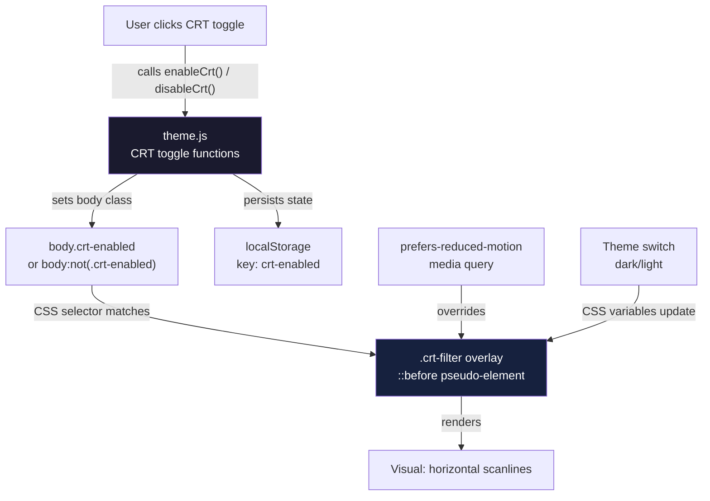

# Retro CRT Filter Design Document

## Overview

This document covers the design for a pure CSS retro CRT (Cathode Ray Tube)
scanline filter effect applied as a full-page overlay. The filter creates
horizontal scanlines characteristic of vintage CRT monitors, enhancing the retro
aesthetic of the portfolio. The implementation uses CSS pseudo-elements and
gradients, with a toggle switch integrated into the existing theme system for
seamless user control.

## Design Summary (Meta)

```yaml
design_type: 'new_feature'
risk_level: 'low'
complexity_level: 'medium'
complexity_rationale: |
  (1) Requirements/ACs: Multiple integration points (theme system, toggle UI, accessibility preferences), 
  state persistence across page reloads, and cross-browser CSS gradient compatibility necessitate medium complexity.
  (2) Constraints/Risks: Must maintain 100% test coverage, integrate with existing NES.css theme without visual 
  conflicts, and respect prefers-reduced-motion for accessibility.
main_constraints:
  - 'Pure CSS only — no canvas or WebGL per user constraint'
  - 'Scanlines only — no flicker, chromatic aberration, or curvature effects per
    user request'
  - '100% Vitest coverage floor must not regress (100%
    lines/branches/functions/statements)'
  - 'Must integrate with existing theme.js toggle system'
  - 'Must respect prefers-reduced-motion media query for accessibility'
  - 'Must work with both dark and light themes'
  - 'CSS-only solution using pseudo-elements (::before, ::after)'
biggest_risks:
  - 'CSS gradient performance on low-end devices (mitigated: using simple
    repeating-linear-gradient)'
  - 'Visual conflict with NES.css existing styles (mitigated: using
    pointer-events: none and proper z-index layering)'
  - 'Toggle state persistence across page reloads requires localStorage
    integration'
unknowns:
  - 'Optimal scanline density for different screen resolutions — must be
    verified visually after build'
  - 'Interaction with existing body.dark class — must verify no visual conflicts'
```

## Background and Context

### Prerequisite ADRs

- `docs/adr/ADR-0001-vue3-vite-migration.md` — Establishes Vite as the build
  tool, Vitest v2 as test runner, Bootstrap 5, and the CSS preprocessor
  pipeline. This Design Doc inherits those toolchain decisions.

No common ADR exists for CSS filter patterns or theme toggles in this project.
The feature introduces a new visual effect type (full-page overlay filter) that
is sufficiently distinct from existing patterns to warrant a standalone design
document.

### Agreement Checklist

#### Scope

- [x] Create `src/assets/scss/components/_crt.scss` — new CRT filter styles
      component
- [x] Modify `src/assets/scss/main.scss` — import CRT styles in the components
      section
- [x] Modify `src/App.vue` — add CRT overlay wrapper element
- [x] Modify `src/theme.js` — integrate CRT toggle functions with existing theme
      system
- [x] Create `src/tests/crt.spec.js` — unit tests for CRT toggle functionality

#### Non-Scope (Explicitly not changing)

- [x] No flicker effect — excluded per user request
- [x] No chromatic aberration — excluded per user request
- [x] No screen curvature effect — excluded per user request
- [x] No canvas-based implementation — excluded per user constraint
- [x] No changes to existing dialog animations (breathing-visualizer, nes-open)
- [x] No changes to ProfileComponent.vue, ProjectsComponent.vue, or other
      components
- [x] No changes to existing NES.css integration or overrides

#### Constraints

- [x] Parallel operation: Not applicable (filter is additive, toggleable
      overlay)
- [x] Backward compatibility: Required — filter defaults to off, no breaking
      changes to existing visual behavior
- [x] Performance measurement: Not required (CSS gradients are GPU-composited;
      no profiling threshold defined)
- [x] Accessibility: Required — must respect prefers-reduced-motion media query

#### Applicable Standards

- [x] SCSS component files placed in `src/assets/scss/components/` and imported
      via `main.scss` `[explicit]`
  - Source: `src/assets/scss/main.scss:18-23` —
    `@import "components/button", "components/card";` etc.
- [x] Component class naming uses BEM-like naming with component prefix
      `[implicit]`
  - Evidence: `src/assets/scss/components/_button.scss`, `_card.scss`,
    `_careers.scss` — all use `.component-name` prefix
  - Confirmed: Yes — new component will use `.crt-filter` prefix
- [x] Theme integration via body class toggling `[implicit]`
  - Evidence: `src/theme.js:2-15` — `document.body.classList.add("dark")` and
    `document.body.classList.remove("dark")`
  - Confirmed: Yes — CRT state will be managed via body class `crt-enabled`
- [x] Test files in `src/tests/` with `.spec.js` suffix `[explicit]`
  - Source: `src/tests/` directory — all test files use `.spec.js` suffix
  - Confirmed: Yes — `src/tests/crt.spec.js` follows this pattern
- [x] CSS custom properties for theming defined in `_root.scss` `[explicit]`
  - Source: `src/assets/scss/base/_root.scss` — comprehensive CSS variables for
    theming
  - Confirmed: Yes — CRT-related CSS variables will be added to `_root.scss` or
    kept local to `_crt.scss`
- [x] Reduced motion support via prefers-reduced-motion `[explicit]`
  - Source: `src/assets/scss/base/_root.scss:160-166` —
    `@media (prefers-reduced-motion: reduce)`
  - Confirmed: Yes — CRT filter will respect this media query

#### Quality Assurance Mechanisms

- [x] **Vitest v2** — Enforces: unit test suite (100% coverage) — Config:
      `vite.config.js:51-62` — Covers: `src/**/*.{js,vue}` — Status: `adopted`
      (run as `pnpm test`; must pass before merge)
- [x] **ESLint** (`plugin:vue/vue3-recommended` +
      `plugin:security/recommended-legacy`) — Enforces: Vue 3 template rules and
      Node.js security patterns — Config: `.eslintrc.json` — Covers:
      `src/**/*.{js,vue}` — Status: `adopted` (must pass with `pnpm run lint`)
- [x] **Prettier** — Enforces: code formatting consistency — Config:
      `.prettierrc.json` — Covers: `src/**/*.{js,vue,scss,css,json,md}` —
      Status: `adopted` (run as `pnpm run format:check`)
- [x] **Stylelint** — Enforces: SCSS/CSS standards — Config: `.stylelintrc.json`
      — Covers: `src/**/*.{scss,css}` — Status: `adopted` (SCSS changes must
      pass stylelint)
- [x] **Vite build** — Enforces: module graph correctness, SCSS compilation,
      asset bundling — Config: `vite.config.js` — Covers: entire `src/` tree —
      Status: `adopted` (run as `pnpm build`; must exit 0)
- [x] **Coverage thresholds** (`lines/branches/functions: 95`) — Config:
      `vite.config.js:58` — Covers: `src/**/*.{js,vue}` — Status: `adopted`
      (target is 100%; must verify with `pnpm test`)
- [x] **Browser visual QA** — Enforces: CSS filter renders correctly across
      themes — Config: manual — Covers: CRT toggle in light and dark modes —
      Status: `adopted` (required because jsdom cannot render CSS overlays;
      primary verification mechanism for visual correctness)

### Problem to Solve

The portfolio has a strong retro gaming aesthetic (NES.css library, pixel fonts,
8-bit styling) but lacks a unifying visual effect that ties the entire
experience together. A subtle CRT scanline filter would enhance the nostalgic
feel by simulating the look of vintage monitor displays, completing the retro
theme without interfering with content readability or usability.

### Current Challenges

- The theme system currently only manages dark/light mode; it needs extension to
  support an additional toggle state.
- The filter must work across all pages and components without requiring
  individual component modifications.
- The toggle switch must be discoverable but unobtrusive — bottom-right corner
  placement is specified.
- Accessibility requirements mandate that the effect can be disabled for users
  with motion sensitivity.
- CSS gradient performance varies across browsers; the implementation must use
  GPU-friendly techniques.

### Requirements

#### Functional Requirements

- FR-1: When enabled, the system shall display horizontal scanlines overlaid on
  the entire page content.
- FR-2: The scanlines shall maintain consistent visual density regardless of
  viewport size.
- FR-3: The system shall provide a toggle switch in the bottom-right corner to
  enable/disable the CRT filter.
- FR-4: The system shall persist the CRT filter state across page reloads using
  localStorage.
- FR-5: The filter shall be disabled by default on first visit.
- FR-6: The filter shall work correctly in both dark and light theme modes.
- FR-7: The filter shall not interfere with click interactions (buttons, links,
  form elements).
- FR-8: When the user has `prefers-reduced-motion: reduce` set, the system shall
  disable the CRT filter regardless of toggle state.

#### Non-Functional Requirements

- **Performance**: CSS gradients are GPU-composited; scanline overlay must not
  cause layout recalculation or jank.
- **Maintainability**: Single SCSS component file with clear CSS custom
  properties for easy adjustment.
- **Reliability**: Browsers without CSS gradient support receive no filter
  (graceful degradation); content remains fully usable.
- **Accessibility**: Respects prefers-reduced-motion; toggle is keyboard
  accessible; high contrast mode compatible.
- **Compatibility**: Targets evergreen browsers (Chrome 88+, Firefox 87+, Safari
  14+, Edge 88+), all of which have full `repeating-linear-gradient` support.

## Acceptance Criteria (AC) - EARS Format

### CRT Filter Functionality

- [ ] **AC-001**: **When** the user clicks the CRT toggle switch in the
      bottom-right corner, the system shall enable the scanline filter overlay
      on the entire page.
- [ ] **AC-002**: **When** the user clicks the CRT toggle switch again while the
      filter is enabled, the system shall disable the scanline filter overlay.
- [ ] **AC-003**: **While** the CRT filter is enabled, **when** the user reloads
      the page, the system shall restore the filter to the enabled state
      (persisted via localStorage).
- [ ] **AC-004**: **While** the user has `prefers-reduced-motion: reduce` set in
      their system preferences, the system shall disable the CRT filter
      regardless of toggle state.
- [ ] **AC-005**: **While** the CRT filter is enabled, the system shall allow
      normal interaction with all clickable elements (buttons, links, dialogs).
- [ ] **AC-006**: **While** the CRT filter is enabled in dark mode, the
      scanlines shall maintain appropriate contrast (darker lines on dark
      background).
- [ ] **AC-007**: **While** the CRT filter is enabled in light mode, the
      scanlines shall maintain appropriate contrast (lighter lines on light
      background).
- [ ] **AC-008**: **When** the user switches between dark and light themes,
      **while** the CRT filter is enabled, the system shall adjust scanline
      opacity automatically to maintain visibility.

### Visual Design

- [ ] **AC-009**: The CRT overlay shall use `pointer-events: none` to ensure
      click-through to underlying content.
- [ ] **AC-010**: The scanlines shall use `repeating-linear-gradient` for
      optimal GPU compositing.
- [ ] **AC-011**: The scanline density shall be approximately 4px spacing
      (configurable via CSS variable).
- [ ] **AC-012**: The toggle switch shall be positioned fixed in the
      bottom-right corner with adequate padding from viewport edges.

### Regression Non-Goals (explicitly out of AC scope)

- Exact scanline opacity values are implementation details; the observable
  criterion is "visible but not distracting" rather than specific alpha values.
- Toggle switch visual styling follows existing NES.css button patterns; exact
  pixel dimensions are design details.

## Existing Codebase Analysis

### Implementation Path Mapping

| Type                 | Path                                    | Description                                                          |
| -------------------- | --------------------------------------- | -------------------------------------------------------------------- |
| New (create)         | `src/assets/scss/components/_crt.scss`  | CRT filter styles component with overlay and toggle styles           |
| Modify               | `src/assets/scss/main.scss:18-23`       | Add `@import "components/crt";` in components section                |
| Modify               | `src/App.vue:12-20`                     | Add CRT overlay div element and toggle button in template            |
| Modify               | `src/theme.js:1-16`                     | Add CRT toggle functions and integrate with existing theme system    |
| New (create)         | `src/tests/crt.spec.js`                 | Unit tests for CRT toggle functionality and localStorage persistence |
| Existing (read-only) | `src/assets/scss/base/_root.scss:1-166` | CSS custom properties including reduced-motion support               |
| Existing (read-only) | `src/assets/scss/themes/_default.scss`  | Theme-specific overrides and base styles                             |
| Existing (read-only) | `src/tests/setup.js:1-30`               | Test setup with matchMedia mock for prefers-reduced-motion testing   |

### Integration Points

- **Integration Target**: Theme system in `src/theme.js` and body class
  management
- **Invocation Method**:
  - CSS overlay: Applied via `body.crt-enabled .crt-filter` selector
  - Toggle functions: `enableCrt()` and `disableCrt()` exported from `theme.js`
  - State persistence: `localStorage.setItem('crt-enabled', 'true'/'false')`
  - Initialization: Called on app mount to restore saved state

### Code Inspection Evidence

| File                                      | Line(s) | Relevance                                                                               |
| ----------------------------------------- | ------- | --------------------------------------------------------------------------------------- |
| `src/theme.js`                            | 1-16    | Target file for CRT toggle integration; existing darkMode/normalTheme pattern to follow |
| `src/App.vue`                             | 12-20   | Target template for CRT overlay wrapper and toggle button placement                     |
| `src/assets/scss/main.scss`               | 18-23   | Import location for new `_crt.scss` component                                           |
| `src/assets/scss/base/_root.scss`         | 160-166 | Reduced-motion media query pattern to replicate for CRT filter                          |
| `src/assets/scss/components/_button.scss` | 1-33    | Component SCSS file pattern to follow for `_crt.scss`                                   |
| `src/tests/setup.js`                      | 1-16    | matchMedia mock for testing prefers-reduced-motion behavior                             |
| `src/tests/theme.spec.js`                 | 1-45    | Existing theme test pattern to follow for CRT tests                                     |
| `src/tests/App.spec.js`                   | 1-25    | App.vue test pattern to extend for CRT overlay testing                                  |

### Fact Disposition Table

No Codebase Analysis input (`focusAreas`) was provided for this session. The
table below is populated from the manual investigation above as a completeness
record.

| Fact ID | Focus Area                        | Disposition | Rationale                                                                          | Evidence                                  |
| ------- | --------------------------------- | ----------- | ---------------------------------------------------------------------------------- | ----------------------------------------- |
| FA-001  | `theme.js` existing functions     | preserve    | `darkMode()` and `normalTheme()` must remain unchanged; CRT functions are additive | `src/theme.js:1-16`                       |
| FA-002  | `body.dark` class pattern         | preserve    | Dark mode toggle mechanism unchanged; CRT uses separate `crt-enabled` class        | `src/theme.js:2-3`                        |
| FA-003  | `localStorage` not currently used | transform   | Add localStorage persistence for CRT state (new pattern for this codebase)         | N/A — new functionality                   |
| FA-004  | `prefers-reduced-motion` support  | preserve    | `_root.scss` already implements this; CRT must respect it                          | `src/assets/scss/base/_root.scss:160-166` |
| FA-005  | NES.css integration               | preserve    | Existing NES.css usage unchanged; CRT overlay must not conflict                    | `package.json:22` — nes.css dependency    |
| FA-006  | Test coverage 100%                | preserve    | All existing tests must pass; new CRT tests must achieve 100% coverage             | `vite.config.js:58` — coverage thresholds |

## Design

### Change Impact Map

```yaml
Change Target: CRT Filter Feature
Direct Impact:
  - src/assets/scss/components/_crt.scss (new file — CRT styles component)
  - src/assets/scss/main.scss (add import for crt component)
  - src/App.vue (add CRT overlay element and toggle button)
  - src/theme.js (add CRT toggle functions and localStorage integration)
  - src/tests/crt.spec.js (new file — CRT functionality tests)
Indirect Impact:
  - All page content receives CRT overlay when enabled (via body.crt-enabled
    selector)
  - Toggle button appears in bottom-right corner of all pages (via App.vue)
No Ripple Effect:
  - ProfileComponent.vue (no changes required)
  - ProjectsComponent.vue (no changes required)
  - SpotifyComponent.vue (no changes required)
  - CareersComponent.vue (no changes required)
  - Existing dialog animations (nes-open, breathing-visualizer unchanged)
  - Existing theme dark/light toggle (unchanged)
  - vite.config.js (no build config changes required)
  - package.json (no dependency changes required)
```

### Interface Change Matrix

| Existing Operation             | New Operation             | Conversion Required | Adapter Required | Compatibility Method                                       |
| ------------------------------ | ------------------------- | ------------------- | ---------------- | ---------------------------------------------------------- |
| Theme system (dark/light only) | Theme system + CRT toggle | No                  | Not Required     | Additive functions in theme.js; no changes to existing API |
| App.vue (no overlay)           | App.vue + CRT overlay div | No                  | Not Required     | Additive template element; no breaking changes             |
| No CRT state persistence       | localStorage persistence  | No                  | Not Required     | New localStorage key `crt-enabled`; defaults to disabled   |

### Architecture Overview



The CRT filter is a CSS-only overlay that responds to body class state managed
by JavaScript toggle functions. State persistence ensures the user's preference
survives page reloads. Accessibility is handled via CSS media query override.

### Data Flow

```
User clicks CRT toggle
  → App.vue toggle handler
    → theme.js enableCrt() / disableCrt()
      → document.body.classList.add/remove("crt-enabled")
        → localStorage.setItem("crt-enabled", "true"/"false")
      → Browser CSS engine matches body.crt-enabled .crt-filter
        → Applies ::before pseudo-element with repeating-linear-gradient
          → Scanline overlay renders at full viewport coverage
      → prefers-reduced-motion: reduce media query
        → Overrides display to none (accessibility)

Page load / reload
  → App.vue mounted hook
    → initCrt()
      → localStorage.getItem("crt-enabled")
        → If "true": enableCrt()
        → If "false" or null: disableCrt() (default)
      → Check window.matchMedia("(prefers-reduced-motion: reduce)")
        → If matches: force disableCrt() (accessibility override)
```

### Integration Points List

| Integration Point      | Location                       | Old Implementation | New Implementation                              | Switching Method         | Verification Method                                  |
| ---------------------- | ------------------------------ | ------------------ | ----------------------------------------------- | ------------------------ | ---------------------------------------------------- |
| CRT overlay visibility | `body.crt-enabled .crt-filter` | No overlay         | Full-page scanline overlay via `::before`       | Body class toggle        | Visual QA: enable/disable toggle and observe overlay |
| Toggle button          | `App.vue`                      | No toggle          | NES-style button in bottom-right corner         | Click event handler      | Click toggle and verify state change                 |
| State persistence      | `theme.js`                     | No persistence     | localStorage key `crt-enabled`                  | localStorage API         | Reload page and verify state restoration             |
| Reduced motion support | `_crt.scss`                    | N/A                | `@media (prefers-reduced-motion: reduce)` block | CSS media query          | Test with system reduced-motion enabled              |
| Theme compatibility    | `_crt.scss`                    | N/A                | CSS variables for scanline colors               | Dark/light class on body | Verify visibility in both theme modes                |

### Main Components

#### `_crt.scss` — CRT Filter Styles

- **Responsibility**: Defines the visual appearance of the scanline overlay and
  toggle button positioning.
- **Interface**:

  ```scss
  // Overlay container
  .crt-filter {
    position: fixed;
    inset: 0;
    pointer-events: none;
    z-index: var(--z-crt-overlay, 9999);

    // Scanlines via pseudo-element
    &::before {
      content: '';
      position: absolute;
      inset: 0;
      background: repeating-linear-gradient(
        0deg,
        rgba(0, 0, 0, 0.15),
        rgba(0, 0, 0, 0.15) 1px,
        transparent 1px,
        transparent 4px
      );
    }
  }

  // Hidden by default, shown when enabled
  body:not(.crt-enabled) .crt-filter {
    display: none;
  }

  // Reduced motion override
  @media (prefers-reduced-motion: reduce) {
    .crt-filter {
      display: none !important;
    }
  }

  // Toggle button positioning
  .crt-toggle {
    position: fixed;
    bottom: 1rem;
    right: 1rem;
    z-index: var(--z-crt-toggle, 10000);
  }
  ```

- **Dependencies**: CSS custom properties from `_root.scss` for z-index values.

#### `theme.js` — CRT Toggle Functions

- **Responsibility**: Provides JavaScript API for enabling/disabling CRT filter
  and managing persistence.
- **Interface**:

  ```javascript
  const CRT_STORAGE_KEY = 'crt-enabled';

  export const enableCrt = () => {
    document.body.classList.add('crt-enabled');
    localStorage.setItem(CRT_STORAGE_KEY, 'true');
  };

  export const disableCrt = () => {
    document.body.classList.remove('crt-enabled');
    localStorage.setItem(CRT_STORAGE_KEY, 'false');
  };

  export const toggleCrt = () => {
    if (document.body.classList.contains('crt-enabled')) {
      disableCrt();
    } else {
      enableCrt();
    }
  };

  export const initCrt = () => {
    // Respect reduced-motion preference
    const prefersReducedMotion = window.matchMedia(
      '(prefers-reduced-motion: reduce)'
    ).matches;
    if (prefersReducedMotion) {
      disableCrt();
      return;
    }

    // Restore saved state or default to disabled
    const savedState = localStorage.getItem(CRT_STORAGE_KEY);
    if (savedState === 'true') {
      enableCrt();
    } else {
      disableCrt();
    }
  };
  ```

- **Dependencies**: Browser localStorage API, matchMedia API for
  prefers-reduced-motion.

#### `App.vue` — CRT Overlay Template

- **Responsibility**: Renders the CRT overlay element and toggle button in the
  application root.
- **Interface**:

  ```vue
  <template>
    <div id="app" class="app container">
      <!-- Existing content -->
      <div class="row -content">
        <div class="col-md-12">
          <ProfileComponent></ProfileComponent>
        </div>
      </div>

      <!-- CRT Filter Overlay -->
      <div class="crt-filter" aria-hidden="true"></div>

      <!-- CRT Toggle Button -->
      <button
        class="nes-btn is-default crt-toggle nes-pointer"
        @click="toggleCrt"
        aria-label="Toggle CRT filter"
        title="Toggle CRT filter"
      >
        <i class="nes-icon star"></i>
      </button>
    </div>
  </template>

  <script>
    import { enableCrt, disableCrt, toggleCrt, initCrt } from './theme.js';

    export default {
      name: 'App',
      // ... existing component registration
      methods: {
        toggleCrt() {
          toggleCrt();
        },
      },
      mounted() {
        initCrt();
      },
    };
  </script>
  ```

- **Dependencies**: `theme.js` CRT functions, NES.css button classes.

### Data Representation Decision

No new complex data structures are introduced. The CRT state is represented by:

1. **Body class** (`crt-enabled`): The source of truth for CSS overlay
   visibility
2. **localStorage key** (`crt-enabled`): Persistence layer for cross-session
   state
3. **Boolean values** (`'true'`/`'false'`): Simple string storage in
   localStorage

**Decision**: Use body class + localStorage string pattern — This aligns with
the existing codebase's preference for simple state management and matches the
theme.js pattern. No need for Pinia store or reactive state objects for this
feature.

### Contract Definitions

```
CRT State Contract:
  Source of Truth: document.body.classList.contains('crt-enabled')
  Persistence: localStorage.getItem('crt-enabled') returns 'true' | 'false' | null
  Default State: disabled (null or 'false')
  Accessibility Override: prefers-reduced-motion: reduce forces disabled state

  State Transitions:
    disabled → enableCrt() → enabled (body class added, localStorage set to 'true')
    enabled → disableCrt() → disabled (body class removed, localStorage set to 'false')
    any → initCrt() with reduced-motion → disabled (accessibility)
```

### Data Contract

#### CRT Toggle Function (`theme.js`)

```yaml
Input:
  Type: 'User click event or programmatic call'
  Preconditions: 'DOM must be ready; body element must exist'
  Validation: 'None required — idempotent operations'

Output:
  Type: 'Side effects only (DOM class, localStorage)'
  Guarantees: |
    "body.crt-enabled class reflects toggle state; 
    localStorage crt-enabled key persists state; 
    prefers-reduced-motion overrides to disabled"
  On Error: |
    "localStorage unavailable: still updates body class (graceful degradation); 
    DOM not ready: no-op (called after mount)"

Invariants:
  - "enableCrt() always adds body class and sets localStorage to 'true'"
  - "disableCrt() always removes body class and sets localStorage to 'false'"
  - 'toggleCrt() switches between states deterministically'
  - 'initCrt() respects reduced-motion and restores saved state'
```

### Field Propagation Map

Not applicable. No data fields cross component boundaries in this change. The
only state is the boolean CRT enabled state managed within theme.js and
reflected in the DOM body class.

### State Transitions and Invariants

```yaml
State Definition:
  - disabled: body does not have 'crt-enabled' class; overlay not visible
  - enabled: body has 'crt-enabled' class; overlay visible via CSS selector
  - reduced-motion-forced:
      overlay hidden regardless of saved preference (accessibility)

State Transitions:
  disabled → user clicks toggle → enabled enabled → user clicks toggle →
  disabled any → initCrt() with reduced-motion preference →
  reduced-motion-forced reduced-motion-forced → preference changes to
  no-preference → initCrt() restores saved state

System Invariants:
  - 'Body class is the single source of truth for visual state'
  - 'localStorage mirrors the body class state for persistence'
  - 'prefers-reduced-motion always takes precedence over saved preference'
  - 'Default state on first visit is disabled'
```

### UI Error State Design

| Component     | Normal State                  | Reduced Motion Override                                    | localStorage Unavailable                      |
| ------------- | ----------------------------- | ---------------------------------------------------------- | --------------------------------------------- |
| CRT Overlay   | Visible when enabled          | Always hidden                                              | Still toggles via body class (no persistence) |
| Toggle Button | Active state reflects overlay | Active state reflects saved preference, but overlay hidden | Works normally (no persistence)               |

### Client State Design

| State Category            | State                                            | Management Method  | Sync Strategy                         |
| ------------------------- | ------------------------------------------------ | ------------------ | ------------------------------------- |
| CRT enabled/disabled      | `crt-enabled` body class                         | theme.js functions | localStorage persistence on change    |
| Reduced motion preference | `matchMedia('(prefers-reduced-motion: reduce)')` | Browser API        | Checked on init and preference change |
| Saved CRT preference      | localStorage `crt-enabled` key                   | localStorage API   | Read on init, written on toggle       |

### Error Handling

| Error Category            | Example                               | Detection                           | Recovery Strategy                                                    | User Impact                                      |
| ------------------------- | ------------------------------------- | ----------------------------------- | -------------------------------------------------------------------- | ------------------------------------------------ |
| localStorage unavailable  | Private browsing mode, quota exceeded | try/catch around localStorage calls | Graceful degradation — body class still updates, state not persisted | Filter works during session but resets on reload |
| DOM not ready             | initCrt() called before mount         | Check document.body exists          | No-op (function should only be called after mount)                   | None — correct usage prevents this               |
| CSS not loaded            | Network issue, build error            | Visual inspection                   | Fallback to no filter (overlay hidden by default)                    | No filter visible, content still usable          |
| Reduced motion preference | User accessibility setting            | matchMedia query                    | Force disable filter                                                 | Filter hidden, user preference respected         |

### Logging and Monitoring

Not applicable. CRT filter is a client-side visual-only feature with no server
communication or analytics requirements.

## Implementation Plan

### Implementation Approach

**Selected Approach**: Vertical slice with dependency order — foundation
(styles) → integration (template) → functionality (JS) → verification (tests).

**Selection Reason**:

- The change has clear dependencies: styles must exist before template elements
  reference them; template must exist before JavaScript can manipulate DOM;
  tests verify the complete integration.
- This is a new feature that adds capability rather than modifying existing
  complex logic, so a single vertical slice through all layers is appropriate.
- The horizontal slice approach (all styles, then all templates, then all JS)
  would delay the first working integration point too long.

### Technical Dependencies and Implementation Order

#### Step 1: Create `_crt.scss` with overlay and toggle styles

- **Technical Reason**: CSS foundation must exist before template references the
  classes.
- **Dependent Elements**: Step 2 (App.vue template), Step 3 (visual
  verification)
- **Deliverable**: `src/assets/scss/components/_crt.scss` with `.crt-filter`,
  `.crt-toggle`, and reduced-motion support

#### Step 2: Update `main.scss` to import CRT component

- **Technical Reason**: SCSS must be compiled into the build.
- **Dependent Elements**: Step 3 (visual verification depends on styles being in
  build)
- **Deliverable**: `@import "components/crt";` added to `main.scss` components
  section

#### Step 3: Modify `App.vue` to add overlay and toggle

- **Technical Reason**: DOM elements must exist before JavaScript can manipulate
  them.
- **Dependent Elements**: Step 4 (theme.js functions), Step 5 (initCrt call)
- **Deliverable**: `.crt-filter` div and `.crt-toggle` button added to App.vue
  template; `toggleCrt` method added

#### Step 4: Add CRT functions to `theme.js`

- **Technical Reason**: JavaScript API for toggle functionality.
- **Dependent Elements**: Step 5 (initCrt call in mounted hook)
- **Deliverable**: `enableCrt()`, `disableCrt()`, `toggleCrt()`, `initCrt()`
  functions exported from theme.js

#### Step 5: Add initCrt() call in App.vue mounted hook

- **Technical Reason**: Restore saved state on app load.
- **Dependent Elements**: Step 6 (test verification)
- **Deliverable**: `initCrt()` called in `mounted()` lifecycle hook

#### Step 6: Build verification (`pnpm build`)

- **Technical Reason**: Confirms SCSS compilation succeeds and Vite bundles
  correctly.
- **Prerequisites**: Steps 1-5 complete.
- **Success Criteria**: Build exits 0, no SCSS compilation errors

#### Step 7: Test suite verification (`pnpm test --coverage`)

- **Technical Reason**: Confirms 100% coverage maintained and all tests pass.
- **Prerequisites**: Steps 1-5 complete.
- **Success Criteria**: All existing tests pass, coverage thresholds met

#### Step 8: Create `crt.spec.js` unit tests

- **Technical Reason**: New functionality requires test coverage.
- **Prerequisites**: Steps 4-5 complete (functions must exist to test).
- **Deliverable**: `src/tests/crt.spec.js` with tests for
  enable/disable/toggle/init functions and localStorage persistence

#### Step 9: Browser visual QA

- **Technical Reason**: CSS overlay and toggle positioning can only be verified
  visually.
- **Prerequisites**: Steps 6-7 complete (working build and tests).
- **Success Criteria**:
  - Toggle appears in bottom-right corner
  - Clicking toggle enables/disables scanlines
  - Scanlines visible in both dark and light themes
  - Reduced-motion preference disables filter

### Migration Strategy

Not applicable. This is an additive feature. The CRT filter defaults to disabled
and does not alter existing behavior. No migration steps are required for users.

## Security Considerations

- **Authentication & Authorization**: N/A — CSS-only visual feature; no new
  entry points or resource access.
- **Input Validation**: N/A — no user-controlled input is processed by this
  feature beyond the toggle click.
- **Sensitive Data Handling**: N/A — no data is read from or written to
  sensitive sources. localStorage key `crt-enabled` stores only a boolean
  preference string (`'true'`/`'false'`), not user data.

## Test Boundaries

### Mock Boundary Decisions

| Component/Dependency                | Mock?          | Rationale                                                                               |
| ----------------------------------- | -------------- | --------------------------------------------------------------------------------------- |
| localStorage                        | Yes            | jsdom supports localStorage but should be isolated per test; mock to ensure clean state |
| matchMedia (prefers-reduced-motion) | Already mocked | `src/tests/setup.js:4-16` provides base mock; extend for reduced-motion testing         |
| DOM body classList                  | No             | jsdom provides full DOM API; test actual class manipulation                             |
| CSS overlay rendering               | Not mockable   | jsdom does not render CSS; visual verification is manual QA path                        |

### Data Layer Testing Strategy

N/A — this feature has no data layer dependencies beyond localStorage
(client-side storage only).

### Integration Verification Points

- **Vitest suite** (all tests): Verify existing JS/Vue behavior is unbroken. Run
  with `pnpm test`.
- **CRT-specific tests**: Verify toggle functions, localStorage persistence, and
  reduced-motion handling. Run with `pnpm test src/tests/crt.spec.js`.
- **Vite build**: Verify SCSS compiles and CSS is emitted. Run with
  `pnpm build`.
- **Browser visual QA** (Chromium + Firefox): Verify overlay renders correctly
  per AC-001 through AC-012.

## Verification Strategy

### Correctness Proof Method

- **Correctness definition**:
  - The CRT toggle enables/disables scanline overlay visible across the entire
    page.
  - The state persists across page reloads via localStorage.
  - The filter is disabled when prefers-reduced-motion is set.
  - The filter works in both dark and light themes.
  - All existing tests pass at 100% coverage; new CRT tests achieve 100%
    coverage.
- **Verification method**:
  1. `pnpm build` exits 0 (SCSS compiled without error).
  2. `pnpm test --coverage` exits 0, all tests pass, coverage thresholds met.
  3. Browser QA: open `vite preview` in Chromium and Firefox; click toggle and
     observe scanline overlay; verify persistence across reload; verify
     reduced-motion disables filter.
- **Verification timing**: After all implementation steps complete, before
  raising a PR.

### Early Verification Point

- **First verification target**: `pnpm build` exits 0 after creating `_crt.scss`
  and updating `main.scss`.
- **Success criteria**: No Sass/Vite compilation error; CSS output contains
  `.crt-filter` rules.
- **Failure response**: Inspect SCSS syntax — likely a missing semicolon or
  incorrect gradient syntax; fix and re-run build before proceeding.

### Output Comparison (When Replacing or Modifying Existing Behavior)

N/A — this design introduces entirely new behavior. No existing CRT filter is
replaced or modified. The existing theme system, dialog animations, and
component styles are unchanged (disposition: preserve for all existing focus
areas).

## Future Extensibility

- **Extension points**:
  - Scanline density, opacity, and color are CSS variables that can be made
    configurable via a settings panel.
  - Additional retro effects (flicker, chromatic aberration, screen curvature)
    can be added as separate optional filters.
  - The toggle button pattern can be reused for other theme enhancements (e.g.,
    pixel font toggle, background pattern toggle).
- **Known future requirements**: None identified. User has explicitly excluded
  flicker and chromatic aberration.
- **Intentional limitations**:
  - Scanlines only (no curvature) keeps the effect subtle and content-readable.
  - CSS-only approach limits effect complexity but ensures broad browser
    compatibility and performance.
  - Fixed toggle position (bottom-right) is a deliberate UX choice for
    consistency.

## Alternative Solutions

### Alternative 1: Canvas-based Filter

- **Overview**: Use HTML5 Canvas with `requestAnimationFrame` to draw scanlines
  programmatically.
- **Advantages**: More control over effect parameters; can add curvature,
  flicker, and distortion effects.
- **Disadvantages**: Violates user constraint ("pure CSS, no canvas"); higher
  CPU/GPU usage; more complex code; requires canvas sizing and resize handling;
  interferes with click events unless carefully managed.
- **Reason for Rejection**: Explicitly ruled out by user constraint.

### Alternative 2: SVG Filter

- **Overview**: Use SVG `<filter>` with `<feTurbulence>` or custom patterns for
  scanlines.
- **Advantages**: Vector-based, scales perfectly; can create more organic retro
  effects.
- **Disadvantages**: More complex markup; SVG filters have varying browser
  support and performance characteristics; overkill for simple horizontal lines.
- **Reason for Rejection**: CSS gradients are simpler, better supported, and
  sufficient for the requirement (horizontal scanlines only).

### Alternative 3: Multiple Pseudo-elements

- **Overview**: Use both `::before` (scanlines) and `::after` (vignette or
  additional effects) on the overlay.
- **Advantages**: Can layer multiple effects without additional DOM elements.
- **Disadvantages**: More complex CSS; current requirement only needs scanlines;
  can be added later if needed.
- **Reason for Rejection**: YAGNI — single `::before` pseudo-element is
  sufficient for current scope.

### Alternative 4: Separate Toggle Component

- **Overview**: Create a dedicated `CrtToggle.vue` component instead of inline
  in App.vue.
- **Advantages**: Better separation of concerns; reusable if multiple toggle
  locations needed.
- **Disadvantages**: Overkill for a single button; adds component file and
  import complexity; current scope only needs one toggle location.
- **Reason for Rejection**: Single toggle button in App.vue is simpler and
  sufficient for this feature scope.

## Risks and Mitigation

| Risk                                               | Impact                         | Probability                                                                         | Mitigation                                                                                            |
| -------------------------------------------------- | ------------------------------ | ----------------------------------------------------------------------------------- | ----------------------------------------------------------------------------------------------------- |
| CSS gradient performance issues on low-end devices | Medium (jank, battery drain)   | Low (repeating-linear-gradient is GPU-optimized in modern browsers)                 | Use simple gradient pattern; add `will-change: transform` if needed; test on low-end device during QA |
| Visual conflict with NES.css existing styles       | Medium (unexpected rendering)  | Low (using pointer-events: none and high z-index ensures overlay doesn't interfere) | Visual QA in both themes; adjust opacity or z-index if conflicts found                                |
| Toggle button overlaps with existing UI elements   | Low (obscured content)         | Low (bottom-right corner is relatively empty in current design)                     | Visual QA; adjust position or padding if overlap detected                                             |
| localStorage quota exceeded                        | Low (persistence fails)        | Very Low (single boolean key uses negligible storage)                               | try/catch around localStorage calls; graceful degradation to session-only state                       |
| prefers-reduced-motion not detected correctly      | Medium (accessibility failure) | Low (matchMedia API is well-supported)                                              | Test with actual system preference changes; verify CSS media query override works                     |
| Scanlines too subtle or too prominent              | Low (poor UX)                  | Low (opacity and spacing are CSS variables, easily adjusted)                        | Visual QA with multiple users; adjust CSS variables for optimal visibility                            |

## References

- MDN Web Docs — `repeating-linear-gradient()`:
  https://developer.mozilla.org/en-US/docs/Web/CSS/gradient/repeating-linear-gradient
- MDN Web Docs — CSS `pointer-events`:
  https://developer.mozilla.org/en-US/docs/Web/CSS/pointer-events
- MDN Web Docs — `prefers-reduced-motion`:
  https://developer.mozilla.org/en-US/docs/Web/CSS/@media/prefers-reduced-motion
- MDN Web Docs — Web Storage API (localStorage):
  https://developer.mozilla.org/en-US/docs/Web/API/Web_Storage_API
- MDN Web Docs — `Window.matchMedia()`:
  https://developer.mozilla.org/en-US/docs/Web/API/Window/matchMedia
- NES.css library — GitHub: https://github.com/nostalgic-css/NES.css
- `docs/adr/ADR-0001-vue3-vite-migration.md` — Toolchain decisions (Vite, Vitest
  v2, Bootstrap 5, Node 22 LTS)
- `src/assets/scss/base/_root.scss` — CSS custom properties and reduced-motion
  support
- `src/theme.js` — Existing theme toggle pattern

## Update History

| Date       | Version | Changes         | Author               |
| ---------- | ------- | --------------- | -------------------- |
| 2026-04-22 | 1.0     | Initial version | John Cyrill Corsanes |
