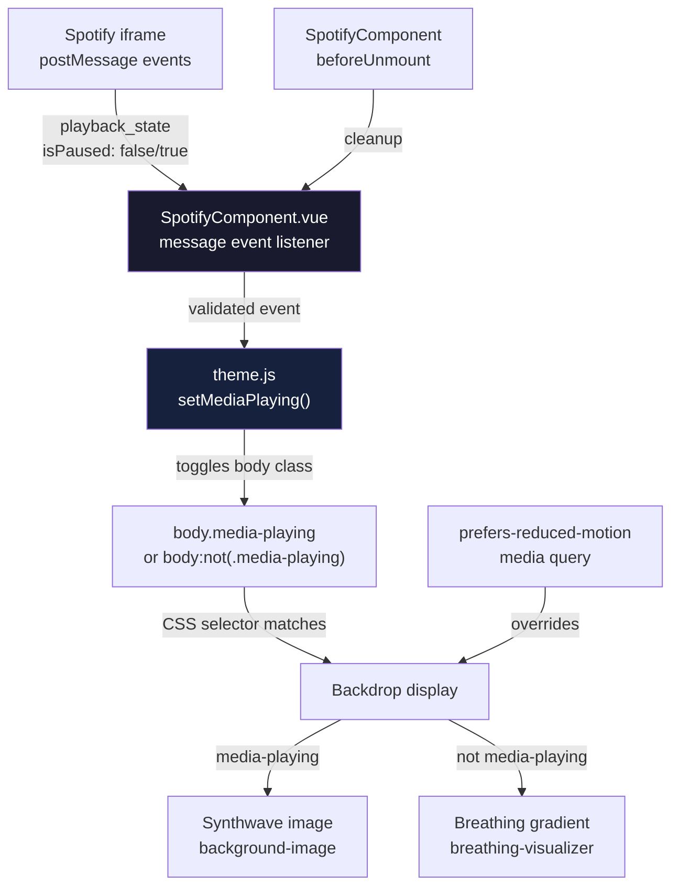

# Media Backdrop Feature Design Document

## Overview

This document covers the design for a dynamic global backdrop that changes when
Spotify music is playing. The feature uses the Spotify Embed API's postMessage
events to detect playback state and switches the page background from a
breathing gradient animation to a synthwave-themed image while music plays. The
backdrop persists even if the Spotify dialog is closed, creating an immersive
audio-visual experience.

## Design Summary (Meta)

```yaml
design_type: 'new_feature'
risk_level: 'medium'
complexity_level: 'medium'
complexity_rationale: |
  (1) Requirements/ACs: PostMessage API integration with cross-origin iframe, 
  state management that persists across component lifecycles, CSS background 
  transitions between gradient and image, and cross-browser event handling 
  necessitate medium complexity.
  (2) Constraints/Risks: Must maintain 100% test coverage, handle cross-origin 
  iframe communication securely, respect prefers-reduced-motion, and ensure 
  backdrop state correctly tracks even when dialog is closed.
main_constraints:
  - 'Use postMessage API for cross-origin Spotify iframe communication'
  - 'Global backdrop state must persist when Spotify dialog is closed'
  - 'Replace breathing-visualizer with synthwave image during playback'
  - '100% Vitest coverage floor must not regress (100%
    lines/branches/functions/statements)'
  - 'Options API pattern for Vue components (follow existing components)'
  - 'BEM naming for CSS classes'
  - '.is-dark class convention for dark mode'
  - 'Must respect prefers-reduced-motion media query'
  - 'Synthwave image must be at /public/img/large/synthwave-8493014.jpg'
biggest_risks:
  - 'Cross-origin iframe postMessage security (mitigated: origin validation
    required)'
  - 'Playback state desync between Spotify Embed and backdrop (mitigated: robust
    event handling)'
  - 'Memory leaks from event listeners (mitigated: proper cleanup in lifecycle
    hooks)'
  - 'Performance impact of background-image transitions (mitigated: CSS
    optimization)'
unknowns:
  - 'Optimal transition timing between gradient and image — must be verified
    visually'
  - 'How Spotify Embed API behaves with playlist autoplay — needs testing'
```

## Background and Context

### Prerequisite ADRs

- `docs/adr/ADR-0001-vue3-vite-migration.md` — Establishes Vite as the build
  tool, Vitest v2 as test runner, Bootstrap 5, and the CSS preprocessor
  pipeline.
- `docs/design/crt-filter-design.md` — Theme.js pattern reference for body class
  management and localStorage state persistence.

No common ADR exists for postMessage iframe communication or media playback
state management in this project. This feature introduces a new pattern for
cross-origin iframe event handling that warrants a standalone design document.

### Agreement Checklist

#### Scope

- [x] Modify `src/components/SpotifyComponent.vue` — Add postMessage event
      listeners for playback detection
- [x] Modify `src/theme.js` — Add media playback state management functions
- [x] Modify `src/assets/scss/base/_transitions.scss` — Add synthwave backdrop
      styles
- [x] Modify `src/visualizer.js` — Refactor to integrate with new playback state
      system
- [x] Create `src/tests/spotify-postmessage.spec.js` — Unit tests for
      postMessage handling
- [x] Create `src/tests/theme-media.spec.js` — Unit tests for media state
      management

#### Non-Scope (Explicitly not changing)

- [x] No changes to Spotify iframe URL or embed parameters
- [x] No changes to dialog open/close behavior
- [x] No changes to breathing-visualizer animation (still used when not playing)
- [x] No changes to existing dark mode toggle functionality
- [x] No changes to CRT filter functionality
- [x] No changes to ProfileComponent.vue, ProjectsComponent.vue, or
      CareersComponent.vue
- [x] No new external dependencies (postMessage is native browser API)

#### Constraints

- [x] Parallel operation: Not applicable (single playback state)
- [x] Backward compatibility: Required — feature works with existing
      visualizer.js
- [x] Performance measurement: Not required (CSS transitions are GPU-composited)
- [x] Accessibility: Required — must respect prefers-reduced-motion

#### Applicable Standards

- [x] Vue components use Options API `[explicit]`
  - Source: `src/components/ProfileComponent.vue:13-84`,
    `src/components/SpotifyComponent.vue:1-12`
  - Confirmed: Yes — existing components use Options API pattern
- [x] SCSS files placed in `src/assets/scss/` with partial naming `[explicit]`
  - Source: `src/assets/scss/base/_transitions.scss`,
    `src/assets/scss/components/_*.scss`
  - Confirmed: Yes — modify existing `_transitions.scss`
- [x] Theme integration via body class toggling `[implicit]`
  - Evidence: `src/theme.js:2-9` — `document.body.classList.add("dark")` and
    `.remove("dark")`
  - Confirmed: Yes — media playback state will use body class `media-playing`
- [x] BEM-like naming for CSS classes `[implicit]`
  - Evidence: `src/assets/scss/components/_button.scss`, `_card.scss` —
    `.component-name` prefix
  - Confirmed: Yes — new classes will follow `.media-backdrop` pattern
- [x] `.is-dark` class convention for dark mode `[explicit]`
  - Source: `CLAUDE.md` — "Use `.is-dark` class on the body element for dark
    mode styles"
  - Confirmed: Yes — synthwave backdrop will respect this convention
- [x] Test files in `src/tests/` with `.spec.js` suffix `[explicit]`
  - Source: `src/tests/` directory — all test files use `.spec.js` suffix
  - Confirmed: Yes — new test files will follow this pattern
- [x] Reduced motion support via prefers-reduced-motion `[explicit]`
  - Source: `src/assets/scss/base/_root.scss:160-166` —
    `@media (prefers-reduced-motion: reduce)`
  - Confirmed: Yes — backdrop transitions will respect this media query

#### Quality Assurance Mechanisms

- [x] **Vitest v2** — Enforces: unit test suite (100% coverage) — Config:
      `vite.config.js:51-62` — Covers: `src/**/*.{js,vue}` — Status: `adopted`
      (run as `pnpm test`; must pass before merge)
- [x] **ESLint** (`plugin:vue/vue3-recommended` +
      `plugin:security/recommended-legacy`) — Enforces: Vue 3 template rules and
      Node.js security patterns — Config: `.eslintrc.json` — Covers:
      `src/**/*.{js,vue}` — Status: `adopted` (must pass with `pnpm run lint`)
- [x] **Prettier** — Enforces: code formatting consistency — Config:
      `.prettierrc.json` — Covers: `src/**/*.{js,vue,scss,css,json,md}` —
      Status: `adopted` (run as `pnpm run format:check`)
- [x] **Stylelint** — Enforces: SCSS/CSS standards — Config: `.stylelintrc.json`
      — Covers: `src/**/*.{scss,css}` — Status: `adopted` (SCSS changes must
      pass stylelint)
- [x] **Vite build** — Enforces: module graph correctness, SCSS compilation,
      asset bundling — Config: `vite.config.js` — Covers: entire `src/` tree —
      Status: `adopted` (run as `pnpm build`; must exit 0)
- [x] **Coverage thresholds** (`lines/branches/functions: 95`) — Config:
      `vite.config.js:58` — Covers: `src/**/*.{js,vue}` — Status: `adopted`
      (target is 100%; must verify with `pnpm test`)
- [x] **Browser visual QA** — Enforces: backdrop renders correctly during
      playback — Config: manual — Covers: Synthwave image display and
      transitions — Status: `adopted` (required because jsdom cannot render CSS
      backgrounds; primary verification mechanism for visual correctness)

### Problem to Solve

The portfolio currently has a breathing gradient visualizer that activates based
on AudioContext state, but this doesn't work for cross-origin iframes like
Spotify Embed. Users want the background to change to a synthwave theme when
music is playing from the Spotify playlist, creating a more immersive experience
that reflects the retro aesthetic of the site.

### Current Challenges

- The existing `visualizer.js` uses `AudioContext` which cannot detect audio
  from cross-origin iframes due to browser security restrictions.
- Spotify Embed API requires postMessage communication to receive playback
  events.
- The backdrop state must persist even when the Spotify dialog is closed.
- CSS transitions between gradient animations and static images need to be
  smooth.
- Memory management is critical for event listeners attached to window messages.

### Requirements

#### Functional Requirements

- FR-1: When Spotify music starts playing, the system shall change the global
  backdrop to display the synthwave image.
- FR-2: When Spotify music stops/pauses, the system shall restore the breathing
  gradient visualizer.
- FR-3: The playback state shall be detected via Spotify Embed API postMessage
  events.
- FR-4: The backdrop state shall persist even if the Spotify dialog is closed.
- FR-5: The system shall handle cross-origin postMessage events securely with
  origin validation.
- FR-6: The synthwave backdrop shall work correctly in both dark and light
  themes.
- FR-7: The system shall clean up event listeners when the component is
  destroyed.
- FR-8: When the user has `prefers-reduced-motion: reduce` set, the system shall
  disable animated transitions.

#### Non-Functional Requirements

- **Performance**: CSS transitions are GPU-composited; backdrop change must not
  cause layout recalculation or jank.
- **Maintainability**: Clear separation between event handling
  (SpotifyComponent), state management (theme.js), and visual presentation
  (SCSS).
- **Reliability**: Robust error handling for postMessage parsing failures;
  graceful degradation if Spotify API changes.
- **Accessibility**: Respects prefers-reduced-motion; maintains sufficient color
  contrast in both backdrop modes.
- **Compatibility**: Targets evergreen browsers with full postMessage support
  (Chrome 60+, Firefox 54+, Safari 11+, Edge 79+).

## Acceptance Criteria (AC) - EARS Format

### Media Backdrop Functionality

- [ ] **AC-001**: **When** Spotify music starts playing, the system shall change
      the page backdrop to display the synthwave image at
      `/public/img/large/synthwave-8493014.jpg`.
- [ ] **AC-002**: **When** Spotify music pauses or stops, the system shall
      restore the breathing gradient visualizer backdrop.
- [ ] **AC-003**: **While** music is playing, **when** the user closes the
      Spotify dialog, the system shall continue displaying the synthwave
      backdrop.
- [ ] **AC-004**: **While** the Spotify dialog is open, **when** the user pauses
      playback and closes the dialog, the system shall restore the gradient
      backdrop.
- [ ] **AC-005**: **When** the user has `prefers-reduced-motion: reduce` set,
      the system shall disable CSS transition animations for backdrop changes.
- [ ] **AC-006**: **While** the synthwave backdrop is active in dark mode, the
      image shall be displayed with appropriate opacity/darkening.
- [ ] **AC-007**: **While** the synthwave backdrop is active in light mode, the
      image shall be displayed with appropriate opacity/lightening.
- [ ] **AC-008**: **When** the Spotify component is destroyed, the system shall
      clean up all postMessage event listeners.

### Spotify Embed Integration

- [ ] **AC-009**: **When** the Spotify iframe sends a playback update via
      postMessage, the system shall validate the event origin before processing.
- [ ] **AC-010**: **When** the Spotify iframe sends a valid playback_state event
      with `isPaused: false`, the system shall set the media-playing state to
      true.
- [ ] **AC-011**: **When** the Spotify iframe sends a valid playback_state event
      with `isPaused: true`, the system shall set the media-playing state to
      false.
- [ ] **AC-012**: **When** a malformed or non-Spotify postMessage is received,
      the system shall ignore it without error.

### Visual Design

- [ ] **AC-013**: The synthwave backdrop shall cover the entire viewport using
      `background-size: cover`.
- [ ] **AC-014**: The transition between gradient and synthwave backdrop shall
      use CSS transition with duration of 500ms.
- [ ] **AC-015**: The breathing-visualizer animation shall be paused when the
      synthwave backdrop is active.

### Regression Non-Goals (explicitly out of AC scope)

- Exact CSS transition timing values are implementation details; the observable
  criterion is "smooth transition" rather than specific millisecond values.
- Synthwave image opacity values are implementation details; the observable
  criterion is "visible but not distracting" in both themes.

## Existing Codebase Analysis

### Implementation Path Mapping

| Type                 | Path                                     | Description                                                |
| -------------------- | ---------------------------------------- | ---------------------------------------------------------- |
| Existing             | `src/components/SpotifyComponent.vue`    | Options API component with iframe, no postMessage handling |
| Modify               | `src/components/SpotifyComponent.vue`    | Add postMessage listener and playback state detection      |
| Existing             | `src/theme.js`                           | Theme functions with body class pattern                    |
| Modify               | `src/theme.js`                           | Add media playback state management functions              |
| Existing             | `src/visualizer.js`                      | AudioContext-based visualizer (commented out in component) |
| Modify               | `src/visualizer.js`                      | Refactor to work with new playback state system            |
| Existing             | `src/assets/scss/base/_transitions.scss` | Contains breathing-visualizer styles                       |
| Modify               | `src/assets/scss/base/_transitions.scss` | Add synthwave backdrop and media-playing styles            |
| New (create)         | `src/tests/spotify-postmessage.spec.js`  | Unit tests for postMessage event handling                  |
| New (create)         | `src/tests/theme-media.spec.js`          | Unit tests for media state management                      |
| Existing (read-only) | `public/img/large/synthwave-8493014.jpg` | Synthwave backdrop image asset                             |
| Existing (read-only) | `src/assets/scss/base/_root.scss`        | CSS custom properties and reduced-motion support           |
| Existing (read-only) | `src/tests/setup.js`                     | Test setup with matchMedia mock                            |

### Integration Points

- **Integration Target**: Spotify Embed iframe via postMessage API
- **Invocation Method**:
  - Playback detection: postMessage event listener on window
  - State management: body class `media-playing` toggled via theme.js functions
  - Visual presentation: CSS selectors based on body class

### Code Inspection Evidence

| File                                     | Line(s) | Relevance                                                                    |
| ---------------------------------------- | ------- | ---------------------------------------------------------------------------- |
| `src/components/SpotifyComponent.vue`    | 1-55    | Target for postMessage integration; Options API pattern to follow            |
| `src/theme.js`                           | 1-56    | Target for media state functions; existing body class pattern to follow      |
| `src/visualizer.js`                      | 1-22    | To be refactored; current AudioContext approach doesn't work with iframe     |
| `src/assets/scss/base/_transitions.scss` | 1-17    | Target for synthwave backdrop styles; breathing-visualizer pattern reference |
| `src/assets/scss/base/_root.scss`        | 160-182 | Reduced-motion media query pattern                                           |
| `src/tests/SpotifyComponent.spec.js`     | 1-56    | Existing SpotifyComponent test pattern to extend                             |
| `src/tests/theme.spec.js`                | 1-131   | Existing theme test pattern to follow for media state tests                  |
| `src/tests/setup.js`                     | 1-30    | matchMedia mock for reduced-motion testing                                   |

### Fact Disposition Table

| Fact ID | Focus Area                     | Disposition | Rationale                                                            | Evidence                                             |
| ------- | ------------------------------ | ----------- | -------------------------------------------------------------------- | ---------------------------------------------------- |
| FA-001  | SpotifyComponent.vue structure | preserve    | Component structure remains; only adding lifecycle hooks and methods | `src/components/SpotifyComponent.vue:1-55`           |
| FA-002  | Spotify iframe src             | preserve    | Spotify playlist URL unchanged                                       | `src/components/SpotifyComponent.vue:25`             |
| FA-003  | visualizer.js current approach | transform   | Replace AudioContext with postMessage-based playback detection       | `src/visualizer.js:1-22` — AudioContext insufficient |
| FA-004  | breathing-visualizer CSS class | preserve    | Class remains for non-playing state; new media-playing class added   | `src/assets/scss/base/_transitions.scss:12-16`       |
| FA-005  | theme.js body class pattern    | preserve    | Existing pattern extended for media-playing state                    | `src/theme.js:2-9`                                   |
| FA-006  | prefers-reduced-motion support | preserve    | Must be respected for backdrop transitions                           | `src/assets/scss/base/_root.scss:160-182`            |
| FA-007  | closeSpotify() method          | preserve    | Existing debug log remains; visualizerIsOff() call remains commented | `src/components/SpotifyComponent.vue:6-9`            |
| FA-008  | Options API pattern            | preserve    | New lifecycle hooks use Options API (mounted, beforeUnmount)         | `src/components/SpotifyComponent.vue:1-12`           |

## Design

### Change Impact Map

```yaml
Change Target: Media Backdrop Feature
Direct Impact:
  - src/components/SpotifyComponent.vue (add postMessage listener, playback
    detection)
  - src/theme.js (add media playback state management functions)
  - src/visualizer.js (refactor to integrate with playback state)
  - src/assets/scss/base/_transitions.scss (add synthwave backdrop styles)
  - src/tests/spotify-postmessage.spec.js (new file — postMessage tests)
  - src/tests/theme-media.spec.js (new file — media state tests)
Indirect Impact:
  - src/tests/SpotifyComponent.spec.js (existing tests may need update for
    lifecycle hooks)
  - src/tests/visualizer.spec.js (existing tests need update for new API)
  - All page content receives backdrop change when media plays (via
    body.media-playing selector)
No Ripple Effect:
  - ProfileComponent.vue (no changes required)
  - ProjectsComponent.vue (no changes required)
  - CareersComponent.vue (no changes required)
  - CRT filter functionality (no changes required)
  - Dark mode toggle (no changes required)
  - Dialog animations (nes-open, breathing-visualizer remain unchanged)
  - vite.config.js (no build config changes required)
  - package.json (no dependency changes required)
```

### Interface Change Matrix

| Existing Operation              | New Operation                    | Conversion Required | Adapter Required | Compatibility Method                             |
| ------------------------------- | -------------------------------- | ------------------- | ---------------- | ------------------------------------------------ |
| handlePlayback() (AudioContext) | handlePlayback() (postMessage)   | Yes                 | Not Required     | Refactor to use new playback state from theme.js |
| visualizerIsOn/Off()            | setMediaPlaying(true/false)      | Yes                 | Not Required     | Replace with theme.js state management functions |
| No postMessage handling         | Spotify postMessage listener     | No                  | Not Required     | Add new functionality to SpotifyComponent.vue    |
| No media state management       | Media playback state in theme.js | No                  | Not Required     | Add new functions to theme.js                    |

### Architecture Overview



The media backdrop uses a three-layer architecture:

1. **Event Layer**: SpotifyComponent listens for postMessage events from the
   iframe
2. **State Layer**: theme.js manages the media-playing state via body class
3. **Presentation Layer**: CSS applies the appropriate backdrop based on body
   class

### Data Flow

```
Spotify iframe sends postMessage
  → window receives message event
    → SpotifyComponent.vue message handler
      → Validates event.origin (https://open.spotify.com)
        → Parses event.data (JSON with playback_state)
          → Checks isPaused property
            → Calls theme.js setMediaPlaying(isPlaying)
              → document.body.classList.add/remove("media-playing")
                → Browser CSS engine matches body.media-playing
                  → Applies synthwave background-image
                → OR matches body:not(.media-playing)
                  → Applies breathing-visualizer gradient

SpotifyComponent beforeUnmount
  → Removes window message event listener
    → Prevents memory leaks and stale callbacks

Page load with no playback
  → body does not have media-playing class
    → breathing-visualizer gradient displayed (if previously active)
```

### Integration Points List

| Integration Point      | Location                         | Old Implementation        | New Implementation                      | Switching Method   | Verification Method                                       |
| ---------------------- | -------------------------------- | ------------------------- | --------------------------------------- | ------------------ | --------------------------------------------------------- |
| Playback state changes | `body.media-playing`             | No state management       | Body class toggled via theme.js         | Body class toggle  | Visual QA: play/pause Spotify and observe backdrop change |
| PostMessage listener   | `SpotifyComponent.vue`           | No listener               | window.addEventListener('message')      | Event callback     | Console logs or unit tests for event handling             |
| Event cleanup          | `SpotifyComponent.beforeUnmount` | No cleanup (no listener)  | window.removeEventListener('message')   | Vue lifecycle hook | Unit test: verify listener removed on unmount             |
| Visual backdrop        | `_transitions.scss`              | breathing-visualizer only | media-playing + breathing-visualizer    | CSS selector       | Visual QA: verify correct backdrop in both states         |
| Reduced motion support | `_transitions.scss`              | Standard transitions      | @media (prefers-reduced-motion: reduce) | CSS media query    | Test with system reduced-motion enabled                   |

### Main Components

#### `SpotifyComponent.vue` — PostMessage Event Handler

- **Responsibility**: Listen for Spotify Embed postMessage events and forward
  playback state to theme.js.
- **Interface**:

  ```vue
  <script>
    import { setMediaPlaying } from '@/theme.js';

    const SPOTIFY_ORIGIN = 'https://open.spotify.com';
    const SPOTIFY_EMBED_EVENT = 'playback_state';

    export default {
      name: 'SpotifyComponent',
      // ... existing component definition
      mounted() {
        this.setupPostMessageListener();
      },
      beforeUnmount() {
        this.removePostMessageListener();
      },
      methods: {
        closeSpotify() {
          console.debug('SpotifyComponent: Spotify dialog closed.');
        },
        setupPostMessageListener() {
          this.messageHandler = this.handlePostMessage.bind(this);
          window.addEventListener('message', this.messageHandler);
        },
        removePostMessageListener() {
          if (this.messageHandler) {
            window.removeEventListener('message', this.messageHandler);
            this.messageHandler = null;
          }
        },
        handlePostMessage(event) {
          // Security: validate origin
          if (event.origin !== SPOTIFY_ORIGIN) {
            return;
          }

          // Validate event data structure
          let data;
          try {
            data =
              typeof event.data === 'string'
                ? JSON.parse(event.data)
                : event.data;
          } catch (e) {
            // Malformed JSON, ignore
            return;
          }

          // Check for playback state events
          if (data && data.event === SPOTIFY_EMBED_EVENT) {
            const isPlaying = data.payload && !data.payload.isPaused;
            setMediaPlaying(isPlaying);
          }
        },
      },
    };
  </script>
  ```

- **Dependencies**: theme.js `setMediaPlaying()` function, Spotify Embed origin.

#### `theme.js` — Media Playback State Management

- **Responsibility**: Manage global media playback state via body class.
- **Interface**:

  ```javascript
  const MEDIA_PLAYING_CLASS = 'media-playing';

  /**
   * Set the global media playing state
   * @param {boolean} isPlaying - Whether media is currently playing
   */
  export const setMediaPlaying = (isPlaying) => {
    if (isPlaying) {
      document.body.classList.add(MEDIA_PLAYING_CLASS);
    } else {
      document.body.classList.remove(MEDIA_PLAYING_CLASS);
    }
  };

  /**
   * Get the current media playing state
   * @returns {boolean} True if media is playing
   */
  export const isMediaPlaying = () => {
    return document.body.classList.contains(MEDIA_PLAYING_CLASS);
  };

  /**
   * Toggle the media playing state
   */
  export const toggleMediaPlaying = () => {
    setMediaPlaying(!isMediaPlaying());
  };
  ```

- **Dependencies**: DOM body element.

#### `visualizer.js` — Refactored Visualizer

- **Responsibility**: Provide backward-compatible visualizer functions that
  integrate with new media state system.
- **Interface**:

  ```javascript
  import { setMediaPlaying } from './theme.js';

  // Legacy: visualizerIsOn/Off now delegate to media state
  export const visualizerIsOn = () => {
    setMediaPlaying(true);
  };

  export const visualizerIsOff = () => {
    setMediaPlaying(false);
  };

  // Legacy handlePlayback kept for compatibility
  // Note: AudioContext approach doesn't work with cross-origin iframes
  // New playback detection is handled by SpotifyComponent postMessage
  export const handlePlayback = () => {
    // This function is now a no-op for Spotify
    // Playback state is managed by postMessage events
    console.debug('handlePlayback: Deprecated, use postMessage detection');
  };
  ```

- **Dependencies**: theme.js `setMediaPlaying()` function.

#### `_transitions.scss` — Backdrop Styles

- **Responsibility**: Define visual styles for both backdrop states.
- **Interface**:

  ```scss
  // Breathing visualizer (default state)
  body.breathing-visualizer {
    background-image: linear-gradient(
      0deg,
      #4b4f18 0%,
      #212529 11%,
      #212529 28%,
      #212529 100%
    );
    transition: background-image 100ms ease-in-out;
    animation: breathing-visualizer 1100ms infinite ease-in-out;
  }

  // Synthwave backdrop (media playing state)
  body.media-playing {
    background-image: url('/img/large/synthwave-8493014.jpg');
    background-size: cover;
    background-position: center;
    background-repeat: no-repeat;
    transition: background-image 500ms ease-in-out;
    animation: none; // Stop breathing animation

    // Dark mode overlay for better contrast
    &.dark::before {
      content: '';
      position: fixed;
      inset: 0;
      background-color: rgba(0, 0, 0, 0.5);
      pointer-events: none;
      z-index: -1;
    }

    // Light mode overlay
    &:not(.dark)::before {
      content: '';
      position: fixed;
      inset: 0;
      background-color: rgba(255, 255, 255, 0.3);
      pointer-events: none;
      z-index: -1;
    }
  }

  // Reduced motion: disable transitions
  @media (prefers-reduced-motion: reduce) {
    body.media-playing,
    body.breathing-visualizer {
      transition: none;
    }
  }
  ```

- **Dependencies**: Synthwave image at
  `/public/img/large/synthwave-8493014.jpg`.

### Data Representation Decision

No new complex data structures are introduced. The media playback state is
represented by:

1. **Body class** (`media-playing`): The source of truth for visual state
2. **Boolean values** (isPlaying parameter): Simple boolean passed to
   setMediaPlaying

**Decision**: Use body class pattern — This aligns with the existing codebase's
preference for simple state management and matches the theme.js pattern used for
dark mode and CRT filter. No need for Pinia store or reactive state objects for
this binary state.

### Contract Definitions

```
Media Playback State Contract:
  Source of Truth: document.body.classList.contains('media-playing')
  Valid States: true (playing) | false (not playing)
  Default State: false (no media-playing class)
  Accessibility Override: prefers-reduced-motion: reduce disables transitions

  State Transitions:
    not playing → setMediaPlaying(true) → playing (body class added)
    playing → setMediaPlaying(false) → not playing (body class removed)
    playing → component destroyed → not playing (class removed on cleanup)

PostMessage Event Contract:
  Origin: https://open.spotify.com
  Event Format: JSON string or object with { event: 'playback_state', payload: { isPaused: boolean } }
  Validation: Must check event.origin before processing
  Error Handling: Malformed events are silently ignored
```

### Data Contract

#### setMediaPlaying Function (`theme.js`)

```yaml
Input:
  Type: boolean
  Preconditions: 'DOM must be ready; body element must exist'
  Validation: 'Coerced to boolean; truthy values enable, falsy disable'

Output:
  Type: 'Side effects only (DOM class manipulation)'
  Guarantees: |
    "body.media-playing class reflects playing state;
    when true: synthwave backdrop displayed;
    when false: breathing-visualizer displayed (if active)"
  On Error: |
    "DOM not ready: no-op (function should be called after mount);
    Missing body element: no-op (graceful degradation)"

Invariants:
  - 'setMediaPlaying(true) always adds body class'
  - 'setMediaPlaying(false) always removes body class'
  - 'Multiple calls with same value are idempotent'
```

#### PostMessage Handler (`SpotifyComponent.vue`)

```yaml
Input:
  Type: 'MessageEvent from window'
  Preconditions: |
    "Event.origin must be 'https://open.spotify.com';
    Event.data must be valid JSON or object with playback_state event"
  Validation: |
    "Origin validation: event.origin === 'https://open.spotify.com';
    Schema validation: data.event === 'playback_state' &&
    typeof data.payload.isPaused === 'boolean'"

Output:
  Type: 'Side effects only (calls setMediaPlaying)'
  Guarantees: |
    "When isPaused is false: calls setMediaPlaying(true);
    When isPaused is true: calls setMediaPlaying(false);
    Invalid events: silently ignored"
  On Error: |
    "Malformed JSON: silently ignored;
    Invalid origin: silently ignored;
    Missing payload: silently ignored"

Invariants:
  - 'Event listener is always cleaned up on component unmount'
  - 'Only events from spotify.com origin are processed'
  - 'Malformed events never cause uncaught exceptions'
```

### Field Propagation Map

Not applicable. No data fields cross component boundaries. The only state is the
boolean media-playing state managed within theme.js and reflected in the DOM
body class.

### State Transitions and Invariants

```yaml
State Definition:
  - not_playing:
      body does not have 'media-playing' class; synthwave backdrop not visible
  - playing: body has 'media-playing' class; synthwave backdrop visible

State Transitions:
  not_playing → Spotify playback starts → playing playing → Spotify playback
  pauses/stops → not_playing playing → SpotifyComponent unmounts → not_playing
  (cleanup) not_playing → page reload → not_playing (no persistence)

System Invariants:
  - 'Body class is the single source of truth for visual state'
  - 'Event listener is always cleaned up on component unmount'
  - 'Only validated Spotify postMessage events trigger state changes'
  - 'prefers-reduced-motion always takes precedence for transitions'
```

### UI Error State Design

| Component        | Normal State                  | Invalid postMessage                         | Component Unmounted                      |
| ---------------- | ----------------------------- | ------------------------------------------- | ---------------------------------------- |
| Backdrop Display | Shows correct backdrop        | No change (invalid events ignored)          | Defaults to not_playing (no memory leak) |
| Event Listener   | Active when component mounted | N/A (invalid events filtered, not an error) | Removed (no memory leak)                 |

### Client State Design

| State Category            | State                                            | Management Method      | Sync Strategy                                  |
| ------------------------- | ------------------------------------------------ | ---------------------- | ---------------------------------------------- |
| Media playing state       | `media-playing` body class                       | theme.js functions     | Synchronous DOM update on state change         |
| Reduced motion preference | `matchMedia('(prefers-reduced-motion: reduce)')` | Browser API            | CSS media query (no JS sync needed)            |
| Event listener reference  | `this.messageHandler` bound function             | Vue component instance | Created in mounted, destroyed in beforeUnmount |

### Error Handling

| Error Category          | Example                             | Detection                       | Recovery Strategy                                  | User Impact                                        |
| ----------------------- | ----------------------------------- | ------------------------------- | -------------------------------------------------- | -------------------------------------------------- |
| Malformed postMessage   | Invalid JSON, missing payload       | try/catch around JSON.parse     | Silently ignore event                              | None — invalid Spotify events are ignored          |
| Invalid event origin    | Message from non-Spotify origin     | event.origin validation         | Return early without processing                    | None — cross-origin messages are security-filtered |
| Missing event payload   | Event without playback_state data   | Schema validation (data.event)  | Return early without processing                    | None — incomplete events are ignored               |
| DOM not ready           | setMediaPlaying called before mount | Check document.body existence   | No-op (function should only be called after mount) | None — correct usage prevents this                 |
| Component unmount leak  | Listener not removed                | Proper cleanup in beforeUnmount | Remove listener in beforeUnmount lifecycle hook    | None — cleanup prevents memory leaks               |
| Reduced motion override | User accessibility preference       | matchMedia query                | CSS transitions disabled                           | Respects user preference                           |

### Logging and Monitoring

Not applicable. Media backdrop is a client-side visual-only feature with no
server communication or analytics requirements. Debug logging is used during
development:

- Console.debug on postMessage events (optional, can be removed for production)
- Console.debug in closeSpotify() method (already exists)

## Implementation Plan

### Implementation Approach

**Selected Approach**: Vertical slice with dependency order — foundation (CSS) →
integration (component) → functionality (event handling) → verification (tests).

**Selection Reason**:

- The change has clear dependencies: styles must exist before they can be
  applied; component template must exist before lifecycle hooks run; event
  handler must exist before it can process messages; tests verify the complete
  integration.
- This is a new feature that adds capability rather than modifying existing
  complex logic, so a single vertical slice through all layers is appropriate.
- The horizontal slice approach would delay the first working integration point
  too long and make debugging postMessage handling more difficult.

### Technical Dependencies and Implementation Order

#### Step 1: Update `_transitions.scss` with synthwave backdrop styles

- **Technical Reason**: CSS foundation must exist before component can reference
  classes.
- **Dependent Elements**: Step 2 (visual verification), Step 3 (component
  integration)
- **Deliverable**: `body.media-playing` styles with synthwave image and theme
  overlays

#### Step 2: Add media state functions to `theme.js`

- **Technical Reason**: State management API needed by component.
- **Dependent Elements**: Step 3 (SpotifyComponent integration)
- **Deliverable**: `setMediaPlaying()`, `isMediaPlaying()`,
  `toggleMediaPlaying()` functions

#### Step 3: Refactor `visualizer.js` to use new state management

- **Technical Reason**: Maintain backward compatibility for existing code.
- **Dependent Elements**: Step 5 (test verification)
- **Deliverable**: Updated visualizerIsOn/Off functions that delegate to
  theme.js

#### Step 4: Modify `SpotifyComponent.vue` with postMessage handling

- **Technical Reason**: Core feature implementation — event listening and
  playback detection.
- **Dependent Elements**: Step 5 (test verification), Step 6 (browser QA)
- **Deliverable**: mounted/beforeUnmount hooks, message handler with origin
  validation

#### Step 5: Update existing visualizer tests

- **Technical Reason**: Existing tests must pass with refactored visualizer.js.
- **Prerequisites**: Step 3 complete.
- **Deliverable**: Updated `src/tests/visualizer.spec.js` with new API

#### Step 6: Create `spotify-postmessage.spec.js` unit tests

- **Technical Reason**: New functionality requires test coverage.
- **Prerequisites**: Step 4 complete.
- **Deliverable**: Tests for message handler, origin validation, payload parsing

#### Step 7: Create `theme-media.spec.js` unit tests

- **Technical Reason**: New theme functions require test coverage.
- **Prerequisites**: Step 2 complete.
- **Deliverable**: Tests for setMediaPlaying, isMediaPlaying, toggleMediaPlaying

#### Step 8: Build verification (`pnpm build`)

- **Technical Reason**: Confirms SCSS compilation succeeds and Vite bundles
  correctly.
- **Prerequisites**: Steps 1-4 complete.
- **Success Criteria**: Build exits 0, no SCSS compilation errors

#### Step 9: Test suite verification (`pnpm test --coverage`)

- **Technical Reason**: Confirms 100% coverage maintained and all tests pass.
- **Prerequisites**: Steps 1-7 complete.
- **Success Criteria**: All existing tests pass, coverage thresholds met, new
  tests pass

#### Step 10: Browser visual QA

- **Technical Reason**: postMessage events and backdrop transitions can only be
  verified in a real browser.
- **Prerequisites**: Steps 8-9 complete (working build and tests).
- **Success Criteria**:
  - Play Spotify music and observe synthwave backdrop
  - Pause music and observe gradient restoration
  - Close dialog during playback, backdrop persists
  - Verify reduced-motion disables transitions
  - Verify both dark and light theme overlays

### Migration Strategy

Not applicable. This is an additive feature. The media backdrop defaults to not
playing and does not alter existing behavior. No migration steps are required.

## Security Considerations

- **Authentication & Authorization**: N/A — Feature processes public Spotify
  Embed events only; no authentication or authorization required.
- **Input Validation**: **Critical** — All postMessage events must be validated:
  - Check `event.origin` is exactly `'https://open.spotify.com'`
  - Parse event.data with try/catch to handle malformed JSON
  - Validate event schema (data.event === 'playback_state') before processing
  - Reject events without proper payload structure
- **Sensitive Data Handling**: N/A — No sensitive data is processed. Event
  payload contains only playback state (isPaused boolean), not user data.
- **Cross-Origin Security**: The implementation only processes messages from the
  expected Spotify origin. Malicious messages from other origins are silently
  ignored.

## Test Boundaries

### Mock Boundary Decisions

| Component/Dependency           | Mock?          | Rationale                                                                |
| ------------------------------ | -------------- | ------------------------------------------------------------------------ |
| window.postMessage             | Yes            | Cannot simulate cross-origin iframe in jsdom; mock MessageEvent dispatch |
| window.add/removeEventListener | No             | jsdom provides full DOM API; test actual listener management             |
| document.body.classList        | No             | jsdom provides full DOM API; test actual class manipulation              |
| matchMedia                     | Already mocked | `src/tests/setup.js:4-16` provides base mock                             |
| CSS backdrop rendering         | Not mockable   | jsdom does not render CSS; visual verification is manual QA path         |
| Spotify iframe                 | Yes            | Cannot load external iframe in test; mock postMessage source             |

### Data Layer Testing Strategy

N/A — this feature has no data layer dependencies beyond DOM manipulation
(client-side only).

### Integration Verification Points

- **Vitest suite** (all tests): Verify existing JS/Vue behavior is unbroken. Run
  with `pnpm test`.
- **SpotifyComponent tests**: Verify postMessage handling, origin validation,
  and lifecycle cleanup. Run with
  `pnpm test src/tests/spotify-postmessage.spec.js`.
- **Theme media tests**: Verify state management functions. Run with
  `pnpm test src/tests/theme-media.spec.js`.
- **Existing visualizer tests**: Verify backward compatibility. Run with
  `pnpm test src/tests/visualizer.spec.js`.
- **Vite build**: Verify SCSS compiles and CSS is emitted. Run with
  `pnpm build`.
- **Browser visual QA** (Chromium + Firefox): Verify backdrop renders correctly
  per AC-001 through AC-012.

## Verification Strategy

### Correctness Proof Method

- **Correctness definition**:
  - When Spotify music plays, the synthwave backdrop is displayed.
  - When Spotify music pauses/stops, the breathing gradient is restored.
  - The backdrop state persists when the dialog is closed.
  - Invalid postMessage events are silently ignored (security).
  - Event listeners are cleaned up on component unmount (no memory leaks).
  - All existing tests pass at 100% coverage; new tests achieve 100% coverage.
- **Verification method**:
  1. `pnpm build` exits 0 (SCSS compiled without error).
  2. `pnpm test --coverage` exits 0, all tests pass, coverage thresholds met.
  3. Browser QA: open `vite preview` in Chromium and Firefox; play/pause Spotify
     and observe backdrop changes; verify persistence across dialog close/open;
     verify reduced-motion disables transitions; verify both theme modes.
- **Verification timing**: After all implementation steps complete, before
  raising a PR.

### Early Verification Point

- **First verification target**: `pnpm test src/tests/theme-media.spec.js`
  passes after implementing theme.js media functions (Step 2).
- **Success criteria**: Tests for setMediaPlaying, isMediaPlaying, and
  toggleMediaPlaying all pass.
- **Failure response**: Review function implementations — likely a classList
  manipulation issue; fix before proceeding to component integration.

### Output Comparison (When Replacing or Modifying Existing Behavior)

**Behavioral equivalence verification**:

Since visualizer.js is being refactored, we verify backward compatibility:

- **Comparison input**: Call `visualizerIsOn()` and `visualizerIsOff()`
- **Expected output**: Body class changes (media-playing added/removed)
- **Diff method**: Compare body.classList before and after function calls
- **Transformation pipeline coverage**:
  - `visualizerIsOn()` → calls `setMediaPlaying(true)` → adds body class
  - `visualizerIsOff()` → calls `setMediaPlaying(false)` → removes body class

Mark as N/A for SpotifyComponent postMessage — this is entirely new behavior
with no existing equivalent.

## Future Extensibility

- **Extension points**:
  - Media playback state could be extended to support multiple media sources
    (not just Spotify) by adding a source identifier parameter.
  - CSS backdrop could support additional themes by adding more body classes
    (e.g., `media-playing-jazz`, `media-playing-rock`).
  - The postMessage handler pattern can be reused for other iframe integrations.
- **Known future requirements**: None identified.
- **Intentional limitations**:
  - Only supports Spotify Embed API (no generic iframe support).
  - No persistence of playback state across page reloads (by design).
  - Single backdrop image (synthwave) — no dynamic image selection.

## Alternative Solutions

### Alternative 1: Polling-based Detection

- **Overview**: Poll the Spotify iframe's playback state via periodic
  postMessage requests instead of listening for events.
- **Advantages**: More control over update frequency; works if events are
  missed.
- **Disadvantages**: Higher CPU/battery usage; unnecessary complexity; events
  are reliable enough for this use case.
- **Reason for Rejection**: Event-driven approach is more efficient and
  sufficient.

### Alternative 2: Pinia Store for State Management

- **Overview**: Use Pinia store instead of body class for media playback state.
- **Advantages**: Reactive state management; easier to extend; works well with
  Vue.
- **Disadvantages**: Overkill for a binary state; adds dependency; body class
  pattern is consistent with existing theme.js approach.
- **Reason for Rejection**: Consistency with existing theme.js pattern; simpler
  implementation; no Pinia currently in project.

### Alternative 3: CSS-only Solution with :has()

- **Overview**: Use CSS `:has()` selector to detect when Spotify iframe is
  playing (if Spotify adds appropriate attributes).
- **Advantages**: No JavaScript required; pure CSS solution.
- **Disadvantages**: Spotify iframe doesn't expose playback state via DOM
  attributes; CSS `:has()` has limited browser support.
- **Reason for Rejection**: Not technically feasible; postMessage is the correct
  API for this integration.

### Alternative 4: Separate Composable for postMessage

- **Overview**: Extract postMessage handling into a Vue composable
  (useSpotifyPlayback).
- **Advantages**: Better separation of concerns; reusable if multiple components
  need playback state.
- **Disadvantages**: Overkill for single usage; Options API pattern in project
  favors component methods.
- **Reason for Rejection**: Single usage in SpotifyComponent; Options API
  pattern makes composable less idiomatic for this codebase.

## Risks and Mitigation

| Risk                                         | Impact | Probability | Mitigation                                                             |
| -------------------------------------------- | ------ | ----------- | ---------------------------------------------------------------------- |
| Spotify API changes postMessage format       | High   | Low         | Schema validation with graceful fallback; ignore unknown event formats |
| Cross-origin security vulnerability          | High   | Low         | Strict origin validation; ignore all non-Spotify origins               |
| Memory leak from event listener              | Medium | Low         | Proper cleanup in beforeUnmount; unit test for listener removal        |
| Performance impact of background transitions | Low    | Low         | CSS transitions are GPU-composited; 500ms duration is reasonable       |
| Reduced motion not detected                  | Medium | Low         | Test with actual system preference; verify CSS media query             |
| Synthwave image loading delay                | Low    | Medium      | Image in public folder (preloaded); use background-image (cached)      |
| postMessage events not received              | High   | Medium      | Verify Spotify Embed API documentation; test in real browser           |
| Browser compatibility for postMessage        | Low    | Low         | postMessage is supported in all modern browsers                        |

## References

- Spotify Embed API Documentation (postMessage events):
  https://developer.spotify.com/documentation/embeds/references/iframe-api
- MDN Web Docs — `Window.postMessage()`:
  https://developer.mozilla.org/en-US/docs/Web/API/Window/postMessage
- MDN Web Docs — `WindowEventHandlers.onmessage`:
  https://developer.mozilla.org/en-US/docs/Web/API/WindowEventHandlers/onmessage
- MDN Web Docs — `MessageEvent`:
  https://developer.mozilla.org/en-US/docs/Web/API/MessageEvent
- MDN Web Docs — `prefers-reduced-motion`:
  https://developer.mozilla.org/en-US/docs/Web/CSS/@media/prefers-reduced-motion
- MDN Web Docs — CSS `background-size`:
  https://developer.mozilla.org/en-US/docs/Web/CSS/background-size
- `docs/adr/ADR-0001-vue3-vite-migration.md` — Toolchain decisions (Vite, Vitest
  v2)
- `docs/design/crt-filter-design.md` — Theme.js pattern reference
- `src/assets/scss/base/_root.scss` — CSS custom properties and reduced-motion
  support
- `src/theme.js` — Existing theme toggle pattern
- `src/components/SpotifyComponent.vue` — Existing component structure

## Update History

| Date       | Version | Changes         | Author               |
| ---------- | ------- | --------------- | -------------------- |
| 2026-04-23 | 1.0     | Initial version | John Cyrill Corsanes |
