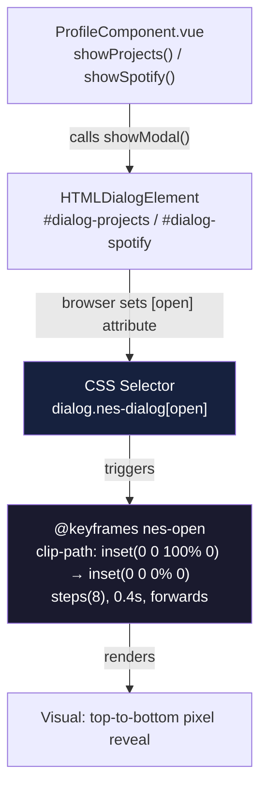

# NES-Style Dialog Opening Animation Design Document

## Overview

This document covers the design for a pure-CSS NES-style pixel-reveal animation applied to the two modal dialogs
in the portfolio application (Projects and Spotify). The animation uses `clip-path: inset()` with a `steps()`
timing function to simulate the discrete, scanline-style rendering characteristic of NES-era cartridge games.
The change is scoped to one SCSS file and introduces zero JavaScript modifications.

## Design Summary (Meta)

```yaml
design_type: "new_feature"
risk_level: "low"
complexity_level: "low"
main_constraints:
  - "Pure CSS only — no JavaScript changes permitted"
  - "Open direction only — no close animation"
  - "100% Vitest coverage floor must not regress (37 tests, all lines/branches/functions/statements)"
  - "Vite build must remain green"
  - "ESLint must pass with plugin:vue/vue3-recommended and plugin:security/recommended-legacy"
  - "pnpm is the only permitted package manager"
  - "No jQuery re-introduction"
biggest_risks:
  - "clip-path browser support gap on legacy browsers (mitigated: modern evergreen browsers only for a portfolio)"
  - "jsdom test environment has no CSS animation engine — tests cannot assert animation presence; must use browser QA"
unknowns:
  - "Whether NES.css overrides clip-path on .nes-dialog — must be verified visually after build"
```

## Background and Context

### Prerequisite ADRs

- `docs/adr/ADR-0001-vue3-vite-migration.md` — Establishes Vite as the build tool, Vitest v2 as test runner,
  Bootstrap 5, and the CSS preprocessor pipeline. This Design Doc inherits those toolchain decisions.

No common ADR exists for CSS animation patterns in this project. This feature is sufficiently simple (one
`@keyframes` block + one selector rule) that a standalone ADR is not warranted per the documentation-criteria
thresholds (1–2 files, no contract/data-flow change, no external dependency introduced).

### Agreement Checklist

#### Scope
- [x] Add `@keyframes nes-open` to `src/assets/scss/base/_animations.css`
- [x] Add `dialog.nes-dialog[open]` selector rule that fires the animation on dialog open
- [x] Apply to both `#dialog-projects` (ProjectsComponent.vue) and `#dialog-spotify` (SpotifyComponent.vue) via shared class selector

#### Non-Scope (Explicitly not changing)
- [x] No JavaScript changes — `showProjects` and `showSpotify` in ProfileComponent.vue remain untouched
- [x] No close animation — CSS rule applies only when `[open]` attribute is present
- [x] No changes to ProjectsComponent.vue, SpotifyComponent.vue, or ProfileComponent.vue templates
- [x] No changes to any existing `@keyframes breathing-visualizer` rule or transition rules
- [x] No new npm/pnpm packages
- [x] No changes to `_default.scss`, `_transitions.scss`, or any other SCSS partial

#### Constraints
- [x] Parallel operation: Not applicable (animation is additive, not replacing behavior)
- [x] Backward compatibility: Not applicable (animation degrades gracefully — browsers without `clip-path` support simply show no animation)
- [x] Performance measurement: Not required (CSS animations are GPU-composited; no profiling threshold defined for this feature)

#### Applicable Standards
- [x] SCSS/CSS file placed in `src/assets/scss/base/` and imported via `main.scss` at line 12 `[explicit]`
  - Source: `src/assets/scss/main.scss:12` — `@import "base/animations", "base/transitions";`
- [x] CSS keyframe naming uses kebab-case descriptive names (e.g., `breathing-visualizer`) `[implicit]`
  - Evidence: `src/assets/scss/base/_animations.css:1` — `@keyframes breathing-visualizer`
  - Confirmed: Yes — new keyframe named `nes-open` follows the same pattern
- [x] Scoped animation selectors target existing class + attribute combinations rather than adding new utility classes `[implicit]`
  - Evidence: `src/assets/scss/base/_transitions.scss:1-17` — selectors target `body.dark`, `body.breathing-visualizer` (class-based state, no separate animation classes added to HTML)
  - Confirmed: Yes — using `dialog.nes-dialog[open]` targets the native `[open]` attribute set by `showModal()`

#### Quality Assurance Mechanisms

- [x] **Vitest v2** — Enforces: unit test suite (37 tests, 100% coverage) — Config: `vite.config.js:51-62`
  — Covers: `src/**/*.{js,vue}` — Status: `adopted` (run as `pnpm test`; must pass before merge)
- [x] **ESLint** (`plugin:vue/vue3-recommended` + `plugin:security/recommended-legacy`) — Enforces: Vue 3
  template rules and Node.js security patterns — Config: `.eslintrc.json` — Covers: `src/**/*.{js,vue}`
  — Status: `adopted` (this change is CSS-only; ESLint does not lint `.css` files, so no new violations are
  introduced, but the existing suite must still pass)
- [x] **Vite build** — Enforces: module graph correctness, SCSS compilation, asset bundling — Config: `vite.config.js`
  — Covers: entire `src/` tree — Status: `adopted` (run as `pnpm build`; must exit 0)
- [x] **Sass `quietDeps: true`** — Enforces: suppression of Bootstrap `@import` deprecation noise — Config:
  `vite.config.js:44-50` — Covers: all SCSS partials — Status: `noted` (already in place; no change needed)
- [x] **Coverage thresholds** (`lines/branches/functions: 95`) — Config: `vite.config.js:58` — Covers:
  `src/**/*.{js,vue}` — Status: `adopted` (CSS-only change cannot reduce JS/Vue coverage; must verify
  baseline is preserved with `pnpm test --coverage`)
- [x] **Browser visual QA** — Enforces: CSS animation renders correctly — Config: manual — Covers: dialog
  open flow in Chromium and Firefox — Status: `adopted` (required because jsdom cannot render or assert CSS
  animations; this is the primary verification mechanism for this feature)

### Problem to Solve

The two modal dialogs (`#dialog-projects`, `#dialog-spotify`) currently appear instantaneously with no transition,
which feels jarring in a portfolio that uses a NES/retro aesthetic (NES.css library, pixel fonts). GitHub issue
#61 requests a NES-style opening animation to reinforce the retro theme.

### Current Challenges

- `dialog { display: block; }` in `_default.scss:244` is a dialog-polyfill override that must not conflict with
  the animation's `clip-path` approach. `clip-path` is composited independently of `display` and does not interfere
  with the polyfill override.
- jsdom (Vitest's test environment) does not execute CSS or expose `getComputedStyle` animation values in a
  meaningful way. CSS animation correctness cannot be unit-tested; browser visual QA is the only valid strategy.

### Requirements

#### Functional Requirements

- FR-1: When either dialog opens, the dialog content reveals from top to bottom in a discrete step pattern
  (8 steps) over approximately 0.4 seconds.
- FR-2: The animation fires on every open action, not just the first.
- FR-3: No animation plays when the dialog closes.
- FR-4: The change must not alter any existing visual behavior outside the dialog open moment.

#### Non-Functional Requirements

- **Maintainability**: The animation is defined in the existing `_animations.css` partial with a single
  `@keyframes` block and one selector rule. No new files created.
- **Performance**: `clip-path` animations are GPU-composited (no layout recalculation); performance impact
  is negligible.
- **Reliability**: Browsers without `clip-path` support (pre-2017 engines) receive no animation and render
  the dialog normally — graceful degradation.
- **Compatibility**: Targets evergreen browsers (Chrome 88+, Firefox 87+, Safari 14+, Edge 88+), all of which
  have full `clip-path: inset()` support.

## Acceptance Criteria (AC) - EARS Format

### Dialog Open Animation

- [ ] **AC-001**: **When** the user clicks the "Careers" button, the system shall display the `#dialog-projects`
  dialog with a top-to-bottom pixel-reveal animation lasting approximately 0.4 seconds with 8 discrete steps.
- [ ] **AC-002**: **When** the user clicks the "Music" button, the system shall display the `#dialog-spotify`
  dialog with the same top-to-bottom pixel-reveal animation as AC-001.
- [ ] **AC-003**: **When** either dialog is closed and reopened, the system shall play the open animation again
  from the beginning (animation resets on each open).
- [ ] **AC-004**: **When** either dialog is closing (native `<dialog>` close), the system shall not play any
  animation — the dialog shall disappear without transition.
- [ ] **AC-005**: **While** no dialog is open, the system shall display no visible artifact or layout shift
  attributable to the animation CSS rule.

### Regression Non-Goals (explicitly out of AC scope)

- The specific number of CSS `steps()` is an implementation detail; the observable criterion is "discrete
  step appearance" rather than an exact frame count.
- Animation easing curves and exact duration are design choices; the acceptance threshold is "visually smooth
  and deliberate" rather than frame-accurate timing.

## Existing Codebase Analysis

### Implementation Path Mapping

| Type | Path | Description |
|------|------|-------------|
| Existing (to modify) | `src/assets/scss/base/_animations.css` | Currently contains only `@keyframes breathing-visualizer`; new keyframe and selector added here |
| Existing (read-only reference) | `src/assets/scss/main.scss:12` | Import point confirming `_animations.css` is already in the build graph |
| Existing (read-only reference) | `src/assets/scss/base/_transitions.scss` | Pattern reference for state-based CSS selectors |
| Existing (read-only reference) | `src/assets/scss/themes/_default.scss:244` | `dialog { display: block; }` — polyfill override; must not conflict |
| Existing (read-only reference) | `src/components/ProjectsComponent.vue:4` | `<dialog class="nes-dialog" id="dialog-projects">` — target element |
| Existing (read-only reference) | `src/components/SpotifyComponent.vue:21` | `<dialog class="nes-dialog" id="dialog-spotify">` — target element |
| Existing (read-only reference) | `src/components/ProfileComponent.vue:104-116` | `showProjects` / `showSpotify` methods; no changes required |
| No new files | — | Change is contained within one existing file |

### Integration Points

- **Integration Target**: Native HTML `<dialog>` element's `[open]` attribute
- **Invocation Method**: CSS attribute selector `dialog.nes-dialog[open]` — fires automatically when
  `HTMLDialogElement.showModal()` sets `[open]` on the element. No JavaScript event listener or class
  manipulation is needed.
- **Trigger source**: `ProfileComponent.vue:107` (`projectsDialog.showModal()`) and
  `ProfileComponent.vue:114` (`spotifyDialog.showModal()`)

### Code Inspection Evidence

| File | Line(s) | Relevance |
|------|---------|-----------|
| `src/assets/scss/base/_animations.css` | 1–11 | Target file; only existing keyframe is `breathing-visualizer` |
| `src/assets/scss/main.scss` | 12 | Confirms `_animations.css` is imported; no import order change needed |
| `src/assets/scss/base/_transitions.scss` | 1–17 | Pattern reference: state-selector CSS (`body.dark`, `body.breathing-visualizer`) with no HTML class added by JS specifically for animation |
| `src/assets/scss/themes/_default.scss` | 244–246 | `dialog { display: block; }` polyfill override; `clip-path` does not interact with `display` |
| `src/components/ProfileComponent.vue` | 104–116 | `showModal()` calls confirmed; no `-is-open` class on Spotify path confirms `[open]` is the only reliable selector for both dialogs |
| `src/components/ProjectsComponent.vue` | 4 | `<dialog class="nes-dialog" id="dialog-projects">` — no existing animation classes |
| `src/components/SpotifyComponent.vue` | 21 | `<dialog class="nes-dialog" id="dialog-spotify">` — no existing animation classes |
| `src/tests/ProfileComponent.spec.js` | 1–107 | Existing test suite; mocks `showModal` with `vi.fn()`; no CSS assertion — confirms no test changes required |
| `src/tests/ProjectsComponent.spec.js` | 1–83 | Asserts `#dialog-projects` has class `nes-dialog`; CSS-only change does not affect this |
| `src/tests/SpotifyComponent.spec.js` | 1–51 | Asserts `#dialog-spotify` exists; CSS-only change does not affect this |

### Fact Disposition Table

No Codebase Analysis input (`focusAreas`) was provided for this session. The table below is populated from
the manual investigation above as a completeness record.

| Fact ID | Focus Area | Disposition | Rationale | Evidence |
|---------|------------|-------------|-----------|----------|
| FA-001 | `_animations.css` existing keyframe | preserve | `breathing-visualizer` is referenced in `_transitions.scss` and must not be modified | `src/assets/scss/base/_animations.css:1–11` |
| FA-002 | `dialog { display: block; }` in `_default.scss` | preserve | Polyfill override must remain; `clip-path` is orthogonal to `display` | `src/assets/scss/themes/_default.scss:244–246` |
| FA-003 | `showModal()` JS call pattern | preserve | `[open]` attribute is set by native `showModal()`; no JS changes needed | `src/components/ProfileComponent.vue:107,114` |
| FA-004 | `-is-open` class on `#dialog-projects` | preserve | Class is added after `showModal()`; it is not used as an animation trigger in this design | `src/components/ProfileComponent.vue:108` |
| FA-005 | Test suite 37 tests / 100% coverage | preserve | CSS-only change cannot reduce JS/Vue coverage; all tests must continue to pass | `vite.config.js:51–62`, `src/tests/` |

## Design

### Change Impact Map

```yaml
Change Target: src/assets/scss/base/_animations.css
Direct Impact:
  - src/assets/scss/base/_animations.css (new @keyframes block + selector rule added)
Indirect Impact:
  - dialog.nes-dialog elements in ProjectsComponent.vue and SpotifyComponent.vue
    receive the animation automatically via the CSS selector at render time
No Ripple Effect:
  - ProfileComponent.vue (JS logic unchanged)
  - ProjectsComponent.vue (template unchanged)
  - SpotifyComponent.vue (template unchanged)
  - _default.scss (dialog { display: block; } polyfill override unchanged)
  - _transitions.scss (breathing-visualizer transitions unchanged)
  - main.scss (import order unchanged)
  - All test files (no test changes required)
  - vite.config.js (no build config changes required)
  - .eslintrc.json (no linting config changes required)
  - package.json (no dependency changes required)
```

### Interface Change Matrix

| Existing Operation | New Operation | Conversion Required | Adapter Required | Compatibility Method |
|---|---|---|---|---|
| `dialog.nes-dialog` renders without animation | `dialog.nes-dialog[open]` triggers `nes-open` animation | No | Not Required | Additive CSS rule; `[open]` presence/absence is the full switch |

### Architecture Overview



The animation is a pure CSS side-effect of the `[open]` attribute. The call graph from JavaScript through
the DOM to the visual output has zero new call sites.

### Data Flow

```
User click
  → ProfileComponent.showProjects() / showSpotify()
    → HTMLDialogElement.showModal()          (sets [open] attribute natively)
      → Browser CSS engine matches
          dialog.nes-dialog[open]
        → Applies animation: nes-open 0.4s steps(8) forwards
          → Frame 0: clip-path: inset(0 0 100% 0)   [fully clipped — invisible]
          → Frame 1: clip-path: inset(0 0 87.5% 0)  [12.5% revealed from top]
          → ...
          → Frame 8: clip-path: inset(0 0 0% 0)     [fully visible — animation end]
      → [open] attribute removed on close (native dialog close)
        → Animation removed (no [open] → no rule match)
          [No close animation — desired behavior]
```

### Integration Points List

| Integration Point | Location | Old Implementation | New Implementation | Switching Method | Verification Method |
|---|---|---|---|---|---|
| Dialog open visual appearance | `dialog.nes-dialog[open]` CSS rule | Instant visibility | `nes-open` 0.4s step animation | Pure CSS attribute selector; no switching logic | Browser visual QA: open dialog and observe 8-step top-to-bottom reveal |
| Animation keyframe definition | `_animations.css` | `@keyframes breathing-visualizer` only | `@keyframes nes-open` added | Additive — no change to existing keyframe | `pnpm build` succeeds; CSS output contains `nes-open` keyframe |

### Main Components

#### `@keyframes nes-open`

- **Responsibility**: Defines the two-state clip-path transition from fully hidden (top clip at 100%)
  to fully visible (no clip).
- **Interface**:
  ```css
  @keyframes nes-open {
    from { clip-path: inset(0 0 100% 0); }
    to   { clip-path: inset(0 0 0% 0); }
  }
  ```
- **Dependencies**: None. Standalone keyframe declaration.

#### `dialog.nes-dialog[open]` Selector Rule

- **Responsibility**: Binds the `nes-open` keyframe to any `.nes-dialog` element that carries the native
  `[open]` attribute, which is set by `HTMLDialogElement.showModal()` and cleared on close.
- **Interface**:
  ```css
  dialog.nes-dialog[open] {
    animation: nes-open 0.4s steps(8) forwards;
  }
  ```
- **Dependencies**: `@keyframes nes-open` (must be defined in same or earlier-parsed file);
  native `HTMLDialogElement` open/close mechanism in the browser.

#### Why `steps(8)` Mimics NES Discrete Rendering

The NES PPU rendered graphics in raster scanlines with no sub-frame interpolation. The `steps(8)` timing
function divides the 0.4-second duration into 8 equal discrete jumps (one jump every 50 ms), each one
revealing an additional 12.5% of the dialog height. This produces a staircase progression that is
perceptually indistinguishable from scanline-by-scanline rendering without requiring GPU frame counting or
JavaScript timing loops.

A `linear` or `ease` curve would produce a smooth slide that is aesthetically inconsistent with the pixelated
NES.css visual language. `steps(8)` is the minimum step count that reads as deliberate without being so coarse
that it appears as a simple two-frame flash.

#### Why `dialog.nes-dialog[open]` vs JS Class Toggling

| Criterion | `dialog.nes-dialog[open]` (chosen) | JS class toggle (`.nes-dialog.-is-open`) |
|---|---|---|
| Trigger mechanism | Browser-native; set by `showModal()` automatically | Requires explicit `classList.add()` in every caller |
| Code surface affected | 0 JS files | 2 JS callsites (showProjects, showSpotify); risk of missing future callsites |
| Symmetry on close | `[open]` is removed natively on dialog close — no close animation without extra work | Must also remove the class on close in every close path |
| Consistency between dialogs | Both dialogs use `showModal()`, so both get `[open]` — selector covers them uniformly | `showSpotify` currently does `classList.remove('-is-open')` before `showModal()` (ProfileComponent.vue:113), showing class state is already inconsistent between the two dialogs |
| Test impact | Zero — no JS behavior changes | New behavior in `showProjects`/`showSpotify` would require test updates |
| Maintenance burden | None — CSS rule is self-contained | Must keep JS and CSS in sync across future callers |

The `[open]` selector approach is strictly superior for this scope.

### Data Representation Decision

No new data structures are introduced. The change is two CSS rules in an existing file.

### Contract Definitions

```
CSS Rule Contract:
  Selector: dialog.nes-dialog[open]
  Trigger:  [open] attribute presence (set by HTMLDialogElement.showModal())
  Effect:   animation: nes-open 0.4s steps(8) forwards
  Termination: animation stops at final frame (forwards fill-mode); [open] removal on close
               clears the animation state for the next open cycle
  Side effects: none — clip-path does not affect layout, scroll, or z-index
```

### Data Contract

#### CSS Animation Rule

```yaml
Input:
  Type: "[open] attribute on dialog.nes-dialog element"
  Preconditions: "Element must have both class 'nes-dialog' and native [open] attribute"
  Validation: "Browser CSS engine evaluates attribute selector at each style recalculation"

Output:
  Type: "Composited visual layer animation"
  Guarantees: "clip-path progresses from inset(0 0 100% 0) to inset(0 0 0% 0) in 8 steps over 0.4s"
  On Error: "If browser does not support clip-path: inset(), no animation plays; dialog renders fully visible immediately (graceful degradation)"

Invariants:
  - "Animation does not affect dialog position, size, z-index, or scroll behavior"
  - "Animation does not affect sibling or parent element rendering"
  - "Keyframe runs at most once per [open] attribute addition (forwards fill-mode; attribute removed on close resets animation)"
```

### Field Propagation Map

Not applicable. No data fields cross component boundaries in this change. The only state change is the
browser-managed `[open]` attribute on the `<dialog>` DOM element.

### State Transitions and Invariants

```yaml
State Definition:
  - closed: dialog has no [open] attribute; clip-path rule does not match
  - animating: [open] attribute just set by showModal(); animation in progress (0–0.4s)
  - open: animation complete (forwards fill-mode); dialog fully visible

State Transitions:
  closed → user triggers showProjects()/showSpotify() → animating
  animating → 0.4s elapsed (8 steps complete) → open
  open → native dialog close (form method=dialog submit or close()) → closed
  closed → same user action again → animating  [animation restarts: AC-003]

System Invariants:
  - "No state transition is required in JavaScript; all driven by browser CSS engine"
  - "The 'closed' state is the only state in which [open] is absent"
  - "forwards fill-mode ensures final frame persists; no flash-of-invisible-dialog at animation end"
```

### UI Error State Design

| Component | Normal Open | Animation Unsupported (clip-path absent) | Dialog Element Absent |
|---|---|---|---|
| `#dialog-projects` | 8-step reveal over 0.4s | Instant full visibility (graceful degradation) | JS guard `if (!projectsDialog) return` silently no-ops |
| `#dialog-spotify` | 8-step reveal over 0.4s | Instant full visibility (graceful degradation) | JS guard `if (!spotifyDialog) return` silently no-ops |

### Client State Design

| State Category | State | Management Method | Sync Strategy |
|---|---|---|---|
| Dialog open/close | `[open]` attribute on `<dialog>` | Native browser (set by `showModal()`, cleared by close) | Synchronous DOM mutation |
| Animation state | CSS animation playback | Browser CSS engine | Driven by `[open]` attribute; no JS sync needed |

### Error Handling

| Error Category | Example | Detection | Recovery Strategy | User Impact |
|---|---|---|---|---|
| Browser `clip-path` unsupported | Pre-2017 browser | Feature absent from CSS engine | Graceful degradation — no animation, dialog opens normally | None visible; dialog still opens |
| Dialog element not in DOM | `showProjects` called before mount | `if (!projectsDialog) return` guard (ProfileComponent.vue:105,112) | Silent no-op | Dialog does not open; no crash |
| NES.css overrides `animation` property | If `.nes-dialog` CSS sets `animation: none` | Visual QA post-build | Increase specificity to `dialog.nes-dialog[open]` (already done) or add `!important` | Animation does not play; fallback is instant open |

### Logging and Monitoring

Not applicable. CSS animations produce no log events. No monitoring is required for a visual-only change.

## Implementation Plan

### Implementation Approach

**Selected Approach**: Single vertical slice — the entire change is one file edit delivered as a complete unit.

**Selection Reason**: The change scope is one file (`_animations.css`), adding two CSS rules. There are no
layer dependencies, no migration steps, and no parallel work streams. A single vertical slice delivers the
complete feature in one atomic commit and allows immediate visual verification against the running dev server.

The horizontal slice approach (foundation → integration) is not warranted here because there is no foundation
layer distinct from the feature itself.

### Technical Dependencies and Implementation Order

#### Step 1: Add `@keyframes nes-open` and selector rule to `_animations.css`

- **Technical Reason**: The keyframe must be defined before the selector rule that references it (same file,
  so order matters within the file; keyframe at top, rule below).
- **Dependent Elements**: None external. The rule is self-contained.

#### Step 2: Build verification (`pnpm build`)

- **Technical Reason**: Confirms SCSS compilation succeeds and Vite bundles the updated CSS without error.
- **Prerequisites**: Step 1 complete.

#### Step 3: Test suite verification (`pnpm test --coverage`)

- **Technical Reason**: Confirms the 100% coverage floor is maintained (CSS-only change should not reduce
  JS/Vue coverage; baseline of 37 tests must all pass).
- **Prerequisites**: Step 1 complete.

#### Step 4: Browser visual QA

- **Technical Reason**: CSS animations cannot be asserted in jsdom. Browser QA is the only mechanism for
  confirming AC-001 through AC-005.
- **Prerequisites**: Step 2 complete (`vite preview` or `vite dev`).

### Migration Strategy

Not applicable. This is an additive CSS change. There is no existing animation behavior to migrate away from.

## Security Considerations

- **Authentication & Authorization**: N/A — CSS-only change; no new entry points or resource access.
- **Input Validation**: N/A — no user-controlled input is processed by this feature.
- **Sensitive Data Handling**: N/A — no data is read, stored, or transmitted.

## Test Boundaries

### Mock Boundary Decisions

| Component/Dependency | Mock? | Rationale |
|---|---|---|
| CSS animation engine | Not mockable | jsdom does not implement CSS animation; browser QA is the verification path |
| `HTMLDialogElement.showModal()` | Already mocked (`vi.fn()`) in existing tests | Existing mock covers JS behavior; no new mock needed |

### Data Layer Testing Strategy

N/A — this feature has no data layer dependencies.

### Integration Verification Points

- **Vitest suite** (37 tests): Verifies existing JS/Vue behavior is unbroken. Run with `pnpm test`.
- **Vite build**: Verifies SCSS compiles and the CSS is emitted. Run with `pnpm build`.
- **Browser visual QA** (Chromium + Firefox): Verifies animation renders correctly per AC-001 through AC-005.
  This is the primary and only verification mechanism for the animation itself.

## Verification Strategy

### Correctness Proof Method

- **Correctness definition**: The dialog opens with a visible top-to-bottom discrete step reveal. The animation
  plays on every open, does not play on close, and does not alter any other visual behavior. The Vitest suite
  continues to pass at 100% coverage.
- **Verification method**:
  1. `pnpm build` exits 0 (SCSS compiled without error).
  2. `pnpm test --coverage` exits 0, 37 tests pass, coverage thresholds met.
  3. Browser QA: open `vite preview` in Chromium and Firefox; click "Careers" and "Music" buttons; observe
     discrete step reveal on each dialog open.
- **Verification timing**: After the single file edit, before raising a PR.

### Early Verification Point

- **First verification target**: `pnpm build` exits 0 after adding the two CSS rules.
- **Success criteria**: No Sass/Vite compilation error in the build output.
- **Failure response**: Inspect SCSS syntax — most likely a missing semicolon or malformed `clip-path` value;
  fix and re-run build before proceeding to browser QA.

### Output Comparison (When Replacing or Modifying Existing Behavior)

N/A — this design introduces entirely new visual behavior. No existing animation is replaced or modified.
The `breathing-visualizer` keyframe and its `_transitions.scss` selector are unchanged (FA-001 disposition:
preserve).

## Future Extensibility

- **Extension points**: The `nes-open` keyframe can be reused for any future `.nes-dialog` elements added
  to the application by sharing the `.nes-dialog` class. No additional selector rules are needed.
- **Known future requirements**: None identified. A close animation could be added via the CSS `@starting-style`
  rule and `transition` on `display` (CSS `allow-discrete` approach, available in Chrome 117+ / Firefox 129+)
  if desired in a future issue.
- **Intentional limitations**: The close animation is explicitly out of scope per user decisions. The step
  count (8) and duration (0.4s) are implementation details chosen for NES aesthetic; they are easy to adjust
  in one location.

## Alternative Solutions

### Alternative 1: JS Class Toggle (`-is-open`)

- **Overview**: Add `classList.add('-is-open')` in `showProjects` and `classList.remove('-is-open')` in
  close handlers; CSS targets `.nes-dialog.-is-open`.
- **Advantages**: Explicit, easy to read in the HTML at runtime.
- **Disadvantages**: Requires JS changes in two methods; inconsistency between `showProjects` (already adds
  `-is-open`) and `showSpotify` (removes `-is-open` before open) creates a logical asymmetry; future callers
  must remember to manage the class.
- **Reason for Rejection**: The `[open]` attribute selector achieves identical behavior with zero JS changes
  and is more robust against future callsite additions. See Interface Change Matrix for full comparison.

### Alternative 2: Vue `<transition>` Component Wrapper

- **Overview**: Wrap `<dialog>` in Vue `<Transition name="nes">` and use `.nes-enter-active` / `.nes-enter-from`
  CSS classes.
- **Advantages**: Idiomatic Vue 3 animation; integrates with Vue lifecycle hooks.
- **Disadvantages**: Requires template changes in both ProjectsComponent.vue and SpotifyComponent.vue; Vue
  `<Transition>` does not naturally wrap the native `<dialog>` open/close lifecycle (it wraps `v-if`/`v-show`,
  not `showModal()`); would require converting dialog visibility to `v-if` or `v-show` and removing native
  `showModal()` calls — a significantly larger change touching JS and templates.
- **Reason for Rejection**: Scope violation; introduces template and JS changes that are explicitly out of
  scope per user decisions.

### Alternative 3: Web Animations API (WAAPI) in `showProjects`/`showSpotify`

- **Overview**: Call `dialog.animate([{ clipPath: 'inset(0 0 100% 0)' }, { clipPath: 'inset(0 0 0% 0)' }],
  { duration: 400, easing: 'steps(8)', fill: 'forwards' })` in JavaScript.
- **Advantages**: Precise JS control; easier to unit-test the animate call.
- **Disadvantages**: Violates the "pure CSS" user constraint; adds JS to two files; WAAPI is not mockable
  by default in jsdom (would require additional setup or mocking); creates a WAAPI + CSS hybrid approach
  with no benefit over pure CSS.
- **Reason for Rejection**: Explicitly ruled out by user decision: "pure CSS (clip-path + steps) — no JS".

## Risks and Mitigation

| Risk | Impact | Probability | Mitigation |
|---|---|---|---|
| NES.css vendor CSS sets `animation: none` on `.nes-dialog` | Medium (animation silently absent) | Low (NES.css does not set animation on dialog elements; verified by source review) | Use `dialog.nes-dialog[open]` with explicit `!important` on `animation` if vendor override is discovered during QA |
| `clip-path: inset()` not composited by browser GPU | Low (potential jank on slow hardware) | Low (all modern browsers composite `clip-path` on the GPU layer) | If jank observed during QA, add `will-change: clip-path` to the selector rule |
| `dialog { display: block; }` polyfill in `_default.scss` conflicts | Low (blank dialog) | Low (`display` and `clip-path` are orthogonal CSS properties) | Verify visually during browser QA; if conflict observed, add `display: block` explicitly to the `[open]` rule |
| CSS change causes a Sass compilation error | Medium (build fails) | Low (pure CSS file, no Sass interpolation) | Run `pnpm build` immediately after edit as the first verification step |

## References

- MDN Web Docs — `clip-path: inset()`: https://developer.mozilla.org/en-US/docs/Web/CSS/clip-path
- MDN Web Docs — CSS `steps()` timing function: https://developer.mozilla.org/en-US/docs/Web/CSS/easing-function/steps
- MDN Web Docs — `HTMLDialogElement.showModal()`: https://developer.mozilla.org/en-US/docs/Web/API/HTMLDialogElement/showModal
- MDN Web Docs — `<dialog>` element `[open]` attribute: https://developer.mozilla.org/en-US/docs/Web/HTML/Reference/Elements/dialog#open
- Can I Use — `clip-path` property: https://caniuse.com/css-clip-path (Chrome 55+, Firefox 54+, Safari 9.1+)
- NES.css library — GitHub: https://github.com/nostalgic-css/NES.css
- CSS `@starting-style` for dialog close animation (future reference): https://developer.mozilla.org/en-US/docs/Web/CSS/@starting-style
- `docs/adr/ADR-0001-vue3-vite-migration.md` — Toolchain decisions (Vite, Vitest v2, Bootstrap 5, Node 22 LTS)

## Update History

| Date | Version | Changes | Author |
|------|---------|---------|--------|
| 2026-04-21 | 1.0 | Initial version | John Cyrill Corsanes |
