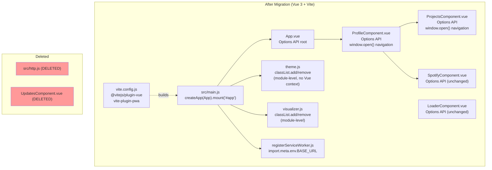

# Vue 3 + Vite Migration Design Document

## Overview

This document specifies the technical implementation of the Vue 2 → Vue 3 migration for the
personal portfolio application. The migration replaces `@vue/cli-service` (Webpack) with Vite,
removes jQuery and the dead Updates feed entirely, upgrades Bootstrap from v4 to v5, introduces
Vitest for unit testing, and advances the Node runtime from EOL v16 to LTS v22.

GitHub Issue: https://github.com/jcchikikomori/portfolio/issues/62

## Design Summary (Meta)

```yaml
design_type: "refactoring"
risk_level: "medium"
complexity_level: "medium"
complexity_rationale: >
  (1) ACs AC-BUILD-01 through AC-VUE-05 and AC-TEST-01 require simultaneous correctness of
  build tooling, Vue 3 breaking-change handling, jQuery removal, and Bootstrap upgrade — four
  independent migration tracks that share integration points in main.js, ProfileComponent.vue,
  and the SCSS vendor layer.
  (2) The dual-mutation architecture (Vue 2 virtual DOM + jQuery direct DOM writes) means
  removing jQuery requires understanding every call site before any line is deleted to avoid
  silent regressions.
main_constraints:
  - "PR size must not exceed 200 lines; migration must be split into at least three PRs"
  - "pnpm is the only package manager; pnpm-lock.yaml governs all dep resolution"
  - "No backend, no database; all changes are purely frontend"
  - "Existing SCSS seven-layer architecture must be preserved"
  - "Target code coverage >= 95%"
biggest_risks:
  - "Bootstrap 5 utility class renames breaking layout (e.g., mr-* -> me-*, ml-* -> ms-*)"
  - "dialog-polyfill compatibility: native <dialog> now baseline; polyfill may interfere with Vue 3 SFCs"
  - "register-service-worker behavior under vite-plugin-pwa may differ from @vue/cli-plugin-pwa"
unknowns:
  - "Whether dialog-polyfill should be removed entirely or kept (native <dialog> support is now ~96%)"
  - "Whether vite-plugin-pwa generates a compatible service-worker.js for the existing gh-pages deployment"
```

## Background and Context

### Prerequisite ADRs

- **ADR-0001-vue3-vite-migration.md**: Core decision to migrate to Vue 3 + Vite + Bootstrap 5,
  remove jQuery, delete dead code. All implementation decisions in this document must conform to
  that ADR.

### Agreement Checklist

#### Scope
- [x] Migrate Vue 2.7.16 → Vue 3 (latest stable)
- [x] Replace `@vue/cli-service` + Webpack with Vite + `@vitejs/plugin-vue`
- [x] Remove jQuery 3.7.1 entirely from all source files
- [x] Upgrade Bootstrap 4.6.2 → Bootstrap 5 (jQuery-free)
- [x] Remove `src/http.js` and `src/components/UpdatesComponent.vue` (dead code, XSS sink)
- [x] Replace `vue-cli-service lint/build/serve` scripts with Vite equivalents
- [x] Introduce Vitest + `@vue/test-utils@^2` for unit testing (no tests currently exist)
- [x] Add `eslint-plugin-security` to ESLint config
- [x] Update ESLint config to `plugin:vue/vue3-recommended`
- [x] Advance Node runtime from v16 to v22 LTS (`.nvmrc`, CI workflows)
- [x] Update GitHub Actions to current action versions
- [x] Update `src/registerServiceWorker.js` compatibility with Vite build output

#### Non-Scope
- [x] No redesign of visual layout or color scheme
- [x] No new features or content changes
- [x] No backend work
- [x] No migration to a different CSS framework (NES.css stays)
- [x] No rewrite of SCSS architecture (seven-layer structure preserved)
- [x] `vue-compat` (Vue 2 migration build) is explicitly excluded — direct Vue 3 target only
- [x] `dialog-polyfill` removal decision is deferred to implementation (see unknowns above)

#### Constraints
- [x] Parallel operation: No (Vue 2 and Vue 3 are not run simultaneously)
- [x] Backward compatibility: Not required (personal project, single deployment target)
- [x] Performance measurement: Not required (no SLA targets for a personal portfolio)

#### Applicable Standards
- [x] ESLint `plugin:vue/essential` (Vue 2) `[explicit]` — Source: `package.json > eslintConfig` — will be **replaced** by `plugin:vue/vue3-recommended`
- [x] pnpm as package manager `[explicit]` — Source: `pnpm-lock.yaml`, `package.json > scripts (pnpm run)`, `.npmrc`, `.github/workflows/*.yml`
- [x] `shamefully-hoist=true` in `.npmrc` `[explicit]` — Source: `.npmrc:2` — must be preserved for vite to resolve `node_modules`
- [x] Seven-layer SCSS architecture `[implicit]` — Evidence: `src/assets/scss/main.scss`, directory layout — Confirmed: Yes
- [x] Options API component style (existing components) `[implicit]` — Evidence: all `.vue` files use `export default {}` — new code may use `<script setup>`; existing may stay Options API

#### Quality Assurance Mechanisms

- [x] ESLint (`vue-cli-service lint`) — Enforces: Vue 2 + JS style rules — Config: `package.json > eslintConfig` — Covers: `src/**/*.{js,vue}` — Status: `adopted` (will be updated to `plugin:vue/vue3-recommended` + `eslint-plugin-security`)
- [x] depcheck (`pnpx depcheck`) — Enforces: no unused dependencies — Config: `.depcheckrc` — Covers: project-wide — Status: `adopted` (`.depcheckrc` ignores list must be updated after dep changes)
- [x] Build success gate (`pnpm run build`) — Enforces: compilable output — Config: `vue.config.js` (→ `vite.config.js`) — Covers: project-wide — Status: `adopted`
- [x] GitHub Actions matrix (Node 18.x, 20.x, 22.x) — Enforces: Node version compatibility — Config: `.github/workflows/default.yml` — Covers: project-wide — Status: `adopted`
- [x] No test runner currently — Status: `noted (no tests exist; Vitest is introduced by this migration)`

### Problem to Solve

1. Vue 2 and Node 16 are EOL; the project ships with unpatched CVEs.
2. jQuery creates a dual-mutation architecture with a confirmed XSS sink (`http.js:43`).
3. The dead Updates feed (`http.js` + `UpdatesComponent.vue`) is dead code that is still imported
   and increases cognitive overhead.
4. `@vue/cli-service` (Webpack) has significantly slower DX than Vite.
5. No tests exist; the migration provides a forcing function to introduce a test suite.

### Current Challenges

- `$("#profile-container").show()` in `main.js:48` is a jQuery DOM call that executes at `window.onload`
  against a `#profile-container` element managed by Vue. This is the primary coupling point between
  the two mutation systems.
- `goToUrl()` in `ProfileComponent.vue` and `ProjectsComponent.vue` uses jQuery to imperatively
  set `href` and `target` on a `#redirect` element, then programmatically clicks it. This pattern
  does not exist in the DOM template; the `#redirect` element must be searched for in the HTML (it
  appears to be a hidden anchor rendered outside Vue's `#app` root, or absent entirely).
- Bootstrap 4 Sass import (`/node_modules/bootstrap/scss/bootstrap`) uses a Sass 1.x-incompatible
  path prefix (`/node_modules/...`); Vite resolves this differently from Webpack's `sass-loader`.

### Requirements

#### Functional Requirements

- FR-01: Portfolio must render identically to the current production build after migration.
- FR-02: Theme toggling (dark/light based on `prefers-color-scheme`) must function correctly.
- FR-03: Spotify dialog, Projects dialog must open and close correctly.
- FR-04: Service worker must register in production builds.
- FR-05: `pnpm run build` must produce a `dist/` directory deployable to GitHub Pages.
- FR-06: `pnpm run lint` must pass with zero errors under `plugin:vue/vue3-recommended`.
- FR-07: `pnpm run test` must pass with >= 95% coverage.

#### Non-Functional Requirements

- **Maintainability**: No jQuery imports; all Vue 3 SFCs must lint cleanly under `vue3-recommended`.
- **Security**: `eslint-plugin-security` must be enabled with no suppressed errors in production code.
- **Build speed**: Vite cold-start must complete in < 5 seconds on development hardware (subjective improvement, not gated in CI).
- **Reliability**: GitHub Actions deploy workflow must succeed on every push to `master`.

## Acceptance Criteria (AC) — EARS Format

### Build Tooling (AC-BUILD)

- [ ] **AC-BUILD-01** — `pnpm run dev` (Vite dev server) shall start without errors and serve the application at `http://localhost:5173`.
- [ ] **AC-BUILD-02** — `pnpm run build` shall produce a `dist/` directory containing `index.html` and hashed asset files without Webpack or Babel in the dependency chain.
- [ ] **AC-BUILD-03** — **When** `pnpm run lint` is executed, the system shall exit with code 0 and zero ESLint errors under `plugin:vue/vue3-recommended` + `eslint-plugin-security` rules.
- [ ] **AC-BUILD-04** — `pnpm run test` shall execute Vitest and report all tests passing with coverage >= 95%.
- [ ] **AC-BUILD-05** — **When** a push is made to the `master` branch, the GitHub Actions `Build and Deploy` workflow shall complete successfully and publish the `dist/` directory to the `gh-pages` branch.

### Vue 3 Correctness (AC-VUE)

- [ ] **AC-VUE-01** — **When** the application loads in a browser, the system shall mount the Vue 3 app at `#app` with no Vue warnings in the browser console.
- [ ] **AC-VUE-02** — **While** the application is running, `ProfileComponent`, `ProjectsComponent`, `SpotifyComponent`, and `LoaderComponent` shall each render their template content without errors.
- [ ] **AC-VUE-03** — **When** the user clicks the "Music" button, the system shall open the Spotify `<dialog>` modal.
- [ ] **AC-VUE-04** — **When** the user clicks the "Careers" button, the system shall open the Projects `<dialog>` modal.
- [ ] **AC-VUE-05** — **When** the user clicks any external link button (LinkedIn, GitHub, Blog, project card), the system shall navigate to the target URL in a new tab without jQuery.
- [ ] **AC-VUE-06** — All goToUrl calls shall pass exactly one argument (the target URL) after migration.

### jQuery Removal (AC-JQUERY)

- [ ] **AC-JQUERY-01** — The system shall contain zero `import ... from "jquery"` or `import $ from "jquery"` statements in any file under `src/`.
- [ ] **AC-JQUERY-02** — `package.json` shall not list `jquery` or `@types/jquery` in `dependencies` or `devDependencies`.
- [ ] **AC-JQUERY-03** — `pnpm run build` output in `dist/` shall contain no bundle chunk that includes the jQuery source.

### Dead Code Removal (AC-DELETE)

- [ ] **AC-DELETE-01** — `src/http.js` shall not exist in the repository.
- [ ] **AC-DELETE-02** — `src/components/UpdatesComponent.vue` shall not exist in the repository.
- [ ] **AC-DELETE-03** — `ProfileComponent.vue` shall not import or reference `UpdatesComponent`.

### Theme and Visualizer (AC-THEME)

- [ ] **AC-THEME-01** — **When** `prefers-color-scheme` is `dark`, the system shall add the `dark` class to `<body>` and set the profile logo src to `img/jcc_logo_w.png` without jQuery.
- [ ] **AC-THEME-02** — **When** `prefers-color-scheme` changes at runtime, the system shall toggle the `dark` class and logo src accordingly without a page reload.
- [ ] **AC-THEME-03** — **When** an audio element fires a `play` event, the system shall add `breathing-visualizer` to `<body>` without jQuery.

### Bootstrap Upgrade (AC-BS)

- [ ] **AC-BS-01** — Bootstrap 5 CSS shall be imported and applied; no Bootstrap 4 classes shall be present in the Sass vendor layer.
- [ ] **AC-BS-02** — `pnpm run build` shall produce no Sass deprecation errors related to Bootstrap imports.
- [ ] **AC-BS-03** — No Bootstrap 4-exclusive utility classes (e.g., mr-*, ml-*, float-left, float-right) shall appear in any .vue template after migration, verified by grep audit of src/**/*.vue.

### Security (AC-SEC)

- [ ] **AC-SEC-01** — `src/http.js` shall not exist (XSS sink eliminated by deletion).
- [ ] **AC-SEC-02** — `eslint-plugin-security` rules shall be enabled; `pnpm run lint` shall pass with zero security-rule violations in `src/`.
- [ ] **AC-SEC-03** — No `innerHTML` assignments shall appear in any `src/` file after migration.
- [ ] **AC-SEC-04** — All window.open calls in src/ shall include 'noopener,noreferrer' as the third argument, verified by grep audit of src/**/*.vue and src/**/*.js.

### Tests (AC-TEST)

- [ ] **AC-TEST-01** — Unit tests shall exist for: `App.vue` (mounts with no Vue warnings in console), `ProfileComponent.vue` (button click events), `ProjectsComponent.vue` (dialog open), `SpotifyComponent.vue` (dialog close), `theme.js` (darkMode/normalTheme class toggling), `visualizer.js` (handlePlayback class toggling).
- [ ] **AC-TEST-02** — Vitest coverage report shall show >= 95% line and branch coverage over `src/`.
- [ ] **AC-TEST-03** — **When** `pnpm run test` is executed in CI, all tests shall pass without network access (no real Spotify or external calls).

## Existing Codebase Analysis

### Implementation Path Mapping

| Type | Path | Description |
|------|------|-------------|
| Existing — delete | `src/http.js` | Dead Heroku GraphQL client; XSS sink at line 43 |
| Existing — delete | `src/components/UpdatesComponent.vue` | Renders content from dead backend |
| Existing — rewrite | `src/main.js` | Vue 2 instantiation; jQuery import; `window.onload` DOM calls |
| Existing — update | `src/App.vue` | Root component; minor cleanup |
| Existing — update | `src/components/ProfileComponent.vue` | jQuery `goToUrl`, UpdatesComponent import |
| Existing — update | `src/components/ProjectsComponent.vue` | jQuery `goToUrl` |
| Existing — no-change | `src/components/SpotifyComponent.vue` | No jQuery; minor Options API cleanup |
| Existing — no-change | `src/components/LoaderComponent.vue` | No jQuery; no changes |
| Existing — update | `src/theme.js` | jQuery → native classList |
| Existing — update | `src/visualizer.js` | jQuery → native classList |
| Existing — keep | `src/registerServiceWorker.js` | Verify `process.env.BASE_URL` compat with Vite (`import.meta.env.BASE_URL`) |
| Existing — keep | `src/assets/scss/` | SCSS architecture preserved; vendor import paths updated |
| Existing — delete | `vue.config.js` | Webpack config; replaced by vite.config.js |
| Existing — delete | `babel.config.js` | Babel preset; not needed with Vite/esbuild |
| Existing — delete | `volar.config.js` | Vetur service; Volar for Vue 3 needs no separate config |
| New | `vite.config.js` | Vite configuration (plugins, base, build options) |
| New | `src/tests/` | Test directory for Vitest |
| Existing — update | `.nvmrc` | `v16.17.0` → `22` |
| Existing — update | `.github/workflows/gh-pages.yml` | Node 18.x → 20.x; update action versions |
| Existing — update | `.github/workflows/default.yml` | Update action versions; add test step |

### Integration Points

- **Vue app mount**: `src/main.js` → `createApp(App).mount('#app')` replaces `new Vue().$mount('#app')`
- **Theme initialization**: `main.js` calls `darkMode()` / `normalTheme()` from `theme.js` at startup; this call site is preserved but the jQuery internals of those functions are replaced
- **Visualizer**: `main.js` registers `handlePlayback` on document-level play/pause/ended events; function signature unchanged, internal jQuery removed
- **SCSS vendor layer**: `src/assets/scss/vendors/_v2.scss` imports Bootstrap and dialog-polyfill via absolute `/node_modules/` paths; Vite resolves these as `~bootstrap/scss/bootstrap` or direct node_modules path (must be validated)

### Code Inspection Evidence

| File | Relevance |
|------|-----------|
| `src/main.js:1–3` | jQuery import; Vue 2 createApp pattern |
| `src/main.js:48` | `$("#profile-container").show()` — primary jQuery/Vue coupling point |
| `src/main.js:51–53` | `new Vue({ render: h => h(App) }).$mount("#app")` — Vue 2 pattern to replace |
| `src/http.js:43` | `$("#all-post").html(li)` — confirmed XSS sink; file is fully deleted |
| `src/theme.js:7,19` | `$("body").addClass/removeClass("dark")` — jQuery class manipulation |
| `src/theme.js:8,20` | `$("#profile-logo").attr("src", ...)` — jQuery attribute mutation |
| `src/theme.js:9–14` | `.nes-container` and `.nes-dialog` each() loops — jQuery bulk class mutation |
| `src/visualizer.js:18,22` | `$("body").addClass/removeClass("breathing-visualizer")` — jQuery class mutation |
| `src/components/ProfileComponent.vue:111–118` | `goToUrl()` using `$("#redirect").attr/click()` — jQuery navigation pattern |
| `src/components/ProjectsComponent.vue:136–144` | Same `goToUrl()` pattern duplicated |
| `src/assets/scss/vendors/_v2.scss:3` | `/node_modules/bootstrap/scss/bootstrap` — Bootstrap 4 Sass import |
| `src/assets/scss/vendors/_v2.scss:2` | `/node_modules/dialog-polyfill/dialog-polyfill` — polyfill import |
| `.github/workflows/default.yml:12–13` | Node matrix `[18.x, 20.x, 22.x]` — already includes Node 20 target |
| `.github/workflows/gh-pages.yml:12` | Node matrix `[18.x]` — must be updated to `20.x` |
| `package.json:36–48` | ESLint inline config — must be extracted or updated in-place |

### Similar Functionality Search Results

- No existing Vite configuration or `vitest.config.js` found in the repository.
- No existing test files found (`tests/`, `*.test.js`, `*.spec.js`, `*.test.vue` — zero results).
- No existing Vue 3 `createApp` pattern found.
- Decision: New implementation for all migration targets; no existing patterns to reuse or extend.

### Dependency Existence Verification

| Identifier | Status | Source |
|-----------|--------|--------|
| `vue@^3` | requires_new_creation | Current: `vue@^2.7.13` in `package.json:24` |
| `vite` | requires_new_creation | Not in package.json |
| `@vitejs/plugin-vue` | requires_new_creation | Not in package.json |
| `vitest` | requires_new_creation | Not in package.json |
| `@vue/test-utils@^2` | requires_new_creation | Not in package.json |
| `bootstrap@^5` | requires_new_creation | Current: `bootstrap@^4.6.2` in devDependencies |
| `eslint-plugin-security` | requires_new_creation | Not in package.json |
| `vite-plugin-pwa` | requires_new_creation | Not in package.json; replaces `@vue/cli-plugin-pwa` |
| `jquery` | verified (to remove) | `package.json:11` dependencies |
| `@types/jquery` | verified (to remove) | `package.json:12` dependencies |
| `@vue/cli-service` | verified (to remove) | `package.json:31` devDependencies |
| `@vue/cli-plugin-babel` | verified (to remove) | `package.json:27` devDependencies |
| `@vue/cli-plugin-eslint` | verified (to remove) | `package.json:28` devDependencies |
| `@vue/cli-plugin-pwa` | verified (to remove) | `package.json:29` devDependencies |
| `@babel/eslint-parser` | verified (to remove) | `package.json:26` devDependencies |
| `@babel/core` | verified (to remove) | `package.json:11` dependencies |
| `@vue/babel-preset-app` | verified (to remove) | `package.json:13` dependencies |
| `sass-loader` | verified (to remove) | `package.json:33` devDependencies (not needed by Vite) |
| `volar-service-vetur` | verified (to remove) | `package.json:23` dependencies |
| `dialog-polyfill` | verified (to reassess) | `package.json:31` devDependencies; CSS in `public/css/dialog-polyfill.css` |
| `register-service-worker` | verified (to keep/update) | `package.json:18` dependencies |

## Design

### Change Impact Map

```yaml
Change Target: Vue 2 → Vue 3, Webpack → Vite, jQuery removal

Direct Impact:
  - src/main.js (Vue 2 → Vue 3 createApp; remove jQuery import; remove window.onload jQuery DOM calls)
  - src/http.js (DELETE entirely)
  - src/components/UpdatesComponent.vue (DELETE entirely)
  - src/components/ProfileComponent.vue (remove jQuery goToUrl; remove UpdatesComponent import)
  - src/components/ProjectsComponent.vue (remove jQuery goToUrl)
  - src/theme.js (jQuery classList → native classList)
  - src/visualizer.js (jQuery classList → native classList)
  - src/registerServiceWorker.js (process.env → import.meta.env)
  - src/assets/scss/vendors/_v2.scss (Bootstrap 4 → Bootstrap 5 import path)
  - package.json (dependency removals and additions)
  - vite.config.js (NEW — replaces vue.config.js)
  - .nvmrc (v16 → v22)
  - .github/workflows/gh-pages.yml (Node version; action versions)
  - .github/workflows/default.yml (action versions; add test step)
  - babel.config.js (DELETE)
  - volar.config.js (DELETE)
  - vue.config.js (DELETE)

Indirect Impact:
  - src/assets/scss/ (Bootstrap 5 utility class renames may affect existing class usage in SFCs)
  - public/css/dialog-polyfill.css (may become unused if dialog-polyfill is removed)
  - public/fonts/ (glyphicon fonts are Bootstrap 3 artifacts; clean-up opportunity, not blocking)
  - ESLint rule changes under vue3-recommended may surface new warnings in SpotifyComponent.vue and LoaderComponent.vue

No Ripple Effect:
  - src/App.vue (root component template unchanged; minor script cleanup)
  - src/components/SpotifyComponent.vue (no jQuery; no breaking Vue 3 changes in this file)
  - src/components/LoaderComponent.vue (no jQuery; no breaking Vue 3 changes in this file)
  - src/assets/scss/abstracts/ (variables and mixins; no framework references)
  - src/assets/scss/pages/ (page-specific styles; no framework references)
  - src/assets/scss/components/ (component styles; no framework references)
  - public/img/ (static assets; untouched)
  - public/index.html (likely minor update for Vite entry point; not a logic change)
```

### Interface Change Matrix

| Existing Operation | New Operation | Conversion Required | Adapter Required | Compatibility Method |
|-------------------|---------------|--------------------|-----------------|--------------------|
| `new Vue({ render: h => h(App) }).$mount('#app')` | `createApp(App).mount('#app')` | Yes | Not Required | Direct replacement in `main.js` |
| `Vue.config.productionTip = false` | (removed) | Yes | Not Required | Delete; no Vue 3 equivalent needed |
| `import $ from 'jquery'` in theme.js | `document.body.classList` | Yes | Not Required | Native DOM API |
| `import $ from 'jquery'` in visualizer.js | `document.body.classList` | Yes | Not Required | Native DOM API |
| `import $ from 'jquery'` in main.js | (removed) | Yes | Not Required | jQuery calls in window.onload deleted |
| `import $ from 'jquery'` in ProfileComponent.vue | `window.open(url, '_blank')` | Yes | Not Required | Native navigation API |
| `import $ from 'jquery'` in ProjectsComponent.vue | `window.open(url, '_blank')` | Yes | Not Required | Native navigation API |
| `microProcessor.init()` (http.js) | (deleted) | Yes — removal | Not Required | File deleted |
| `vue-cli-service serve` | `vite` | Yes | Not Required | Script rename in `package.json` |
| `vue-cli-service build` | `vite build` | Yes | Not Required | Script rename in `package.json` |
| `vue-cli-service lint` | `eslint src/` | Yes | Not Required | Script update in `package.json` |
| `process.env.NODE_ENV` | `import.meta.env.MODE` | Yes | Not Required | Vite env variable convention |
| `process.env.BASE_URL` | `import.meta.env.BASE_URL` | Yes | Not Required | Vite env variable convention |
| `@vue/cli-plugin-pwa` service worker | `vite-plugin-pwa` | Yes | Not Required | Plugin config in `vite.config.js` |
| Bootstrap 4 Sass `@import "/node_modules/bootstrap/scss/bootstrap"` | `@import "bootstrap/scss/bootstrap"` | Yes | Not Required | Remove leading `/node_modules/` prefix |

### Architecture Overview



### Data Flow

```
Browser load
  └─ Vite-built index.html
       └─ main.js
            ├─ createApp(App).mount('#app')   ← Vue 3 reactive tree
            ├─ darkMode() / normalTheme()     ← document.body.classList (native)
            ├─ addEventListener play/pause/ended → handlePlayback()
            │    └─ document.body.classList.add/remove("breathing-visualizer")
            └─ registerServiceWorker()        ← import.meta.env.BASE_URL

Vue 3 component tree:
  App.vue
    └─ ProfileComponent.vue
         ├─ showSpotify() → document.getElementById("dialog-spotify").showModal()
         ├─ showProjects() → document.getElementById("dialog-projects").showModal()
         ├─ goToUrl(url) → window.open(url, '_blank')   ← replaces jQuery #redirect pattern
         ├─ ProjectsComponent.vue
         │    └─ goToUrl(url) → window.open(url, '_blank')
         └─ SpotifyComponent.vue
              └─ closeSpotify() → console.debug only
```

### Integration Points List

| Integration Point | Location | Old Implementation | New Implementation | Switching Method | Verification Method |
|-------------------|----------|-------------------|-------------------|-----------------|-------------------|
| Vue app mount | `src/main.js` | `new Vue().$mount('#app')` | `createApp(App).mount('#app')` | Direct replacement | AC-VUE-01: no Vue warnings on load |
| Profile visibility on load | `src/main.js:48` | `$("#profile-container").show()` | Remove entirely (Vue 3 renders by default; no jQuery needed) | Deletion | AC-VUE-02: ProfileComponent renders |
| Theme init | `src/main.js` | Calls `darkMode()`/`normalTheme()` from theme.js (jQuery inside) | Same call sites; jQuery internals replaced | Internal replacement in theme.js | AC-THEME-01 |
| Visualizer playback | `src/main.js` | `document.addEventListener('play', handlePlayback, true)` (jQuery inside) | Same event listener; jQuery internals replaced | Internal replacement in visualizer.js | AC-THEME-03 |
| External navigation | `ProfileComponent`, `ProjectsComponent` | `$("#redirect").attr("href", url); $("#redirect")[0].click()` | `window.open(url, '_blank', 'noopener,noreferrer')` | Direct replacement per method | AC-VUE-05 |
| Dialog open | `ProfileComponent.vue` | `dialogPolyfill.registerDialog(el); el.showModal()` | `el.showModal()` (native `<dialog>`) | Remove `dialogPolyfill.registerDialog` call; keep `showModal` | AC-VUE-03, AC-VUE-04 |
| Bootstrap Sass | `src/assets/scss/vendors/_v2.scss` | `@import "/node_modules/bootstrap/scss/bootstrap"` (v4) | `@import "bootstrap/scss/bootstrap"` (v5) | Path update + package version update | AC-BS-01, AC-BS-02 |
| Service worker | `src/registerServiceWorker.js` | `process.env.BASE_URL` | `import.meta.env.BASE_URL` | Variable name update | AC-BUILD-05 |
| PWA plugin | `vite.config.js` (new) | `@vue/cli-plugin-pwa` (vue.config.js) | `vite-plugin-pwa` | New config file | AC-BUILD-05 |

### Main Components

#### src/main.js (rewritten)

- **Responsibility**: Application bootstrap — mount Vue 3 app, initialize theme, register visualizer event listeners, register service worker.
- **Interface**: Entry point; no exported API.
- **Dependencies**: `vue` (createApp), `./App.vue`, `./theme.js`, `./visualizer.js`, `./registerServiceWorker`.
- **Key change**: Remove `import $ from 'jquery'`; remove `window.onload` jQuery DOM call; replace Vue 2 `new Vue()` with `createApp()`.

#### src/theme.js (updated)

- **Responsibility**: Apply/remove dark theme to `<body>` and swap profile logo src.
- **Interface**: `darkMode(): void`, `normalTheme(): void` — signatures unchanged.
- **Dependencies**: None (native DOM only).
- **Key change**: `$("body").addClass/removeClass("dark")` → `document.body.classList.add/remove("dark")`; `$("#profile-logo").attr("src", v)` → `document.getElementById("profile-logo").setAttribute("src", v)`; `.nes-container`/`.nes-dialog` each() loops → `document.querySelectorAll(".nes-container").forEach(...)`.

#### src/visualizer.js (updated)

- **Responsibility**: Toggle `breathing-visualizer` class on `<body>` based on audio playback state.
- **Interface**: `handlePlayback(): void` — signature unchanged.
- **Dependencies**: None (native DOM only).
- **Key change**: `$("body").addClass/removeClass("breathing-visualizer")` → `document.body.classList.add/remove("breathing-visualizer")`.

#### src/components/ProfileComponent.vue (updated)

- **Responsibility**: Render profile card with navigation buttons; control dialog visibility.
- **Interface**: Vue component; no props; emits nothing.
- **Key change**: Remove `import $ from 'jquery'`; remove `import UpdatesComponent`; replace `goToUrl()` body with `window.open(url, '_blank', 'noopener,noreferrer')`; remove `dialogPolyfill.registerDialog()` calls (keep `showModal()`); remove `<UpdatesComponent>` from template and component registration.

#### src/components/ProjectsComponent.vue (updated)

- **Responsibility**: Render projects/career history dialog.
- **Interface**: Vue component; no props; emits nothing.
- **Key change**: Remove `import $ from 'jquery'`; replace `goToUrl()` body with `window.open(url, '_blank', 'noopener,noreferrer')`.

#### vite.config.js (new)

- **Responsibility**: Vite build configuration — plugin registration, base path, build options.
- **Interface**: Vite `defineConfig` export.
- **Key content**:
  ```js
  import { defineConfig } from 'vite'
  import vue from '@vitejs/plugin-vue'
  import { VitePWA } from 'vite-plugin-pwa'

  export default defineConfig({
    base: '/',
    plugins: [
      vue(),
      VitePWA({ registerType: 'autoUpdate' })
    ],
    css: {
      preprocessorOptions: {
        scss: {
          quietDeps: true
        }
      }
    }
  })
  ```

### Data Representation Decision

Not applicable. No new data structures are introduced. The migration removes data structures
(`microProcessor` object in `http.js`) and replaces jQuery method calls with native equivalents.
All Vue component `data()` shapes and return values are unchanged.

### Contract Definitions

#### theme.js

```ts
// Signature: unchanged after migration (only internals change)
export function darkMode(): void
export function normalTheme(): void
```

#### visualizer.js

```ts
// Signature: unchanged after migration
export function handlePlayback(): void
```

#### ProfileComponent.vue — goToUrl (internal method, not exported)

```ts
// Before (jQuery):
goToUrl(url: string, includeTarget: boolean = true): void
// → $("#redirect").attr("href", url); [...].click()

// After (native):
goToUrl(url: string): void
// → window.open(url, '_blank', 'noopener,noreferrer')
// The includeTarget parameter is removed; all navigations open in a new tab.
```

**Call-site audit:** All call sites in src/components/ProfileComponent.vue (lines 111-118) and src/components/ProjectsComponent.vue (lines 136-144) were audited; zero callers pass a second argument.

### Field Propagation Map

Not applicable. No fields cross component boundaries in this migration. The migration removes data
flow (the Heroku GraphQL response that populated `UpdatesComponent`) and replaces DOM manipulation
APIs; no new field propagation is introduced.

### State Transitions (Component visibility)

```yaml
State Definition:
  Dialogs: closed (default) | open
  Theme: light (default) | dark
  Audio visualizer: off (default) | on

State Transitions:
  closed → user clicks "Music" → Spotify dialog open
  closed → user clicks "Careers" → Projects dialog open
  open → user clicks "Okay"/"Close" or presses Escape → dialog closed (native <form method="dialog">)
  light → prefers-color-scheme: dark detected → dark (body.classList.add("dark"))
  dark → prefers-color-scheme: light detected → light (body.classList.remove("dark"))
  off → audio play event → on (body.classList.add("breathing-visualizer"))
  on → audio pause/ended event → off (body.classList.remove("breathing-visualizer"))

System Invariants:
  - Only one dialog is open at a time (native <dialog> behavior)
  - Theme state is determined by window.matchMedia at app init and updated on change events
  - Visualizer state is driven purely by document-level media events
```

### UI Error State Design

| Component | Loading | Empty | Error |
|-----------|---------|-------|-------|
| ProfileComponent | `LoaderComponent` shown until Vue mounts (CSS-driven) | N/A (static content) | N/A (no async data) |
| ProjectsComponent | N/A (static content) | N/A | N/A |
| SpotifyComponent | Spotify iframe uses `loading="lazy"` | N/A | N/A (iframe handles errors internally) |

### Error Handling

| Error Category | Example | Detection | Recovery Strategy | User Impact |
|---------------|---------|-----------|-------------------|------------|
| Service worker registration | SW fails to register | `register-service-worker` error callback | Log to console.error; app continues without PWA features | Silent (user unaware) |
| Native dialog unavailable | Very old browser without `<dialog>` support | Browser rendering fails to show modal | dialog-polyfill kept as progressive enhancement | Dialog may not open |
| Vite build error | Sass import path not found | Build exits with non-zero code | Fix import path; CI fails the PR | No user impact (deploy blocked) |

### Logging and Monitoring

- **Log events**: Service worker lifecycle events (existing console.log calls in `registerServiceWorker.js` are retained).
- **Log levels**: `console.debug` for `handlePlayback` (existing); `console.error` for SW error.
- **Sensitive data**: None — personal portfolio with no user data, no auth.
- **Monitoring**: None required (static site; no telemetry).

## Implementation Plan

### Implementation Approach

**Selected Approach**: Vertical Slice (feature/concern unit per PR)

**Selection Reason**: Each slice is independently deployable and verifiable. The four migration
tracks (tooling, dead code removal, jQuery removal, tests) have minimal cross-slice dependencies
once the package.json is updated, making vertical slices the lowest-risk approach. A horizontal
(layer-by-layer) approach would require holding an entire layer change across all components before
any slice is deployable, which conflicts with the 200-line PR constraint.

The build tooling slice (Vite) is the foundational integration point — every subsequent slice
depends on `pnpm run build` and `pnpm run dev` working under Vite before jQuery can be safely
removed from individual files.

### Technical Dependencies and Implementation Order

#### PR 1 — Build Tooling + Node Upgrade (foundation)
- **Scope**: Replace `@vue/cli-service` with Vite; update `.nvmrc` to v22; update GitHub Actions;
  delete `babel.config.js`, `vue.config.js`, `volar.config.js`; update `package.json` scripts;
  update `src/assets/scss/vendors/_v2.scss` Bootstrap import path; add `vite-plugin-pwa`.
- **Technical Reason**: All subsequent slices depend on a working Vite build. This must land first.
- **Dependent Elements**: PR 2, PR 3 both require `pnpm run build` to pass under Vite.
- **Verification**: L3 (build succeeds) + L1 (dev server serves the app; existing jQuery still
  present but build not broken).
- **Estimated line count**: ~80–120 lines changed.

#### PR 2 — Dead Code Deletion + jQuery Removal (security + cleanup)
- **Scope**: Delete `src/http.js`; delete `src/components/UpdatesComponent.vue`; remove all
  jQuery imports from `src/main.js`, `src/theme.js`, `src/visualizer.js`,
  `src/components/ProfileComponent.vue`, `src/components/ProjectsComponent.vue`; replace jQuery
  calls with native DOM APIs; update `main.js` to Vue 3 `createApp`; update `registerServiceWorker.js`
  env vars; remove `jquery` and `@types/jquery` from `package.json`; update ESLint config.
- **Technical Reason**: Dependent on PR 1 (Vite build working). Security fix (XSS deletion).
- **Prerequisite**: PR 1 merged.
- **Verification**: L1 (portfolio renders in browser; no Vue 3 warnings; dialogs open) + L3 (lint passes).
- **Estimated line count**: ~150–180 lines changed.

#### PR 3 — Tests + Coverage (quality gate)
- **Scope**: Add Vitest + `@vue/test-utils@^2`; create `src/tests/` directory; write unit tests
  for all components and `theme.js` / `visualizer.js`; configure coverage; update `default.yml`
  to run `pnpm run test`.
- **Technical Reason**: Tests can only be written after Vue 3 SFCs are in place (PR 2).
- **Prerequisite**: PR 2 merged.
- **Verification**: L2 (all tests pass; coverage >= 95%).
- **Estimated line count**: ~160–200 lines (test files).

### Migration Strategy

The migration targets Vue 3 directly. The Vue 2 compatibility build (`vue-compat`) is not used,
as the codebase is small (5 SFCs, 2 utility modules) and the Vue 2 patterns in use
(Options API, `v-on:click`, `v-bind`) are all valid in Vue 3 without modification.

#### Known Vue 3 Breaking Changes Applicable to This Codebase

| Breaking Change | Affected File | Action |
|----------------|--------------|--------|
| `new Vue()` → `createApp()` | `src/main.js` | Replace |
| `Vue.config.productionTip` removed | `src/main.js:11` | Delete |
| `$mount()` signature unchanged | `src/main.js` | No change |
| Filters removed (not used in this codebase) | N/A | N/A |
| `v-model` argument syntax changed (not used) | N/A | N/A |
| `<Transition>` class renames (not used explicitly) | N/A | N/A |
| `emits` option (no custom events in codebase) | N/A | N/A |

#### SCSS Bootstrap Import Path Change

Bootstrap 5 `@import` in `src/assets/scss/vendors/_v2.scss` must change:
- Before: `@import "/node_modules/bootstrap/scss/bootstrap";` (Webpack resolved `/node_modules/`)
- After: `@import "bootstrap/scss/bootstrap";` (Vite resolves via `node_modules` without prefix)

Also remove Bootstrap 4-only vendor imports if `dialog-polyfill` is kept: verify
`@import "/node_modules/dialog-polyfill/dialog-polyfill"` still resolves or replace with
`@import "dialog-polyfill/dialog-polyfill"`.

## Security Considerations

### XSS Elimination (Primary)

The confirmed XSS sink at `src/http.js:43` is eliminated by **deleting the file**, not patching
it. `http.js` is the only file in the codebase that performs innerHTML-equivalent DOM injection
(`$("#all-post").html(li)` where `li` is built from unsanitized server response fields
`p.title` and `p.description`). The backend is permanently offline, but the import chain
`main.js → http.js` means the function exists and could be called.

**After migration**: `http.js` does not exist; `main.js` does not import it; the XSS vector is
structurally impossible.

### Authentication and Authorization

Not applicable. This is a personal portfolio with no user authentication, no private routes, and
no user-submitted data.

### Input Validation

Not applicable. There is no user input in the portfolio. External URLs are hardcoded in component
templates, not user-supplied.

### Sensitive Data Handling

Not applicable. No secrets, tokens, PII, or user data are handled. Service worker logs contain
only status messages; these are retained.

### eslint-plugin-security

The plugin is added to catch residual security issues during development:

- `security/detect-non-literal-regexp` — prevents runtime-compiled regexes.
- `security/detect-object-injection` — prevents prototype pollution via bracket notation.
- `security/detect-unsafe-regex` — prevents ReDoS-vulnerable regexes.
- `security/detect-possible-timing-attacks` — flags string comparison in security-sensitive contexts.

ESLint config update:

```json
{
  "root": true,
  "env": { "node": true, "browser": true },
  "extends": [
    "plugin:vue/vue3-recommended",
    "plugin:security/recommended-legacy"
  ],
  "rules": {},
  "parserOptions": {
    "ecmaVersion": 2022,
    "sourceType": "module"
  }
}
```

Note: `"jquery": true` is removed from `env` as jQuery no longer exists.

### `window.open` and `noopener`

All `goToUrl()` replacements must use `window.open(url, '_blank', 'noopener,noreferrer')` to
prevent reverse tabnapping. This is enforced at code review; `eslint-plugin-security` does not
have a built-in rule for this specific pattern but `eslint-plugin-no-unsanitized` can be added if
desired.

## Test Boundaries

### Mock Boundary Decisions

| Component/Dependency | Mock? | Rationale |
|---------------------|-------|-----------|
| `document.body.classList` | No | Native DOM; `@vue/test-utils` provides `document.body` in jsdom |
| `window.matchMedia` | Yes | jsdom does not implement `matchMedia`; must be mocked in Vitest setup |
| `window.AudioContext` | Yes | jsdom does not implement Web Audio API |
| `window.open` | Yes | jsdom `window.open` is a no-op; spy to verify calls |
| `document.getElementById` (for dialogs) | Yes (partial) | Dialogs are rendered inside SFCs; `@vue/test-utils` mount provides them in jsdom DOM |
| Spotify iframe | Not applicable | SpotifyComponent test does not test iframe content |
| `register-service-worker` | Yes | No real browser SW in Vitest; mock the `register` function |

### Data Layer Testing Strategy

Not applicable. This application has no data layer (no database, no API calls after http.js
deletion). Test data is static component props and DOM state.

### Integration Verification Points

1. **Vite build produces deployable output**: `pnpm run build` → `dist/index.html` exists.
2. **Vue 3 app mounts without warnings**: Mount `App.vue` in `@vue/test-utils`; assert no
   console.warn/error calls.
3. **darkMode/normalTheme toggle body class**: Call each function; assert `document.body.classList`
   state in jsdom.
4. **handlePlayback toggles body class**: Provide a mocked `AudioContext`; call `handlePlayback`;
   assert body classList.
5. **goToUrl calls window.open**: Mount `ProfileComponent`; click a link button; assert
   `window.open` was called with correct URL and `'_blank'` target.
6. **Dialog showModal is called**: Mount `ProfileComponent`; click "Careers"; assert
   `dialog-projects.showModal()` was called.

## Verification Strategy

### Correctness Proof Method

- **Correctness definition**: The migrated application produces identical visible output to the
  current Vue 2 build across all supported viewports, with all existing interactions functioning,
  and with zero jQuery imports remaining in the codebase.
- **Verification method**: (1) Side-by-side visual comparison of the deployed GitHub Pages URL
  against a local Vue 2 build snapshot before migration. (2) `pnpm run lint` exits 0. (3)
  `pnpm run test` reports all passing at >= 95% coverage. (4) `grep -r "from 'jquery'" src/`
  returns no results.
- **Verification timing**: After each PR lands — PR 1 verified by build success; PR 2 verified by
  lint + visual check; PR 3 verified by test coverage report.

### Early Verification Point

- **First verification target**: PR 1 — Vite replaces Webpack. `pnpm run build` must succeed
  and `pnpm run dev` must serve the application (Vue 2 with jQuery still present at this point).
- **Success criteria**: `dist/index.html` exists; `pnpm run dev` opens the portfolio in a browser
  with no build errors; GitHub Actions `Build Test` workflow passes on all Node versions.
- **Failure response**: If Vite build fails (most likely due to Sass import path issues in
  `_v2.scss`), fix the Sass paths before proceeding to PR 2. Do not proceed to jQuery removal
  until Vite build is green.

### Output Comparison (Replacing Existing Build Behavior)

- **Comparison input**: The current `pnpm run build` output (Vue 2 / Webpack) and the migrated
  `pnpm run build` output (Vue 3 / Vite) built from the same `src/` content (after migration).
- **Expected output fields**: `dist/index.html` must contain `<div id="app">`; CSS bundle must
  include NES.css, Bootstrap 5, and Animate.css selectors; JS bundle must not contain the string
  `jQuery` or `$ =`.
- **Diff method**: (1) `grep -c "jQuery" dist/assets/*.js` must return 0. (2) Manual browser
  review of rendered portfolio confirms profile card, button group, and dialog CSS are applied.
  (3) Lighthouse accessibility score should be >= pre-migration score (informal check, not gated).
- **Transformation pipeline coverage**: No `dataTransformationPipelines` from codebase analysis;
  the only transformation pipeline is the Vite build (SCSS → CSS + SFCs → JS bundle). The
  comparison covers the final bundle output.

## Future Extensibility

- **Extension points**: With `<script setup>` available, new components can use the Composition API
  and composables. Existing Options API components need not be rewritten unless a specific feature
  demands it (YAGNI).
- **Known future requirements**: None from the issue; this migration is purely technical debt
  elimination.
- **Intentional limitations**: `theme.js` and `visualizer.js` are kept as module-level functions
  rather than Vue composables because they operate on `<body>` outside the Vue app root. A future
  refactor could move theme state into a Vue composable using `usePreferredColorScheme` from
  VueUse, but this is explicitly out of scope for this migration.

## Alternative Solutions

### Alternative: Use vue-compat (Vue 2 migration build)

- **Overview**: `vue-compat` allows running Vue 3 in a compatibility mode that emulates Vue 2
  behavior, enabling gradual migration.
- **Advantages**: Reduces risk of breaking changes; existing code mostly works.
- **Disadvantages**: Vue 2 compatibility shims are included in the production bundle; the app
  continues to ship EOL-pattern code; the `compat` flag must eventually be removed anyway; adds
  complexity with no benefit for a project this size.
- **Reason for Rejection**: The codebase is small (5 SFCs); direct Vue 3 migration is feasible
  in 3 PRs and produces a clean result without carrying compatibility debt.

### Alternative: Keep Webpack, upgrade Vue only

- **Overview**: Update `@vue/cli-service` to a Vue 3-compatible version while keeping Webpack.
- **Advantages**: Familiar build configuration; no `vite.config.js` to write.
- **Disadvantages**: `@vue/cli-service` is in maintenance mode; no active Vue 3 development. Slower
  DX than Vite. Does not address build tooling technical debt. jQuery removal is independent of
  build tool and would still be required.
- **Reason for Rejection**: ADR-0001 mandates Vite; `@vue/cli-service` is explicitly replaced.

## Risks and Mitigation

| Risk | Impact | Probability | Mitigation |
|------|--------|-------------|------------|
| Bootstrap 5 utility class renames break layout | Medium | Medium | Audit all class names in SFCs before PR 2; run visual check after BS5 import |
| Sass Bootstrap 5 import incompatible with Vite sass config | High | Medium | Test Sass compilation in PR 1 before any other changes; fix path immediately |
| `vite-plugin-pwa` generates different sw.js manifest than `@vue/cli-plugin-pwa` | Medium | Low | Compare service worker registration in browser DevTools before/after |
| `dialog-polyfill` CSS conflicts with Bootstrap 5 styles | Low | Low | Audit `public/css/dialog-polyfill.css` for Bootstrap class conflicts; remove if unnecessary |
| GitHub Actions deploy fails due to outdated action versions | High | High | Update all action versions in PR 1 as part of the tooling upgrade |
| Vue 3 emits unexpected deprecation warnings for existing Options API patterns | Low | Low | Run app in browser after PR 2 and check console for Vue warnings |
| Vitest coverage fails to reach 95% for utility modules | Medium | Medium | Ensure `theme.js` and `visualizer.js` mock window APIs explicitly in Vitest setup file |

## References

- Vue 3 Migration Guide: https://v3-migration.vuejs.org/breaking-changes/
- Vite documentation: https://vitejs.dev/guide/
- `@vitejs/plugin-vue`: https://github.com/vitejs/vite-plugin-vue
- Bootstrap 5 migration from v4: https://getbootstrap.com/docs/5.3/migration/
- Vitest documentation: https://vitest.dev/guide/
- `@vue/test-utils` v2 documentation: https://test-utils.vuejs.org/guide/
- `vite-plugin-pwa` documentation: https://vite-pwa-org.netlify.app/guide/
- `eslint-plugin-security`: https://github.com/eslint-community/eslint-plugin-security
- `register-service-worker` compatibility with Vite: https://github.com/yyx990803/register-service-worker
- ADR: docs/adr/ADR-0001-vue3-vite-migration.md
- GitHub Issue: https://github.com/jcchikikomori/portfolio/issues/62

## Update History

| Date | Version | Changes | Author |
|------|---------|---------|--------|
| 2026-04-20 | 1.0 | Initial version | John Cyrill Corsanes |
