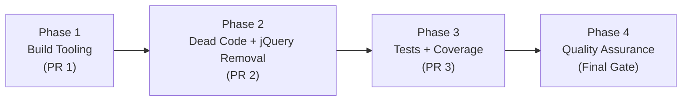
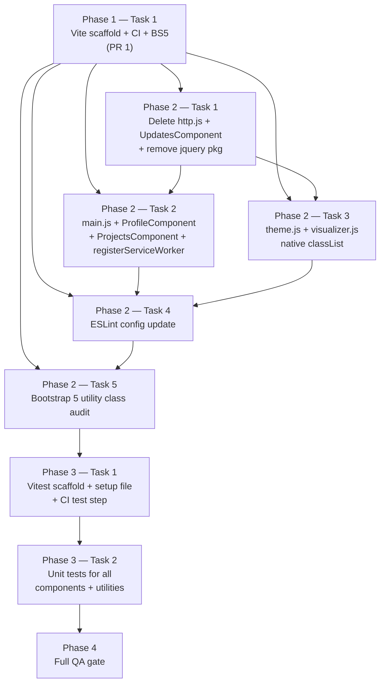

# Work Plan: Vue 3 + Vite Migration

Created Date: 2026-04-20
Type: refactor
Estimated Duration: 3 PRs / 3–5 days
Estimated Impact: 18 files changed (7 deleted, 3 new, 8 updated)
Related Issue/PR: https://github.com/jcchikikomori/portfolio/issues/62

## Related Documents

- Design Doc: [docs/design/vue3-vite-migration.md](../design/vue3-vite-migration.md)
- ADR: [docs/adr/ADR-0001-vue3-vite-migration.md](../adr/ADR-0001-vue3-vite-migration.md)

---

## Verification Strategy (from Design Doc)

### Correctness Proof Method

- **Correctness definition**: The migrated application produces identical visible output to the current Vue 2 build across all supported viewports, all existing interactions function, and zero jQuery imports remain in the codebase.
- **Verification method**: (1) Side-by-side visual comparison of the deployed GitHub Pages URL against a local Vue 2 build snapshot. (2) `pnpm run lint` exits with code 0. (3) `pnpm run test` reports all passing with coverage >= 95%. (4) `grep -r "from 'jquery'" src/` returns no results.
- **Verification timing**: After each PR — PR 1 verified by build success; PR 2 verified by lint + visual check; PR 3 verified by test coverage report.

### Early Verification Point

- **First verification target**: PR 1 — Vite replaces Webpack. `pnpm run build` must succeed and `pnpm run dev` must serve the application (Vue 2 with jQuery still present at this point).
- **Success criteria**: `dist/index.html` exists; `pnpm run dev` opens the portfolio in a browser with no build errors; GitHub Actions `Build Test` workflow passes on all Node versions in the matrix.
- **Failure response**: If Vite build fails (most likely Sass import path issues in `_v2.scss`), fix the Sass paths before proceeding to PR 2. Do not proceed to jQuery removal until the Vite build is green.

---

## Quality Assurance Mechanisms (from Design Doc)

Adopted quality gates for the change area. Each task in this plan must satisfy these mechanisms.

| Mechanism | Enforces | Config Location | Covered Files |
|-----------|----------|-----------------|---------------|
| ESLint (`pnpm run lint`) | Vue 3 style rules + security rules (`plugin:vue/vue3-recommended` + `plugin:security/recommended`) | `package.json > eslintConfig` (to be updated to `.eslintrc.json` in Phase 1) | `src/**/*.{js,vue}` |
| depcheck (`pnpx depcheck`) | No unused dependencies remain after removals | `.depcheckrc` (ignore list must be updated after dep changes in Phase 1) | project-wide |
| Build success gate (`pnpm run build`) | Compilable Vite output | `vite.config.js` (new, created in Phase 1) | project-wide |
| Vitest coverage (`pnpm run test`) | >= 95% line and branch coverage | `vite.config.js > test.coverage` (Phase 3) | `src/**` |
| GitHub Actions matrix (Node 18.x, 20.x, 22.x) | Node version compatibility | `.github/workflows/default.yml` | project-wide |

---

## E2E Gap Assessment

No E2E test skeletons were provided. The portfolio application presents a user-facing multi-step journey (load page → click "Music" to open Spotify dialog → close dialog; load page → click "Careers" to open Projects dialog → close dialog). However:

- Both journeys are single-boundary interactions (one click to open, one click/Escape to close) with no state carrying across steps beyond dialog open/close.
- The portfolio has no user authentication, form submission, or multi-page navigation.
- All interactions are covered by unit tests in AC-TEST-01 (dialog open/close, button click events).

Assessment: No multi-step user-facing journey meets the threshold for E2E test generation. Unit test coverage at >= 95% is sufficient.

---

## Design-to-Plan Traceability

Maps each Design Doc technical requirement to the covering task. Every row has a covering task or an explicit gap justification.

| DD Section | DD Item | Category | Covered By Task(s) | Gap Status | Notes |
|---|---|---|---|---|---|
| Implementation Plan — PR 1 | Replace `@vue/cli-service` with Vite; create `vite.config.js` | impl-target | Phase 1 — Task 1 | covered | |
| Implementation Plan — PR 1 | Update `.nvmrc` to Node 22 | prerequisite | Phase 1 — Task 1 | covered | |
| Implementation Plan — PR 1 | Update GitHub Actions workflow files | prerequisite | Phase 1 — Task 1 | covered | |
| Implementation Plan — PR 1 | Delete `babel.config.js`, `vue.config.js`, `volar.config.js` | impl-target | Phase 1 — Task 1 | covered | |
| Implementation Plan — PR 1 | Update `package.json` scripts (`dev`, `build`, `lint`) | connection-switching | Phase 1 — Task 1 | covered | |
| Implementation Plan — PR 1 | Update Bootstrap Sass import path in `_v2.scss` (v4 → v5) | impl-target | Phase 1 — Task 1 | covered | |
| Implementation Plan — PR 1 | Add `vite-plugin-pwa` | connection-switching | Phase 1 — Task 1 | covered | |
| Interface Change Matrix | `vue-cli-service serve` → `vite` / `vue-cli-service build` → `vite build` | contract-change | Phase 1 — Task 1 | covered | |
| Interface Change Matrix | `process.env.NODE_ENV` → `import.meta.env.MODE` | contract-change | Phase 2 — Task 2 | covered | Env var swap is part of registerServiceWorker.js update |
| Interface Change Matrix | Bootstrap 4 Sass import path change | contract-change | Phase 1 — Task 1 | covered | |
| Implementation Plan — PR 2 | Delete `src/http.js` | impl-target | Phase 2 — Task 1 | covered | AC-DELETE-01, AC-SEC-01 |
| Implementation Plan — PR 2 | Delete `src/components/UpdatesComponent.vue` | impl-target | Phase 2 — Task 1 | covered | AC-DELETE-02 |
| Implementation Plan — PR 2 | Remove all jQuery imports from `src/main.js` | impl-target | Phase 2 — Task 2 | covered | AC-JQUERY-01 |
| Implementation Plan — PR 2 | Rewrite `src/main.js` to Vue 3 `createApp` | impl-target | Phase 2 — Task 2 | covered | AC-VUE-01 |
| Implementation Plan — PR 2 | Remove jQuery from `src/theme.js`; replace with native `classList` | impl-target | Phase 2 — Task 3 | covered | AC-THEME-01, AC-THEME-02 |
| Implementation Plan — PR 2 | Remove jQuery from `src/visualizer.js`; replace with native `classList` | impl-target | Phase 2 — Task 3 | covered | AC-THEME-03 |
| Implementation Plan — PR 2 | Remove jQuery `goToUrl` from `ProfileComponent.vue`; replace with `window.open` | impl-target | Phase 2 — Task 2 | covered | AC-VUE-05, AC-SEC-04 |
| Implementation Plan — PR 2 | Remove jQuery `goToUrl` from `ProjectsComponent.vue`; replace with `window.open` | impl-target | Phase 2 — Task 2 | covered | AC-VUE-05, AC-SEC-04 |
| Implementation Plan — PR 2 | Remove `UpdatesComponent` import from `ProfileComponent.vue` | impl-target | Phase 2 — Task 1 | covered | AC-DELETE-03 |
| Implementation Plan — PR 2 | Remove `dialogPolyfill.registerDialog` calls; keep `showModal` | impl-target | Phase 2 — Task 2 | covered | AC-VUE-03, AC-VUE-04 |
| Implementation Plan — PR 2 | Update `registerServiceWorker.js` `process.env` → `import.meta.env` | contract-change | Phase 2 — Task 2 | covered | |
| Implementation Plan — PR 2 | Update ESLint config to `plugin:vue/vue3-recommended` + `eslint-plugin-security` | impl-target | Phase 2 — Task 4 | covered | AC-BUILD-03, AC-SEC-02 |
| Implementation Plan — PR 2 | Remove `jquery` and `@types/jquery` from `package.json` | impl-target | Phase 2 — Task 1 | covered | AC-JQUERY-02 |
| Implementation Plan — PR 3 | Add Vitest + `@vue/test-utils@^2`; configure coverage | prerequisite | Phase 3 — Task 1 | covered | AC-BUILD-04 |
| Implementation Plan — PR 3 | Create `src/tests/` and write unit tests for all components | impl-target | Phase 3 — Task 2 | covered | AC-TEST-01 |
| Implementation Plan — PR 3 | Write unit tests for `theme.js` and `visualizer.js` | impl-target | Phase 3 — Task 2 | covered | AC-TEST-01 |
| Implementation Plan — PR 3 | Update `default.yml` to run `pnpm run test` step in CI | connection-switching | Phase 3 — Task 1 | covered | AC-BUILD-04, AC-BUILD-05 |
| Test Boundaries | Mock `window.matchMedia`, `window.AudioContext`, `window.open` in Vitest setup | impl-target | Phase 3 — Task 1 | covered | AC-TEST-03 |
| Verification Strategy | Side-by-side visual comparison after each PR | verification | Phase 1 QA, Phase 2 QA, Phase 4 QA | covered | Manual check at each phase gate |
| Security Considerations | `eslint-plugin-security` enabled; zero suppressed violations | verification | Phase 2 — Task 4 / Phase 4 QA | covered | AC-SEC-02 |
| Security Considerations | No `innerHTML` assignments in `src/` | verification | Phase 2 — Task 4 / Phase 4 QA | covered | AC-SEC-03 |
| Security Considerations | All `window.open` calls include `noopener,noreferrer` | verification | Phase 2 — Task 2 / Phase 4 QA | covered | AC-SEC-04 |
| Bootstrap Upgrade | Audit and remove Bootstrap 4-exclusive utility classes from SFC templates | verification | Phase 2 — Task 5 | covered | AC-BS-03 |

---

## Objective

Migrate the personal portfolio from Vue 2 + Webpack + jQuery + Bootstrap 4 to Vue 3 + Vite + Bootstrap 5, eliminate all jQuery, remove dead code, introduce a Vitest unit test suite, and advance the Node runtime to 22 LTS — all within the 200-line PR constraint.

## Background

Vue 2 and Node 16 are both EOL. The codebase ships with an active XSS sink (`src/http.js:43`), dead backend code (`UpdatesComponent.vue`), and a dual-mutation architecture (Vue 2 virtual DOM + jQuery direct DOM writes). Vite replaces `@vue/cli-service` as the build tool. Three sequential PRs achieve the migration while keeping each PR independently reviewable at <= 200 lines.

---

## Risks and Countermeasures

### Technical Risks

- **Risk**: Vite cannot resolve Bootstrap 5 Sass import due to path prefix difference from Webpack.
  - **Impact**: High — blocks all subsequent phases.
  - **Countermeasure**: Fix `_v2.scss` import path in Phase 1 Task 1 immediately; validate `pnpm run build` before finishing Phase 1.

- **Risk**: Bootstrap 5 utility class renames (`mr-*` → `me-*`, `ml-*` → `ms-*`, `float-left` → `float-start`) break layout.
  - **Impact**: Medium — visual regression in rendered portfolio.
  - **Countermeasure**: Run grep audit `grep -r "mr-\|ml-\|float-left\|float-right" src/**/*.vue` in Phase 2 Task 5 before merging PR 2.

- **Risk**: `dialog-polyfill` CSS conflicts with Bootstrap 5 styles.
  - **Impact**: Low — dialogs may display incorrectly.
  - **Countermeasure**: Audit `public/css/dialog-polyfill.css` for Bootstrap class conflicts; remove polyfill registration calls in Phase 2 Task 2; keep CSS file unless visual regression is confirmed.

- **Risk**: `vite-plugin-pwa` generates a different `sw.js` manifest than `@vue/cli-plugin-pwa`.
  - **Impact**: Medium — PWA may not install correctly on GitHub Pages.
  - **Countermeasure**: Compare service worker registration in browser DevTools before/after merge of PR 1.

- **Risk**: Vitest coverage fails to reach 95% for `theme.js` and `visualizer.js`.
  - **Impact**: Medium — CI gate blocks PR 3.
  - **Countermeasure**: Explicitly mock `window.matchMedia` and `window.AudioContext` in the Vitest setup file before writing tests.

### Schedule Risks

- **Risk**: GitHub Actions deploy fails due to outdated action versions.
  - **Impact**: High — blocks deployment even if build passes.
  - **Countermeasure**: Update all action versions in Phase 1 Task 1 as the first change in PR 1.

---

## Phase Structure Diagram



---

## Task Dependency Diagram



---

## Implementation Phases

Implementation approach: **Vertical Slice** — each phase corresponds to one independently deployable PR.

---

### Phase 1: Build Tooling + Node Upgrade (PR 1) (Estimated commits: 1)

**Purpose**: Replace `@vue/cli-service` / Webpack with Vite; upgrade Node runtime to 22 LTS; update GitHub Actions; upgrade Bootstrap 4 → 5 at the package and Sass import level. This phase proves the foundational build tooling works — all subsequent phases depend on it.

**Verification**: Early verification point — `pnpm run build` produces `dist/index.html`; `pnpm run dev` serves the app; GitHub Actions matrix passes on all Node versions. Vue 2 + jQuery still present at this stage (build tooling only).

#### Tasks

- [ ] **Task 1: Vite scaffold, CI hardening, Bootstrap 5 dependency install, and Node 22 upgrade**

  **What to do**:
  1. Install new dependencies with pnpm:
     - Add: `vue@^3.4`, `vite@^5`, `@vitejs/plugin-vue@^5`, `vite-plugin-pwa@^0.20`, `bootstrap@^5.3`, `sass`
     - Remove: `@vue/cli-service`, `@vue/cli-plugin-babel`, `@vue/cli-plugin-eslint`, `@vue/cli-plugin-pwa`, `@babel/eslint-parser`, `@babel/core`, `@vue/babel-preset-app`, `sass-loader`, `volar-service-vetur`
     - Defer jQuery and `@types/jquery` removal to Phase 2 (build must still work with jQuery present)
  2. Create `vite.config.js` with `@vitejs/plugin-vue`, `vite-plugin-pwa` (`registerType: 'autoUpdate'`), `css.preprocessorOptions.scss.quietDeps: true`, and `base: '/'`.
  3. Delete `vue.config.js`, `babel.config.js`, `volar.config.js`.
  4. Update `package.json` scripts: `"dev": "vite"`, `"build": "vite build"`, `"preview": "vite preview"`, `"lint": "eslint src/"`.
  5. Update `src/assets/scss/vendors/_v2.scss`: change `@import "/node_modules/bootstrap/scss/bootstrap"` to `@import "bootstrap/scss/bootstrap"`. Reassess and update `@import "/node_modules/dialog-polyfill/dialog-polyfill"` to `@import "dialog-polyfill/dialog-polyfill"`.
  6. Update `.nvmrc` from `v16.17.0` to `22`.
  7. Update `.github/workflows/gh-pages.yml`: Node matrix `[18.x]` → `[20.x]`; update `actions/checkout`, `actions/setup-node`, and `JamesIves/github-pages-deploy-action` to current versions.
  8. Update `.github/workflows/default.yml`: Update action versions to current; Node matrix already includes `22.x` — verify and retain.
  9. Update `public/index.html` if Vite requires entry point changes (e.g., remove `<script>` tags that reference Webpack-injected bundles; Vite uses `<script type="module" src="/src/main.js">`).
  10. Run `pnpm run build` locally and confirm `dist/index.html` exists. Run `pnpm run dev` and visually verify the app loads.

  **Completion criteria**:
  - Implementation: `vite.config.js` exists; `vue.config.js`, `babel.config.js`, `volar.config.js` deleted; `_v2.scss` import paths updated; `.nvmrc` = `22`; GitHub Actions updated.
  - Quality: `pnpm run build` exits 0 with `dist/index.html` present; no Sass deprecation errors in build output.
  - Integration: `pnpm run dev` serves app at `http://localhost:5173`; GitHub Actions `Build Test` workflow passes on all Node versions.

  **Estimated line count**: ~80–120 lines.
  **PR**: PR 1

#### Phase 1 Completion Criteria

- [ ] `pnpm run build` exits 0; `dist/index.html` exists; no Sass errors.
- [ ] `pnpm run dev` starts without errors and serves the portfolio.
- [ ] GitHub Actions CI passes (build matrix on Node 18, 20, 22).
- [ ] `vite.config.js` committed; `vue.config.js`, `babel.config.js`, `volar.config.js` deleted.
- [ ] `.nvmrc` = `22`; GitHub Actions action versions updated.
- [ ] `grep -c "jQuery" dist/assets/*.js` may still return > 0 at this phase (jQuery removal is Phase 2).

---

### Phase 2: Dead Code Deletion + jQuery Removal (PR 2) (Estimated commits: 1)

**Purpose**: Delete XSS vector (`http.js`) and dead feed (`UpdatesComponent.vue`); remove all jQuery imports and replace every jQuery call with native DOM APIs; rewrite `src/main.js` to Vue 3 `createApp`; update `registerServiceWorker.js` env variable syntax; update ESLint config for Vue 3 + security rules; audit Bootstrap 5 utility class usage.

**Verification**: L1 (portfolio renders in browser with no Vue warnings; dialogs open; theme toggles) + L3 (lint passes at `pnpm run lint`).

**Prerequisite**: Phase 1 merged to `develop`.

#### Tasks

- [ ] **Task 1: Delete dead code and remove jQuery from package.json**

  **What to do**:
  1. Delete `src/http.js`.
  2. Delete `src/components/UpdatesComponent.vue`.
  3. Remove `jquery` and `@types/jquery` from `package.json` dependencies. Run `pnpm install` to update `pnpm-lock.yaml`.
  4. Verify no remaining references to `UpdatesComponent` or `http.js` anywhere in `src/` using grep.

  **Completion criteria**:
  - Implementation: `src/http.js` and `src/components/UpdatesComponent.vue` do not exist; `package.json` has no `jquery` or `@types/jquery` entry.
  - Quality: `grep -r "http.js\|UpdatesComponent\|from 'jquery'\|import \$" src/` returns no results.
  - Integration: `pnpm install` completes without error; `pnpm run build` still exits 0 (confirms no remaining import of deleted files).

  **Covers**: AC-DELETE-01, AC-DELETE-02, AC-JQUERY-02, AC-SEC-01.

- [ ] **Task 2: Rewrite main.js, ProfileComponent.vue, ProjectsComponent.vue, registerServiceWorker.js — remove jQuery, apply Vue 3 patterns**

  **What to do**:
  1. `src/main.js`: Replace `new Vue({ render: h => h(App) }).$mount('#app')` with `createApp(App).mount('#app')`; remove `import $ from 'jquery'`; remove `Vue.config.productionTip = false`; remove `window.onload` jQuery DOM call (`$("#profile-container").show()`).
  2. `src/components/ProfileComponent.vue`:
     - Remove `import $ from 'jquery'`.
     - Remove `import UpdatesComponent from './UpdatesComponent.vue'` and its component registration.
     - Remove `<UpdatesComponent />` from the template.
     - Replace `goToUrl(url, includeTarget = true)` body with `window.open(url, '_blank', 'noopener,noreferrer')`. Remove the `includeTarget` parameter entirely (AC-VUE-06).
     - Replace `dialogPolyfill.registerDialog(el); el.showModal()` with `el.showModal()` for both Spotify and Projects dialogs.
  3. `src/components/ProjectsComponent.vue`:
     - Remove `import $ from 'jquery'`.
     - Replace `goToUrl(url, includeTarget = true)` body with `window.open(url, '_blank', 'noopener,noreferrer')`. Remove `includeTarget` parameter.
  4. `src/registerServiceWorker.js`: Replace all `process.env.NODE_ENV` with `import.meta.env.MODE`; replace `process.env.BASE_URL` with `import.meta.env.BASE_URL`.

  **Completion criteria**:
  - Implementation: `main.js` uses `createApp`; `ProfileComponent.vue` and `ProjectsComponent.vue` have no jQuery imports; `goToUrl` signature is `goToUrl(url)` in both components; `registerServiceWorker.js` uses `import.meta.env`.
  - Quality: `grep -r "from 'jquery'\|import \$\|process\.env" src/` returns no results; `pnpm run build` exits 0.
  - Integration: Open browser on dev server; confirm Vue app mounts with no warnings; confirm "Music" and "Careers" dialogs open; confirm link buttons open in new tab.

  **Covers**: AC-VUE-01, AC-VUE-02, AC-VUE-03, AC-VUE-04, AC-VUE-05, AC-VUE-06, AC-JQUERY-01, AC-DELETE-03, AC-SEC-04.

- [ ] **Task 3: Remove jQuery from theme.js and visualizer.js — replace with native classList**

  **What to do**:
  1. `src/theme.js`:
     - Remove `import $ from 'jquery'`.
     - `darkMode()`: Replace `$("body").addClass("dark")` with `document.body.classList.add("dark")`; replace `$("#profile-logo").attr("src", v)` with `document.getElementById("profile-logo").setAttribute("src", v)`; replace `.nes-container`/`.nes-dialog` jQuery `each()` loops with `document.querySelectorAll(".nes-container").forEach(el => el.classList.add("dark"))` etc.
     - `normalTheme()`: Apply the same `classList.remove` equivalents.
     - Function signatures `darkMode(): void` and `normalTheme(): void` remain unchanged.
  2. `src/visualizer.js`:
     - Remove `import $ from 'jquery'`.
     - `handlePlayback()`: Replace `$("body").addClass("breathing-visualizer")` with `document.body.classList.add("breathing-visualizer")`; replace `$("body").removeClass("breathing-visualizer")` with `document.body.classList.remove("breathing-visualizer")`.
     - Function signature `handlePlayback(): void` remains unchanged.

  **Completion criteria**:
  - Implementation: `theme.js` and `visualizer.js` have no jQuery imports; all jQuery calls replaced with native DOM equivalents.
  - Quality: `grep -r "from 'jquery'\|import \$" src/theme.js src/visualizer.js` returns no results; `pnpm run build` exits 0.
  - Integration: Verify dark theme applies on page load if `prefers-color-scheme: dark`; verify `breathing-visualizer` class appears on body when audio plays (manual or DevTools check).

  **Covers**: AC-JQUERY-01, AC-THEME-01, AC-THEME-02, AC-THEME-03.

- [ ] **Task 4: Update ESLint config to Vue 3 + security rules; verify zero violations**

  **What to do**:
  1. Extract or replace the inline `eslintConfig` in `package.json` with a standalone `.eslintrc.json` at project root:
     ```json
     {
       "root": true,
       "env": { "node": true, "browser": true },
       "extends": [
         "plugin:vue/vue3-recommended",
         "plugin:security/recommended"
       ],
       "rules": {},
       "parserOptions": {
         "ecmaVersion": 2022,
         "sourceType": "module"
       }
     }
     ```
     Remove `"jquery": true` from `env`. Remove `"@babel/eslint-parser"` from `parser`.
  2. Install `eslint-plugin-security@^3` with pnpm.
  3. Run `pnpm run lint`. Fix any violations surfaced by `plugin:vue/vue3-recommended` in `SpotifyComponent.vue`, `LoaderComponent.vue`, or `App.vue`.
  4. Confirm `pnpm run lint` exits 0 with zero errors and zero security rule violations.

  **Completion criteria**:
  - Implementation: `.eslintrc.json` (or equivalent) extends `plugin:vue/vue3-recommended` and `plugin:security/recommended`; `eslint-plugin-security` is in `devDependencies`.
  - Quality: `pnpm run lint` exits 0 with zero errors; no `// eslint-disable` suppressions added to production code.
  - Integration: ESLint config applied project-wide (`src/**`).

  **Covers**: AC-BUILD-03, AC-SEC-02, AC-SEC-03.

- [ ] **Task 5: Bootstrap 5 utility class audit in SFC templates**

  **What to do**:
  1. Run grep audit: `grep -rn "mr-\|ml-\|pr-\|pl-\|float-left\|float-right\|text-left\|text-right\|font-weight-\|font-italic\|badge-\|bg-gradient-\|no-gutters\|form-group\|form-row\|form-inline\|sr-only" src/**/*.vue`.
  2. For each match found, replace with the Bootstrap 5 equivalent (e.g., `mr-*` → `me-*`, `ml-*` → `ms-*`, `float-left` → `float-start`, `float-right` → `float-end`).
  3. Run `pnpm run build` and visually check the rendered portfolio for layout regressions.

  **Completion criteria**:
  - Implementation: Zero Bootstrap 4-exclusive utility class strings in `src/**/*.vue`.
  - Quality: `pnpm run build` exits 0; no Sass errors; visual review confirms layout unchanged.
  - Integration: Bootstrap 5 CSS applied; no layout breakage across mobile, tablet, desktop viewports.

  **Covers**: AC-BS-01, AC-BS-02, AC-BS-03.

#### Phase 2 Completion Criteria

- [ ] `src/http.js` does not exist.
- [ ] `src/components/UpdatesComponent.vue` does not exist.
- [ ] `grep -r "from 'jquery'\|import \$" src/` returns no results.
- [ ] `grep -r "process\.env" src/` returns no results.
- [ ] `pnpm run build` exits 0; `pnpm run lint` exits 0 with zero errors.
- [ ] `grep -c "jQuery" dist/assets/*.js` returns 0.
- [ ] Visual browser check: portfolio renders; dialogs open; theme toggles; no Vue console warnings.
- [ ] Bootstrap 5 utility class grep audit returns zero Bootstrap 4-exclusive matches.

---

### Phase 3: Tests + Coverage (PR 3) (Estimated commits: 1)

**Purpose**: Introduce Vitest with `@vue/test-utils@^2`; write unit tests for all components and utility modules; configure coverage at >= 95%; add `pnpm run test` to the CI `default.yml` workflow.

**Verification**: L2 — all tests pass; Vitest coverage report shows >= 95% line and branch coverage over `src/`.

**Prerequisite**: Phase 2 merged to `develop`.

#### Tasks

- [ ] **Task 1: Vitest scaffold, setup file, and CI integration**

  **What to do**:
  1. Install with pnpm: `vitest@^1`, `@vue/test-utils@^2`, `jsdom`, `@vitest/coverage-v8`.
  2. Add to `vite.config.js` test configuration block:
     ```js
     test: {
       environment: 'jsdom',
       globals: true,
       setupFiles: ['./src/tests/setup.js'],
       coverage: {
         provider: 'v8',
         reporter: ['text', 'lcov'],
         threshold: { lines: 95, branches: 95 },
         include: ['src/**/*.{js,vue}'],
         exclude: ['src/tests/**', 'src/registerServiceWorker.js']
       }
     }
     ```
  3. Create `src/tests/setup.js` with global mocks required by jsdom:
     - Mock `window.matchMedia` (jsdom does not implement it).
     - Mock `window.AudioContext` (jsdom does not implement Web Audio API).
     - Mock `window.open` as a `vi.fn()` spy.
     - Mock `register-service-worker`'s `register` function.
  4. Add `"test": "vitest run --coverage"` to `package.json` scripts.
  5. Update `.github/workflows/default.yml`: add `pnpm run test` step after the build step.

  **Completion criteria**:
  - Implementation: `vitest`, `@vue/test-utils@^2`, `jsdom`, `@vitest/coverage-v8` in `devDependencies`; `src/tests/setup.js` exists with all four mocks; `vite.config.js` has `test` block with coverage threshold at 95%.
  - Quality: `pnpm run test` exits 0 with zero test failures even before tests are written (no test files yet = no failures).
  - Integration: `default.yml` includes `pnpm run test` step; CI run picks up the test step.

  **Covers**: AC-BUILD-04, AC-TEST-03.

- [ ] **Task 2: Unit tests for all components and utility modules (>= 95% coverage)**

  **What to do**:

  Create the following test files in `src/tests/`:

  **`src/tests/App.spec.js`** (AC-TEST-01 — App.vue):
  - Mount `App.vue` with `@vue/test-utils` `mount()` in jsdom.
  - Assert no `console.warn` or `console.error` calls during mount (spy on `console.warn` and `console.error` before mount).
  - Assert the rendered output contains a `#app` wrapper or the root component element.
  - Test cases: (1) mounts without Vue warnings, (2) renders root element.

  **`src/tests/ProfileComponent.spec.js`** (AC-TEST-01 — ProfileComponent.vue, AC-VUE-05):
  - Mount `ProfileComponent.vue` with `mount()`.
  - Test "Music" button click triggers `showModal()` on `#dialog-spotify` (mock `document.getElementById` return value with a spy for `showModal`).
  - Test "Careers" button click triggers `showModal()` on `#dialog-projects`.
  - Test a link button click calls `window.open` with the correct URL and `'_blank'` target and `'noopener,noreferrer'`.
  - Test cases: (1) Music button opens Spotify dialog, (2) Careers button opens Projects dialog, (3) link button calls window.open with noopener.

  **`src/tests/ProjectsComponent.spec.js`** (AC-TEST-01 — ProjectsComponent.vue):
  - Mount `ProjectsComponent.vue` with `mount()`.
  - Test a project card link click calls `window.open` with the correct URL and `'noopener,noreferrer'`.
  - Test cases: (1) project link button calls window.open with noopener.

  **`src/tests/SpotifyComponent.spec.js`** (AC-TEST-01 — SpotifyComponent.vue):
  - Mount `SpotifyComponent.vue` with `mount()`.
  - Test close button click calls `closeSpotify()` (or the dialog's `close()` method on the dialog element).
  - Test cases: (1) renders without errors, (2) close button calls dialog close.

  **`src/tests/theme.spec.js`** (AC-TEST-01 — theme.js):
  - Import `darkMode` and `normalTheme` from `src/theme.js`.
  - Before each test, reset `document.body.className`.
  - `darkMode()`: Assert `document.body.classList.contains('dark')` is true.
  - `normalTheme()`: After `darkMode()`, call `normalTheme()`; assert `document.body.classList.contains('dark')` is false.
  - Assert profile logo `src` attribute is set correctly after each call (add a `#profile-logo` img element to jsdom body in test setup).
  - Test cases: (1) darkMode adds 'dark' to body, (2) normalTheme removes 'dark' from body, (3) darkMode sets logo to white variant, (4) normalTheme sets logo to default variant.

  **`src/tests/visualizer.spec.js`** (AC-TEST-01 — visualizer.js):
  - Import `handlePlayback` from `src/visualizer.js`.
  - Before each test, reset `document.body.className`.
  - Mock or dispatch a play event; assert `document.body.classList.contains('breathing-visualizer')` is true.
  - Mock or dispatch pause/ended event; assert class is removed.
  - Test cases: (1) play event adds 'breathing-visualizer', (2) pause event removes 'breathing-visualizer', (3) ended event removes 'breathing-visualizer'.

  **Completion criteria**:
  - Implementation: Six test files in `src/tests/`; test cases covering all functions listed in AC-TEST-01.
  - Quality: `pnpm run test` passes with all tests green; coverage report shows >= 95% lines and branches over `src/`; no `vi.mock` suppressions hiding untested paths.
  - Integration: `window.open` spy verifies `noopener,noreferrer` is always passed (AC-SEC-04); `document.body.classList` state verified through real jsdom (AC-THEME-01, AC-THEME-02, AC-THEME-03).

  **Covers**: AC-TEST-01, AC-TEST-02, AC-TEST-03.

#### Phase 3 Completion Criteria

- [ ] `pnpm run test` exits 0; all tests pass.
- [ ] Vitest coverage report: >= 95% line coverage and >= 95% branch coverage over `src/`.
- [ ] Six test files committed in `src/tests/`.
- [ ] `default.yml` CI workflow includes `pnpm run test` step and it passes.

---

### Phase 4: Quality Assurance — Final Gate (Estimated commits: 0–1)

**Purpose**: Cross-cutting acceptance criteria verification; confirm all QA mechanisms pass; confirm visual parity with pre-migration build; confirm jQuery bundle exclusion; confirm security rules pass.

**Verification**: All Design Doc ACs verified; zero lint errors; >= 95% coverage; no jQuery in bundle.

#### Tasks

- [ ] **Verify all Design Doc acceptance criteria achieved**

  Run through every AC and mark each as met:
  - AC-BUILD-01 through AC-BUILD-05
  - AC-VUE-01 through AC-VUE-06
  - AC-JQUERY-01 through AC-JQUERY-03
  - AC-DELETE-01 through AC-DELETE-03
  - AC-THEME-01 through AC-THEME-03
  - AC-BS-01 through AC-BS-03
  - AC-SEC-01 through AC-SEC-04
  - AC-TEST-01 through AC-TEST-03

- [ ] **Security review: confirm security ACs implemented**

  - `grep -r "innerHTML" src/` returns no results (AC-SEC-03).
  - `grep -r "window.open" src/` — every match includes `'noopener,noreferrer'` (AC-SEC-04).
  - `pnpm run lint` exits 0 with zero `security/` rule violations (AC-SEC-02).
  - `src/http.js` does not exist (AC-SEC-01, AC-DELETE-01).

- [ ] **Full quality check pass**

  ```
  pnpm run lint        # exits 0, zero errors
  pnpm run build       # exits 0, no Sass errors, dist/index.html exists
  pnpm run test        # exits 0, all tests pass, coverage >= 95%
  grep -c "jQuery" dist/assets/*.js   # returns 0 (AC-JQUERY-03)
  ```

- [ ] **Visual parity check**

  Open `pnpm run preview` and verify:
  - Profile card renders correctly on mobile, tablet, desktop.
  - "Music" button opens Spotify `<dialog>`; Escape/close button closes it.
  - "Careers" button opens Projects `<dialog>`; close button closes it.
  - Link buttons (LinkedIn, GitHub, Blog) open in new tab.
  - Dark theme applies when `prefers-color-scheme: dark` is set.
  - No Vue warnings in browser console.

- [ ] **depcheck verification**

  Run `pnpx depcheck` and confirm no unused dependencies remain in `package.json`. Update `.depcheckrc` ignore list if needed for false positives (e.g., `vite-plugin-pwa` registered in `vite.config.js` not detected by depcheck).

#### Phase 4 Completion Criteria

- [ ] All Design Doc acceptance criteria verified as met.
- [ ] `pnpm run lint` exits 0 with zero errors.
- [ ] `pnpm run build` exits 0 with zero Sass errors.
- [ ] `pnpm run test` exits 0 with >= 95% coverage.
- [ ] `grep -c "jQuery" dist/assets/*.js` returns 0.
- [ ] `pnpx depcheck` reports no unused dependencies.
- [ ] Visual parity confirmed across mobile, tablet, desktop.
- [ ] No Vue warnings in browser console on first load.

---

## Completion Criteria

- [ ] All four phases completed.
- [ ] All Design Doc acceptance criteria satisfied (AC-BUILD-01 through AC-TEST-03).
- [ ] Zero ESLint errors under `plugin:vue/vue3-recommended` + `plugin:security/recommended`.
- [ ] Vitest coverage >= 95% lines and branches.
- [ ] No jQuery imports anywhere in `src/`; no jQuery in `dist/` bundle.
- [ ] `src/http.js` and `src/components/UpdatesComponent.vue` do not exist in the repository.
- [ ] `pnpm run build` produces `dist/` deployable to GitHub Pages.
- [ ] GitHub Actions `Build and Deploy` workflow passes on push to `master`.
- [ ] Three PRs merged to `develop`, then to `master`; each PR <= 200 lines.

---

## Progress Tracking

### Phase 1 — Build Tooling + Node Upgrade

- Start: YYYY-MM-DD HH:MM
- Complete: YYYY-MM-DD HH:MM
- Notes:

### Phase 2 — Dead Code Deletion + jQuery Removal

- Start: YYYY-MM-DD HH:MM
- Complete: YYYY-MM-DD HH:MM
- Notes:

### Phase 3 — Tests + Coverage

- Start: YYYY-MM-DD HH:MM
- Complete: YYYY-MM-DD HH:MM
- Notes:

### Phase 4 — Quality Assurance

- Start: YYYY-MM-DD HH:MM
- Complete: YYYY-MM-DD HH:MM
- Notes:

---

## Notes

- **pnpm only**: All dependency operations must use `pnpm`. Never use `npm` or `yarn` in this project.
- **PR size constraint**: Each PR must stay at or below 200 lines changed. If Task 2 in Phase 2 approaches this limit, split into a separate commit for `main.js` + components and a separate commit for `registerServiceWorker.js`.
- **jQuery deferral in Phase 1**: jQuery is NOT removed in Phase 1. The package remains in `package.json` through Phase 1 so that the Vite build can succeed with existing Vue 2 + jQuery code. Removal happens in Phase 2 Task 1.
- **`dialog-polyfill` status**: The polyfill registration calls (`dialogPolyfill.registerDialog()`) are removed in Phase 2 Task 2 since native `<dialog>` has ~96% baseline support. The `public/css/dialog-polyfill.css` file is retained unless visual regression is confirmed during Phase 2 QA. The Sass import in `_v2.scss` is updated in Phase 1.
- **`registerServiceWorker.js` coverage exclusion**: This file is excluded from Vitest coverage because it requires a real service worker environment. The `register-service-worker` package is mocked in `setup.js`.
- **Branch flow**: Work on `develop` branch. Each phase corresponds to one PR targeting `develop`. After all three feature PRs are merged to `develop`, raise a release PR from `develop` to `master` to trigger the `gh-pages` deploy.
- **Glyphicon fonts**: `public/fonts/` contains Bootstrap 3 glyphicon artifacts. These are not blocking but can be removed as a clean-up opportunity in Phase 4 QA if depcheck flags them as unused assets.
