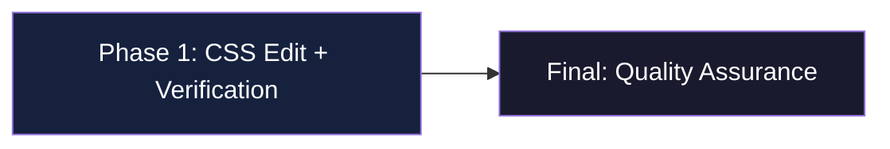
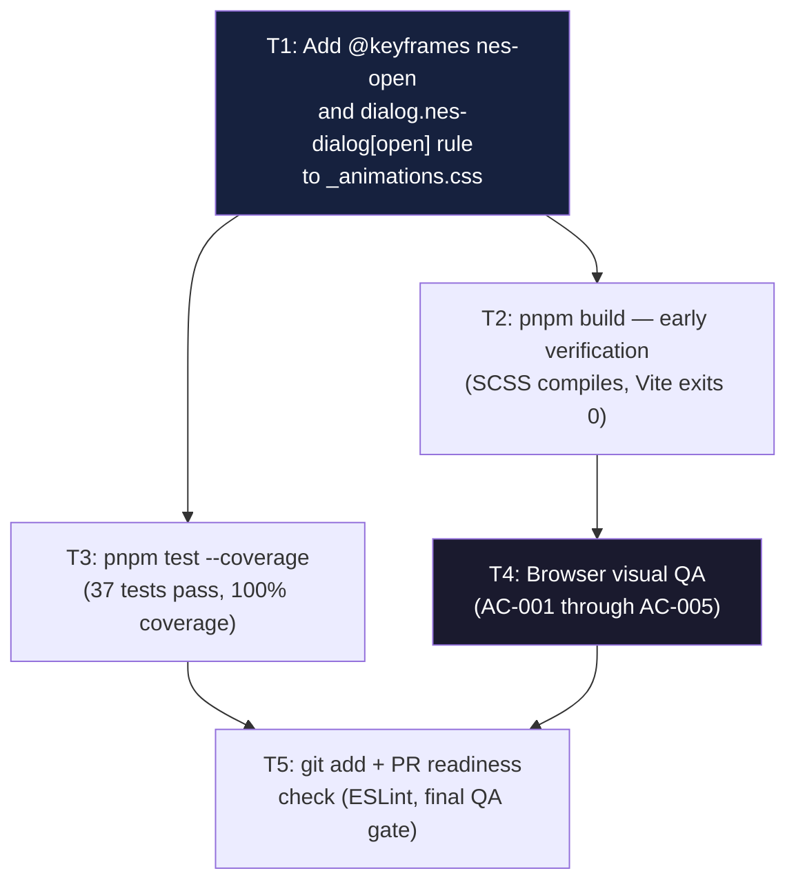

# Work Plan: NES-Style Dialog Opening Animation

Created Date: 2026-04-21
Type: feature
Estimated Duration: 1 hour
Estimated Impact: 1 file
Related Issue/PR: #61

## Related Documents

- Design Doc: [docs/design/nes-dialog-animation-design.md](../design/nes-dialog-animation-design.md)
- ADR: None (1-file CSS change; below ADR threshold per documentation-criteria)
- PRD: None (direct implementation from issue #61)

## Verification Strategy (from Design Doc)

### Correctness Proof Method

- **Correctness definition**: The dialog opens with a visible top-to-bottom discrete step reveal. The animation plays on every open, does not play on close, and does not alter any other visual behavior. The Vitest suite continues to pass at 100% coverage.
- **Verification method**:
  1. `pnpm build` exits 0 (SCSS compiled without error).
  2. `pnpm test --coverage` exits 0, 37 tests pass, coverage thresholds met.
  3. Browser QA: open `vite preview` in Chromium and Firefox; click "Careers" and "Music" buttons; observe discrete step reveal on each dialog open.
- **Verification timing**: After the single file edit, before raising a PR.

### Early Verification Point

- **First verification target**: `pnpm build` exits 0 after adding the two CSS rules.
- **Success criteria**: No Sass/Vite compilation error in build output.
- **Failure response**: Inspect SCSS syntax — most likely a missing semicolon or malformed `clip-path` value; fix and re-run build before proceeding to browser QA.

## Quality Assurance Mechanisms (from Design Doc)

Adopted quality gates for the change area. All tasks must satisfy these mechanisms.

| Mechanism | Enforces | Config Location | Covered Files |
|-----------|----------|-----------------|---------------|
| Vitest v2 (`pnpm test`) | Unit test suite (37 tests, 100% line/branch/function/statement coverage) | `vite.config.js:51-62` | `src/**/*.{js,vue}` |
| ESLint (`plugin:vue/vue3-recommended` + `plugin:security/recommended-legacy`) | Vue 3 template rules and Node.js security patterns | `.eslintrc.json` | `src/**/*.{js,vue}` |
| Vite build (`pnpm build`) | Module graph correctness, SCSS compilation, asset bundling | `vite.config.js` | entire `src/` tree |
| Coverage thresholds (`lines/branches/functions: 95`) | Coverage floor must not regress | `vite.config.js:58` | `src/**/*.{js,vue}` |
| Browser visual QA (Chromium + Firefox) | CSS animation renders correctly per AC-001 through AC-005 | manual | dialog open flow |

Notes:
- ESLint does not lint `.css` files; this change introduces no new lint violations, but the existing suite must still pass.
- `Sass quietDeps: true` is already in place (`vite.config.js:44-50`); no action needed.
- CSS animations cannot be asserted in jsdom; browser QA is the sole verification mechanism for animation correctness.

## E2E Gap Check

No E2E test skeletons were provided. This change introduces a visual-only CSS animation on existing dialog open flows. The user-facing steps (click button → dialog opens → animation plays) are verified by browser visual QA rather than automated E2E tests. The Design Doc explicitly states jsdom cannot render CSS animations and designates browser QA as the primary verification mechanism. No E2E gap flag is raised because the verification mechanism is documented and adopted.

## Design-to-Plan Traceability

| DD Section | DD Item | Category | Covered By Task(s) | Gap Status | Notes |
|---|---|---|---|---|---|
| Implementation Plan / Step 1 | Add `@keyframes nes-open` and `dialog.nes-dialog[open]` rule to `_animations.css` | impl-target | Phase 1 Task 1 | covered | |
| Implementation Plan / Step 2 | `pnpm build` exits 0 | verification | Phase 1 Task 2 | covered | Early verification point |
| Implementation Plan / Step 3 | `pnpm test --coverage` — 37 tests pass, 100% coverage | verification | Phase 1 Task 3 | covered | |
| Implementation Plan / Step 4 | Browser visual QA — AC-001 through AC-005 | verification | Phase 1 Task 4 | covered | jsdom limitation; browser QA is primary mechanism |
| Acceptance Criteria / AC-001 | `#dialog-projects` opens with 8-step reveal over 0.4s | verification | Phase 1 Task 4 | covered | Verified via browser QA |
| Acceptance Criteria / AC-002 | `#dialog-spotify` opens with same animation | verification | Phase 1 Task 4 | covered | Verified via browser QA |
| Acceptance Criteria / AC-003 | Animation resets and replays on each open | verification | Phase 1 Task 4 | covered | Verified via browser QA |
| Acceptance Criteria / AC-004 | No animation on dialog close | verification | Phase 1 Task 4 | covered | Verified via browser QA |
| Acceptance Criteria / AC-005 | No visible artifact when no dialog is open | verification | Phase 1 Task 4 | covered | Verified via browser QA |
| Design / Applicable Standards | `_animations.css` imported via `main.scss:12`; no import order change | connection-switching | Phase 1 Task 1 | covered | Additive; existing import covers new rules |
| Design / Constraints | `@keyframes breathing-visualizer` and `_transitions.scss` unchanged | prerequisite | Phase 1 Task 1 | covered | No-op; existing rules preserved |

## Objective

Add a pure-CSS NES-style pixel-reveal opening animation to the `#dialog-projects` and `#dialog-spotify` modal dialogs, reinforcing the retro NES aesthetic. The animation is additive — no existing behavior changes, no JavaScript modifications.

## Background

The two modal dialogs currently appear instantaneously with no transition. GitHub issue #61 requests a NES-style opening animation. The `[open]` attribute is set natively by `showModal()`, making a CSS attribute selector the zero-JS trigger. The entire change fits in one file (~6 lines of CSS).

## Risks and Countermeasures

### Technical Risks

- **Risk**: NES.css vendor CSS sets `animation: none` on `.nes-dialog`, silently suppressing the animation.
  - **Impact**: Medium — animation does not play.
  - **Countermeasure**: Verify visually during browser QA. If override found, add `!important` to the `animation` property in the selector rule.

- **Risk**: Sass compilation error due to syntax mistake in the new CSS rules.
  - **Impact**: Medium — `pnpm build` fails, blocking the PR.
  - **Countermeasure**: Run `pnpm build` immediately after the edit (early verification point); fix any syntax error before proceeding.

- **Risk**: `dialog { display: block; }` polyfill in `_default.scss:244` conflicts with `clip-path`.
  - **Impact**: Low — `display` and `clip-path` are orthogonal CSS properties.
  - **Countermeasure**: Confirmed non-conflicting by design analysis; verify visually during browser QA.

### Schedule Risks

- None. Single-file CSS edit; no dependency on other in-flight work.

## Implementation Phases

Phase structure: **Single Vertical Slice** (per Design Doc implementation approach — one file, one atomic change).

### Task Dependency Diagram

---

### Phase 1: CSS Edit and Verification (Estimated commits: 1)

**Purpose**: Deliver the complete NES-style dialog animation in a single atomic edit and verify all quality gates.
**Verification**: `pnpm build` exits 0 (early verification point), then `pnpm test --coverage` baseline holds, then browser QA confirms AC-001 through AC-005.

#### Tasks

- [ ] **Task 1 — Add animation rules to `src/assets/scss/base/_animations.css`**
  - Add `@keyframes nes-open` block (keyframe at top, before selector rule, consistent with file order).
  - Add `dialog.nes-dialog[open] { animation: nes-open 0.4s steps(8) forwards; }` selector rule below the keyframe.
  - Do not modify existing `@keyframes breathing-visualizer` block.
  - Implementation Complete: Both rules present in `_animations.css`; existing keyframe unchanged.
  - Quality Complete: No extraneous whitespace or syntax errors; file follows kebab-case keyframe naming convention.
  - Integration Complete: No import order changes needed; `main.scss:12` already imports `_animations.css`.

- [ ] **Task 2 — Early verification: `pnpm build` exits 0**
  - Run: `pnpm build`
  - Success criteria: No Sass/Vite error in output; build exits 0.
  - Failure response: Fix SCSS syntax (likely missing semicolon or malformed `clip-path` value); re-run.

- [ ] **Task 3 — Test suite verification: `pnpm test --coverage`**
  - Run: `pnpm test --coverage`
  - Success criteria: 37 tests pass; line/branch/function/statement coverage all at 100%.
  - Note: CSS-only change cannot reduce JS/Vue coverage; this is a regression guard.

- [ ] **Task 4 — Browser visual QA**
  - Serve production build: `pnpm build && pnpm preview` (use `vite preview` for preview mode).
  - Verify in Chromium and Firefox:
    - AC-001: Click "Careers" — `#dialog-projects` opens with visible top-to-bottom discrete-step reveal (~0.4s, 8 steps).
    - AC-002: Click "Music" — `#dialog-spotify` opens with the same animation.
    - AC-003: Close and reopen either dialog — animation plays again from the beginning.
    - AC-004: Close the dialog — no animation plays on close; dialog disappears without transition.
    - AC-005: No layout shift, flicker, or visual artifact when no dialog is open.
  - If NES.css vendor override suppresses animation: add `!important` to animation property and re-verify.

#### Phase 1 Completion Criteria

- [ ] `_animations.css` contains `@keyframes nes-open` and `dialog.nes-dialog[open]` selector rule.
- [ ] Existing `@keyframes breathing-visualizer` is unmodified.
- [ ] `pnpm build` exits 0.
- [ ] `pnpm test --coverage` exits 0, 37 tests, 100% coverage.
- [ ] Browser QA confirms AC-001 through AC-005 in Chromium and Firefox.

---

### Final Phase: Quality Assurance (Estimated commits: 0 additional)

**Purpose**: Final gate confirming all design constraints are satisfied before the PR is raised.

#### Tasks

- [ ] **Task 5 — PR readiness check**
  - Verify ESLint passes: `pnpm lint` (no new violations; CSS files are not linted by ESLint).
  - Confirm all Design Doc acceptance criteria AC-001 through AC-005 are satisfied (from Phase 1 Task 4 results).
  - Confirm PR diff is scoped to `src/assets/scss/base/_animations.css` only (no unrelated files).
  - Confirm PR line count is within the 200-line limit (expected ~6 lines).
  - Stage changes: `git add src/assets/scss/base/_animations.css`.

#### Final Phase Completion Criteria

- [ ] All Phase 1 completion criteria satisfied.
- [ ] ESLint passes with zero errors.
- [ ] PR diff is scoped to one file, within 200 lines.
- [ ] Changes staged; user commits manually (GPG-signing required per project Git rules).

---

## Completion Criteria

- [ ] All phases completed.
- [ ] Design Doc AC-001 through AC-005 satisfied.
- [ ] `pnpm build` exits 0.
- [ ] `pnpm test --coverage` exits 0, 37 tests, 100% coverage.
- [ ] Browser visual QA passed in Chromium and Firefox.
- [ ] ESLint passes.
- [ ] PR diff scoped to `src/assets/scss/base/_animations.css` only.

## Progress Tracking

### Phase 1

- Start: —
- Complete: —
- Notes: —

### Final Phase

- Start: —
- Complete: —
- Notes: —

## Notes

- **No test file changes**: CSS animations are not testable in jsdom. The 100% coverage baseline is preserved because no JS/Vue files are modified. Do not add or modify any test files.
- **No package changes**: `pnpm` is the only permitted package manager; no new dependencies are introduced.
- **No jQuery**: jQuery is fully removed from this project; do not re-introduce.
- **`vite dev` vs `vite preview`**: The `<link rel="manifest">` is not injected in dev mode (expected PWA behavior). For CSS animation QA use `pnpm preview` against a production build, or `pnpm dev` is also acceptable since CSS is hot-reloaded.
- **Git flow**: `feature/62-vue-migrate` branch; target `develop`. Never run `git commit` or `git push` — user commits manually with GPG signing.
- **Sass deprecation warnings**: Bootstrap `@import` warnings in build output are non-blocking; `quietDeps: true` is already configured.
